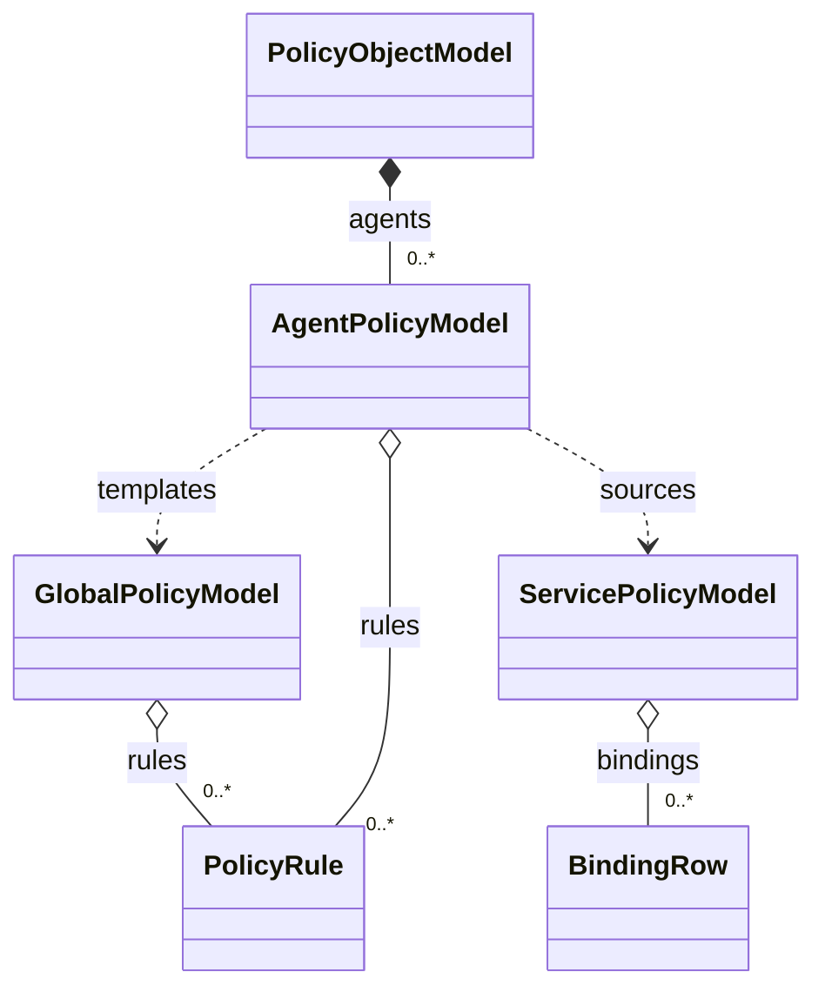
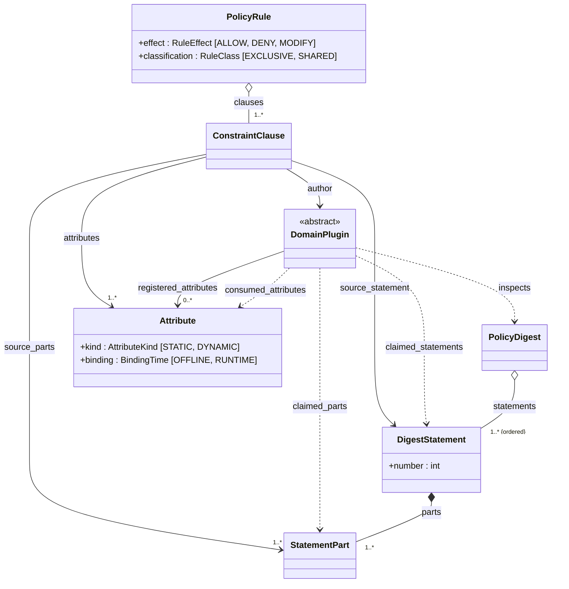
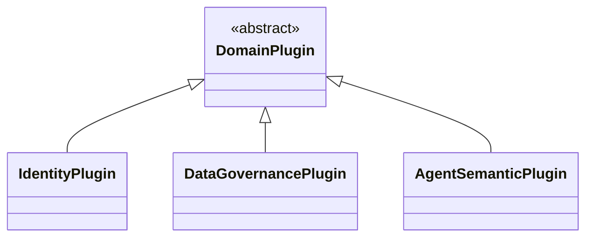
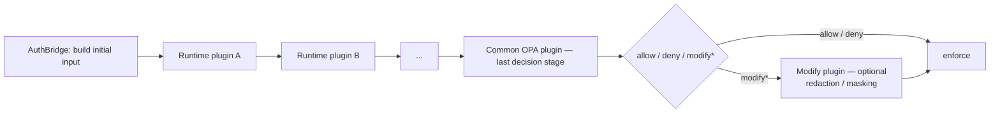
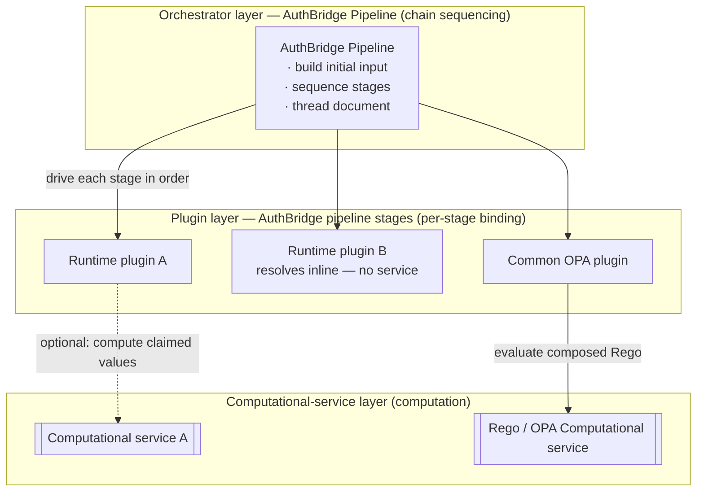
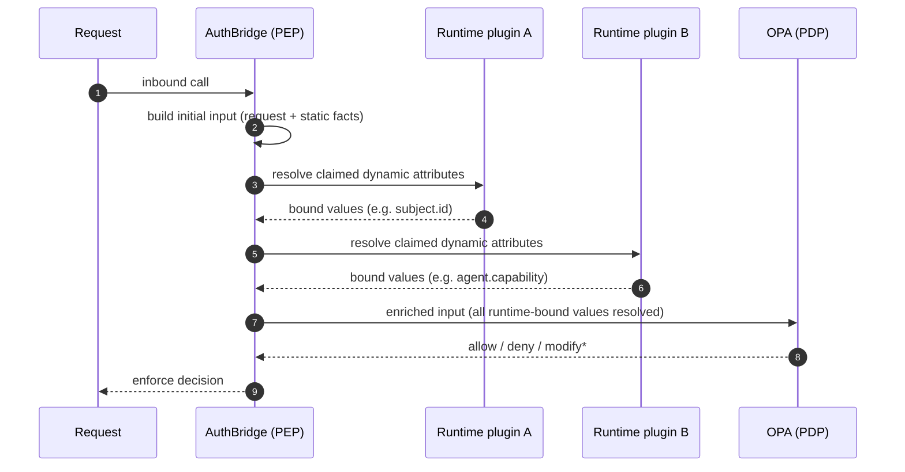
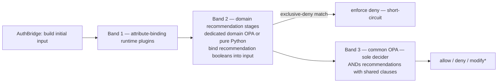

# AIAC Pluggable Architecture

**Status: architecture concept / target design.** This document records a shared
understanding reached for evolving AIAC. It supersedes nothing yet. Most
implementation decisions are **deliberately deferred** (see _Deferred
Decisions_) — the focus here is concept and architecture, not implementation.
Scope of this iteration is **UC-1 "Service onboarding" only**.

This spec uses the vocabulary fixed in the repo-root `CONTEXT.md` glossary and the
committed `docs/specs/digested-policy.md` language. Where an earlier discussion
used "deny-overrides" as an inter-rule combining rule, this spec reconciles that
to the engine's committed **identify-never-reconcile** principle; deny-overrides
stays **reserved to the authoring (digest) layer only** (see _Further Notes_).

## Problem Statement

From the platform owner's and the AIAC maintainer's perspective:

- Today AIAC models access as **RBAC only**, over IdP roles and scopes. A decision
  is a binary **allow / deny** on a `(role, scope)` pair. Policy that must reason over
  attributes from **other problem domains** — data sensitivity (PI / PII), owned
  by Data Governance, and agent capabilities and properties, owned by Agent
  Semantic — cannot be expressed.
- The modeling logic is **monolithic**. The identity/RBAC model, digest handling,
  rule building, and Rego emission are entangled in one core, so supporting a new
  kind of attribute (a new domain) means changing the core rather than adding a
  module.
- Consequently AIAC cannot grow toward fine-grained, attribute-aware
  authorization without a structural change; each new domain of knowledge would
  fork the core.

## Solution

From the same perspective:

- Introduce the **AIAC Framework**: an **attribute-agnostic** core that defines no
  entity and no attribute, and hosts **domain modeling plugins**. Each plugin owns
  one problem **domain** — the **Identity plugin**, the **Data Governance (DG)
  plugin**, and the **Agent Semantic plugin** (see _Domain plugins_).
- **Enhance the access-control modeling from RBAC to an RBAC+ABAC mixture.** RBAC
  is **not replaced** — it stays relevant and keeps working, now enriched with the
  fine-grained, attribute-aware control ABAC brings. ABAC is the substrate; **RBAC
  is expressed as the Identity plugin** (itself an RBAC+ABAC mix) over that
  substrate. Policy statements carry attribute conditions contributed by one or
  more domains.
- **Extend** the existing container model (POM → APM → SPM) with a persistent
  **Global Policy Model** (GPM) that keeps every rule. The SPM keeps each
  service's catalog and its binding rows; the APM stays a derived projection.
  **Keep** the two-layer policy stack and the PDP/PEP separation.
- The **AIAC Framework provides shared services** that all plugins reuse — chiefly
  the **PDP Policy Writer** (POM → Rego, exactly as today), digest retention, rule
  composition (its **rule-assembly unit** also assigns each rule its **effect**),
  and conflict detection. **Plugins never emit Rego.**
- The upstream **digested policy** (existing) is the Framework's input: numbered,
  well-formed, attribute-aware statements. Each plugin inspects every statement
  and claims only the relevant ones and, inside each claimed statement, only the
  **parts** it can model. It contributes per-domain **constraint clauses** for
  those parts, tagged with the source statement. The Framework composes the
  clauses into rules and assigns each rule its **effect**.
- Runtime attribute **values** are computed and bound by distinct **runtime
  plugins** in the AuthBridge pre-OPA pipeline — separate from, and not 1:1 with,
  the offline domain plugins.

## Domain plugins

Three domain modeling plugins are in view across this spec. They are named once
here and referred to by these names throughout:

- **Identity plugin** — carries today's identity/RBAC model forward, now
  **enhanced with ABAC**: it still models RBAC over IdP roles and scopes, and
  gains the fine-grained attribute conditions ABAC brings. It is itself an
  **RBAC+ABAC mixture**. Owns IdP roles and scopes; a scope is a **resource plus
  an action** over it (see _UC-1 binding_). It also produces and registers the
  addressed resource's attributes (`resource.*`).
- **Data Governance (DG) plugin** — owns data-sensitivity attributes (PI / PII).
- **Agent Semantic plugin** — owns agent capabilities and properties.

The Identity plugin comes first; the DG and Agent Semantic plugins follow.

## Embodiment example — employee PI access

A concrete **employee-PI access** policy is the embodiment that inspired this
design and grounds every concept below. It is a single policy that reasons over
**two domains at once** — **Identity** (who is asking, their role, their place in
the org, and the groups of the resource they address) and **Data Governance**
(what the data is: PI) — which today's RBAC-only model cannot express. It makes
the digest → clauses → rules flow, the multi-domain attributes, the
producer/consumer split, and the absence of conflict concrete.

### The digest (input)

Numbered, attribute-aware statements — the existing **digested policy** the
Framework composes over:

1. Employee may read and modify its own PI.
2. Employee may not access another employee's PI.
3. People manager may read a subordinate's PI.
4. People manager may not modify a subordinate's PI.
5. People manager may not access PI of employees who are not their subordinates.
6. HR representative may read any employee's PI.
7. HR representative may not modify another employee's PI.
8. Any employee may access group data they belong to.

### The rules (composed output)

Each statement composes into **one rule**; the clauses tagged to that statement
**AND** together, and the rule carries a single **effect**, which the Framework
assigns (see _Digest → clauses → rules_). `principal.*` is the requester
(Identity); `subject.*` is the **data subject** — the employee the PI is about;
`resource.*` is the addressed resource (Identity); `data.*` is the request or
response payload content (Data Governance); `request.action ∈ {R, W}`.

```
1. ALLOW: principal.id == subject.id          && request.action in [R,W]    && data.classification in [PI]
2. DENY:  principal.id != subject.id          && request.action in [R,W]    && data.classification in [PI]
3. ALLOW: principal.id == subject.manager.id  && request.action in [R]      && data.classification in [PI]
4. DENY:  principal.id == subject.manager.id  && request.action in [W]      && data.classification in [PI]
5. DENY:  principal.id != subject.manager.id  && request.action in [R,W]    && data.classification in [PI]
6. ALLOW: principal.role in [HR]              && request.action in [R]      && data.classification in [PI]
7. DENY:  principal.role in [HR]              && request.action in [W]      && data.classification in [PI]
8. ALLOW: principal.groups ∩ resource.groups  && request.action in [R,W]
```

### How it embodies the Framework

- **Multi-domain in one policy.** Rules 1–7 AND clauses from more than one domain,
  so each is a **shared** rule. Rule 8 (`principal.groups ∩ resource.groups`) is
  the one **exclusive** (Identity-only) rule, if the Identity plugin also claims
  its action part (see _Open attribute rows_). Identity contributes
  `principal.id / role / groups`, the org relation `subject.manager.id`, and
  `resource.groups`; Data Governance contributes `data.classification`.
  `subject.id` is registered by the plugin that produces it (Agent Semantic in
  the table below; open, see _Open attribute rows_). This is precisely the
  RBAC→RBAC+ABAC enhancement — the RBAC part is the named-role condition of
  rules 6–7 (`principal.role in [HR]`), which the Framework binds to IdP roles
  (see _Global Policy Model_); the other clauses (the relations,
  `resource.groups`, `request.action`, `data.classification`) are the ABAC part,
  ANDed on one rule.
- **Clauses AND per statement.** Rule 1 is three clauses ANDed — identity
  (`principal.id == subject.id`), access (`request.action in [R,W]`), and
  classification (`data.classification in [PI]`) — all **tagged to statement 1**.
- **Producer/consumer split (User Story 7, made concrete).** The **Identity
  plugin authors** `principal.id == subject.id`, but the **value** of `subject.id`
  (which employee the record is about) is **produced by the Agent Semantic plugin**,
  and the value of `data.classification` by the **Data Governance plugin** — both at
  runtime, since both are **dynamic** (see _Attributes it declares_). The static
  side of the same clause, `principal.id`, is an offline IdP-directory fact. Author
  (on the clause) and value producer (on the attribute) differ, and are recorded
  separately.
- **No conflict by construction.** The allow/deny pairs **partition** their
  target: rule 1 vs 2 on `principal.id == subject.id`; rules 3 / 4 / 5 on the
  manager relation and the action; rule 6 vs 7 on the action for HR. No `(target)`
  carries both allow and deny, so **identify-never-reconcile** raises nothing. Had
  two statements granted and denied the same case, the Framework would surface a
  **Conflict** (422) — never merge, never "deny wins."
- **Where "modify" would enter.** Every rule here is ALLOW or DENY. A natural
  extension of statement 6 ("HR may read any PI") is *allow with PI masking* — the
  deferred **`RuleEffect.MODIFY`**, enforced by the optional **Modify plugin**
  after the decision (see _Runtime pipeline_).

### Attributes it declares (by producing domain)

An attribute's **kind** classifies it by *where its value can be computed*:

- **dynamic** — the value (or a derivative of it) depends on data or metadata in
  the request or response, so it can be computed **only at runtime**.
- **static** — the value is drawn from a bounded, request-independent source (an IdP
  directory, a catalog), so it **can** be computed **offline**, for every possible
  value, ahead of any request.

Kind is *computability*, not *schedule*. A static attribute is normally precomputed
offline and the request only **selects** which value applies; but one whose value set
is large or impractical to enumerate ahead of time **may** instead be computed at
runtime — an efficiency choice that does **not** change its kind. Binding time is
therefore **orthogonal** to kind.

The attributes these rules reference, each with its kind and its value producer
— the plugin that registers it (`request.action` is request context, bound by
AuthBridge; which plugin registers it, and which plugin produces `subject.id`,
are open — see _Open attribute rows_):

| Attribute | Kind | Value producer |
| --- | --- | --- |
| `principal.id` | dynamic | Identity |
| `principal.role` | static | Identity |
| `principal.groups` | static | Identity |
| `subject.id` (data subject) | dynamic | Agent Semantic |
| `subject.manager.id` | static | Identity |
| `data.classification` | dynamic | Data Governance |
| `resource.groups` | static | Identity |
| `request.action` | dynamic | AuthBridge |

The split follows the kind definition:

- **`principal.*`** is **static** — the requester's id, role, and group memberships
  are stable facts in the IdP directory, a bounded catalog computable offline for
  every principal, independent of any request; at request time AuthBridge only
  **selects** the authenticated requester's facts into `input`.
- **`subject.*`** is **dynamic** — the data subject (whose PI a record is about, and
  therefore that subject's manager) is discovered from the accessed record at request
  time, not from an offline directory keyed by a known identity.
- **`data.*`** is **dynamic** — the governance attributes of the payload content
  (for example its classification) are read from the actual request / response,
  which is fixed only by the request.
- **`resource.*`** is **static** — the addressed resource's attributes (for example
  its groups) come from a bounded resource catalog, computable offline; the request
  only **selects** the addressed resource's row.
- **`request.*`** is **dynamic** — the action is pure request metadata.

`principal.*` and `resource.*` are the static groups here (the IdP directory and
the resource catalog): their complete value sets are bounded and
offline-computable, whereas every other group's value emerges from the specific
request or response. The definition's caveat still holds in general — a static
attribute whose value set is impractical to precompute may be computed at
runtime — but no attribute in this example needs it.

## User Stories

Grouped by point of view.

### Platform owner

1. As a platform owner, I want authorization to consider attributes beyond IdP
   roles, so that access reflects data sensitivity (Data Governance) and agent
   capability (Agent Semantic), not only role membership (Identity).
2. As a platform owner, I want RBAC **preserved and enhanced, not replaced** (the
   Identity plugin — RBAC plus the fine-grained control ABAC brings), so that
   today's role-based policies keep working while gaining attribute-aware conditions.

### AIAC maintainer

3. As an AIAC maintainer, I want the core Framework to define no attribute of its
   own, so that adding a new problem domain never requires changing the core.
4. As an AIAC maintainer, I want a new domain added as a **plugin**, so that the
   Identity, Data Governance, and Agent Semantic plugins stay cleanly separated.
5. As an AIAC maintainer, I want the **PDP Policy Writer to remain a Framework
   shared service** that emits Rego from the POM as today, so that PDP emission is
   uniform across all domains.
6. As an AIAC maintainer, I want the Framework to **retain the digested policy**
   (repurposing the Policy RAG), so that composition has a stable, numbered input.
7. As an AIAC maintainer, I want a clause's **author** (offline, single owner) and
   an **attribute's** value **producer** (runtime, possibly another domain) to be
   recorded separately — the author on the clause, the producer on the attribute —
   so that cross-domain value references work. E.g. the Identity plugin authors
   `principal.id == subject.id` while the Agent Semantic plugin produces the
   `subject.id` attribute value at runtime. A single clause may reference
   several attributes with different producers, so the producer cannot live on the
   clause.
8. As an AIAC maintainer, I want the raw-NL → digest conversion to stay **upstream
   and out of band** (the existing Policy Digester), so that the runtime path stays
   deterministic and cheap and conflict gating has one chokepoint.

### Domain-plugin developer

9. As a domain-plugin developer, I want to **register the attributes** whose
   values my domain produces, so that policy statements can reference them.
10. As a domain-plugin developer, I want to supply **static attribute values**
    offline wherever precomputing them is practical, so that request-independent
    facts about entities are available without a runtime lookup.
11. As a domain-plugin developer, I want to **mark which of my registered
    attributes are resolved at runtime** — every dynamic attribute, plus any static
    attribute I defer to runtime instead of precomputing — so that the system knows
    which attributes are bound at runtime and by whom.
12. As a domain-plugin developer, I want to author **constraint clauses over the
    attributes I declare as consumed** (my own or another domain's), so that my
    domain's intent enters a policy rule.
13. As a domain-plugin developer, I want to **never write Rego**, so that I work in
    my domain's terms and the Framework handles PDP emission.
14. As a domain-plugin developer, I want to **inspect every digest statement**
    and **claim responsibility for only the relevant subset** — and, inside each
    claimed statement, **only the parts my domain can model** — so that my
    domain contributes only where it is relevant and leaves the other parts to
    other domains.

### Runtime-plugin developer

15. As a runtime-plugin developer, I want to **compute and bind the claimed
    runtime-resolved attribute values** — dynamic attributes, plus any static
    attribute deferred to runtime — in the AuthBridge pre-OPA pipeline, so that OPA
    evaluates over resolved values.

### The Framework (composition)

16. As the Framework, I want each posted clause **tagged with its source statement**,
    so that clauses from the same statement AND into one rule.
17. As the Framework, I want to classify each rule as **exclusive** (one domain
    contributed) or **shared** (two or more), so that Rego can be emitted per-domain
    or shared accordingly.
18. As the Framework, I want to **assign each rule's effect** with an LLM-based
    **effect classifier** (a Decide → Evaluate agent) over the source statement,
    so that effect written in words other than "may" / "may not" is read
    correctly and no plugin decides effect.
19. As the Framework, I want to **verify that the plugins' claims cover every
    part** of each statement exactly once, and to **fail closed** (default deny)
    when a part has no claimant or more than one, so that no condition of the
    policy is silently lost or read two ways.

### Security & compliance owner

20. As a security owner, I want a `(role, scope)` (or its ABAC generalization)
    carrying both allow and deny to be **surfaced as a Conflict, never silently
    reconciled**, so that contradictory intent is never buried.
21. As a security owner, I want an intra-pass grant∩deny (a **Contradiction**)
    caught and the pass failed closed, so that a single domain never emits
    self-contradictory rules.
22. As a compliance owner, I want to record — but defer — a **third effect,
    "modify"** (for example, allow with PI/PII redaction/masking), so that the need
    is captured before it is designed.

### Platform operator

23. As a platform operator, I want exclusive rules that can later run in a
    **dedicated domain OPA** for performance, without changing the model, so that
    topology is an optimization, not a redesign.

### UC-1 service onboarding

24. As a service developer being onboarded (UC-1), I want the **target service
    taken from the onboarding event**, so that onboarding needs no extra input.
25. As the onboarding orchestrator (UC-1), I want the existing **Role-to-Scope
    mapping** reused to resolve the target and the services it influences, so that
    onboarding finds the affected services as today, and only its result changes:
    the service's binding rows, not whole rules (see _UC-1 binding_).

## Implementation Decisions

**AIAC Framework and plugins**

- The core is named the **AIAC Framework** and is **attribute-agnostic**: it
  defines no entity and no attribute, and renders rule **shapes**, never
  attributes.
- An **offline domain plugin** (the Identity, Data Governance, and Agent Semantic
  plugins each being one) provides exactly four things: (1) **attribute
  registration** — only for the attributes whose values it produces, each with its
  kind (static or dynamic, per _Attributes it declares_), its binding time
  (offline or runtime; always runtime for a dynamic attribute, and runtime for a
  static attribute it defers to runtime rather than precompute), and its value
  set; (2) the static attribute values it precomputes offline; (3) the attributes
  it **consumes** — any registered attribute, its own or another plugin's; (4)
  constraint clauses over the attributes it consumes.
- A **runtime plugin** is distinct and **not 1:1** with domains. It computes and
  binds the runtime-resolved attribute values it claims in the AuthBridge
  **pre-OPA** pipeline. It registers no attributes, authors no clauses, and renders
  no Rego.
- **Producer/consumer split:** a clause's author (offline, single owner) may differ
  from the attribute's runtime value producer (possibly another domain). The two
  are recorded separately, and on different entities: the **author is a property of
  the clause**, the **value producer a property of the attribute** (the plugin
  that registered it, per _AIAC Framework and plugins_ item 1). Because one
  clause can reference several attributes with different producers, the producer is
  necessarily per-attribute, not per-clause.
- **Exactly one producer, and it registers the attribute.** Only the offline
  plugin that produces an attribute's value registers the attribute (its name,
  kind, binding time, and value set). A runtime plugin registers nothing. At
  registration, the Framework refuses a second registration of one attribute,
  and a consumed attribute that no plugin registered. A DENY clause over an
  attribute that nobody produces never fires, so the policy would silently give
  more access.

**Container model (extended with a Global Policy Model, RBAC+ABAC content)**

- The **POM → APM → SPM** hierarchy is retained and extended with a persistent
  **Global Policy Model** (GPM). POM (Policy Object Model, successor to
  PolicyModel) collects APMs; each APM derives from the GPM rules and the binding
  rows of its related SPMs.
- The **GPM keeps every rule**. Each SPM keeps its service's catalog (its roles,
  its scopes, and each scope's (resource, action) pair) and its **binding rows**,
  with no effect and no clauses (see _Global Policy Model_).
- Per-domain **fragments** (constraint clauses) sit in the GPM rules, one time
  each, not in the SPMs, because a clause does not depend on any role or scope.
  Exact fragment structure is deferred; semantically a fragment is **a
  policy-rule constraint clause**, and clauses from the same source statement
  **AND** into one rule.

**Framework shared services**

- The **PDP Policy Writer is a Framework shared service**. It emits Rego from the
  POM exactly as today. Plugins never emit Rego.
- **Rule composition** is a Framework shared service. Its **rule-assembly unit**
  ANDs the clauses of one statement into one rule and assigns the rule's
  **effect** (see _Digest → clauses → rules_).
- The Framework **retains the digested policy** (the Policy RAG is repurposed for
  this). This is distinct from a domain-knowledge RAG that feeds static attribute
  values.

**Digest → clauses → rules (composition)**

- Input is the existing **digested policy**: numbered, well-formed, attribute-aware
  statements produced upstream and out of band by the **Policy Digester**.
- **Statement claims (broadcast).** Each domain plugin **inspects every
  statement** of the digest, then **claims (tags) only the statements relevant
  to its domain**. It models only the statements it claimed.
- **Part claims.** Inside each statement it claimed, a plugin claims (tags) only
  the **parts** it can model, and authors clauses for those parts only. It leaves
  the other parts — the parts it cannot understand or model — to other plugins.
  For example, in statement 1 the DG plugin claims *PI* and leaves *Employee* to
  the Identity plugin. A part has exactly one claimant. The part representation
  is deferred (see _Deferred Decisions_).
- Each clause a plugin posts is **tagged with its source statement**, so
  same-statement clauses AND into one rule, which the Framework keeps in the
  **Global Policy Model** (see _Global Policy Model_ below).
- **Effect is a Framework decision.** The Framework's **rule-assembly unit** ANDs
  the clauses of one statement into one rule and decorates the rule with its
  **effect**. An **LLM-based effect classifier** reads the statement and gives
  the effect, because a statement can express effect in words other than "may"
  and "may not" (for example "is prohibited from", "has no access to", "is
  entitled to"). The classifier is a two-step agent: **Decide**, then
  **Evaluate**. If Evaluate rejects the decision, Decide tries again with
  Evaluate's feedback, a limited number of times; if Evaluate still rejects it,
  the Framework raises an exception, and onboardings fail closed (default deny;
  see _Two steps_). Plugins author clauses only; a plugin never assigns an
  effect.
- **Coverage check.** The rule-assembly unit also verifies that the plugins'
  claims **cover every part** of each statement **exactly once** (the effect
  words belong to the effect classifier). If a part has no claimant, or more
  than one, the Framework raises an exception and applies nothing; onboardings
  fail closed (default deny; see _Two steps_). This applies to ALLOW and DENY
  rules: a lost condition broadens an ALLOW and widens a DENY, and both break
  faithfulness.
- **Two steps.** The statement-level work runs **one time per digest version and
  plugin set**, at system startup, before any onboarding (and on a policy
  update, when UC-2 exists): statement claims, part claims, ABAC clauses, the
  effect, and the coverage check. Its results do not depend on any role or
  scope, and the Framework never computes them again for the same digest
  version and plugin set. Until this result exists, or when this step failed,
  no onboarding starts: each request fails closed and is retried. The **RBAC
  binding** runs **per service**, at each onboarding: it matches the new
  service's own roles and scopes to the **named parts** of the statements (see
  _Global Policy Model_). A statement that binds nothing for a service gives no
  rule for that service; that is not a coverage failure.
- **Global Policy Model.** A persistent **Global Policy Model** keeps every rule:
  a reference to its statement, its effect, its ABAC clauses, and an **RBAC
  template** — the statement's named requester (user roles or agent roles) and
  its named resource (scopes), in the policy's own terms. A part that names no
  such term adds no RBAC condition. Only the RBAC part is a template: the ABAC
  clauses need no binding from SPM data, because the Framework precomputes a
  static value offline and a runtime stage binds a dynamic value per request.
  Each SPM keeps the **binding rows** of its service (the row shape is deferred,
  see _Binding-row shape_). When the Framework derives an agent's policy, it
  fills each template from the binding rows, mechanically (no LLM). A rule is
  complete only after the binding, because the roles and scopes depend on the
  services.
- Rules are classified **exclusive** (one contributing domain) or **shared** (two
  or more). The classification is a **topology hint, not a decision change**: in
  phase 1 both kinds are inlined into the common OPA; in phase 2 an exclusive rule may
  run as a **domain recommendation stage** (a dedicated domain OPA or pure Python)
  that binds a boolean recommendation into `input`, while shared rules stay in the
  **common OPA** — which remains the **sole decider** either way (see
  _OPA execution topology_).

**Conflict handling (engine principle: identify-never-reconcile)**

- **Contradiction** — an intra-pass grant∩deny within one focal's own proposed rule
  set — is caught by the pass's auditor and fails that pass closed
  (`PolicyContradictionError`).
- Because a plugin assigns no effect (see _Digest → clauses → rules_), a plugin
  pass cannot itself produce a grant∩deny. Where the grant∩deny check sits after
  this change is part of the deferred _Multi-domain conflict detection_.
- **Conflict** — a cross-pass / cross-source allow∩deny on the same target — is
  detected structurally and **surfaced, never reconciled** (`ConflictReport` →
  HTTP 422). No precedence, no "deny wins," no merge.
- Multi-domain conflict detection (how conflicts across domains are found and
  reported) is **deferred** (see _Deferred Decisions_).

**UC-1 binding**

- The **target service ID** comes from the onboarding **event payload**
  (`trigger.entity_id`; NATS `aiac.apply.service.{id}`).
- The existing **Role-to-Scope mapping** is reused to resolve the target service and
  the services it influences.
- **A scope is a resource plus an action.** Each IdP scope is the combination of
  a **resource** and an **action** over it. For example, the scope `get_record`
  of a hypothetical HR tool is the action *read* over the resource *employee
  record*, and `update_record` is *modify* over the same resource. A statement's
  resource and action relate to UC-1's scopes through this pair; how a statement
  binds to scopes is part of the deferred _Digest → UC-1 mapping_.
- The two-stage pipeline (Service Provision, then Service Policy Builder) stays.
  The Service Policy Builder's result changes: an onboarding gives the service's
  **binding rows**, not whole rules. The Framework keeps the rules in the Global
  Policy Model and derives each affected agent's policy from the GPM rules and
  the binding rows. The exact `compute_and_apply` contract is deferred (see
  _Deferred Decisions_).

## Object Model (POM)

UML class diagrams of the **POM (Policy Object Model)**. They are a concept-level
rendering, consistent with the deferred implementation detail above (exact
clause/fragment structure, plugin API, and the like). Two layers are shown:

1. **Container model** — the committed `POM → APM → SPM` shape, extended with
   the **Global Policy Model** (GPM) that keeps the rules.
2. **RBAC+ABAC content** — the classes that live inside the GPM/APM (clauses,
   plugins, digest, attributes).

The diagrams show the POM data model plus its direct composition inputs. They do
not show the Framework shared services (PDP Policy Writer, conflict detection) or
the AuthBridge runtime plugins, because those are not part of the POM object
graph.

### Container model



- **`PolicyObjectModel` (POM)** — top container; collects APMs.
- **`GlobalPolicyModel` (GPM)** — the persistent source of truth for rules. It
  keeps every rule (its statement reference, effect, ABAC clauses, and RBAC
  template), one time per digest version and plugin set. Only the Framework's
  global step writes it.
- **`AgentPolicyModel` (APM)** — a pure derived projection. The PCE builds it
  from the GPM rules and the binding rows of the related SPMs; it is not
  persisted.
- **`ServicePolicyModel` (SPM)** — the persistent service catalog, one per
  service: its roles, its scopes with each scope's (resource, action) pair, and
  its binding rows. It keeps no effect and no clauses.
- **`BindingRow`** — one stored LLM match of an own IdP object of the service (a
  role or a scope) to the policy. It carries IdP IDs and a link to the policy,
  never an effect or a clause. Its shape is deferred (see _Binding-row shape_).
- **`PolicyRule`** — the attribute-aware pivot of the RBAC+ABAC content. Its
  downstream dependencies are shown in the next diagram.

### PolicyRule and its dependencies

The `PolicyRule` subgraph, extracted from the full model. It drops the container
classes (`POM`, `GPM`, `APM`, `SPM`) and keeps `PolicyRule` with the transitive
closure of the classes it depends on.



- **`PolicyRule`** — attribute-aware. Clauses from the same source statement AND
  into one rule. Its `effect` is the enum `RuleEffect` (`ALLOW` / `DENY` — a third
  value `MODIFY` for redaction / masking is recorded but deferred); its
  `classification` is the enum `RuleClass` (`EXCLUSIVE`, one contributing domain /
  `SHARED`, two or more — the classification granularity is deferred). Its
  effect is assigned by the Framework's rule-assembly unit (the effect
  classifier), never by a plugin.
- **`ConstraintClause`** — one policy-rule constraint clause (a fragment),
  authored offline by a single owner domain (`author`). The exact clause/fragment
  structure is deferred.
- **`PolicyDigest`** — the digested policy as a whole: an **ordered (numbered)
  collection of shared statements** — aggregation (`o--`, empty diamond), so the
  statements it holds are **shared, not owned**, and outlive the digest that
  references them. It is the Framework's stable, numbered composition input
  (repurposing the Policy RAG); the statement `number` fixes the order and is the
  tag clauses carry back as their `source_statement`. Each `DomainPlugin`
  **depends on** the `PolicyDigest` — it inspects every statement (broadcast)
  and claims the relevant subset (`claimed_statements`) and, inside those, the
  parts it can model (`claimed_parts`).
- **`DigestStatement`** — one numbered, attribute-aware statement from the
  digested policy. Its `number` is its position in the owning `PolicyDigest`.
- **`StatementPart`** — one part of a statement that a plugin can claim and
  model (for example *Employee* or *PI* in statement 1). Each part has exactly
  one claimant. Each clause traces back to the parts it models
  (`source_parts`). The part representation is deferred (see
  _Statement-part representation_).
- **`DomainPlugin`** (abstract) — an offline domain plugin. Its concrete subtypes
  are shown in the next diagram.
- **`Attribute`** — one registered domain attribute. Its `kind` is the enum
  `AttributeKind` (`STATIC` / `DYNAMIC`), classifying it by *where its value can be
  computed*: `DYNAMIC` when the value depends on request/response data and so is
  computable **only at runtime**; `STATIC` when the value is request-independent and
  so **can** be computed **offline**. Kind is computability, not schedule — a
  `STATIC` attribute whose value set is impractical to precompute **may** still be
  computed at runtime without becoming `DYNAMIC` (see _Attributes it declares_).
  Its `binding` is the enum `BindingTime` (`RUNTIME` for a dynamic attribute or
  a static one deferred to runtime, `OFFLINE` otherwise). Its **value producer**
  is the plugin that registered it (`registered_attributes`); it may differ from
  the plugins that consume the attribute (`consumed_attributes`) and author
  clauses over it.

### DomainPlugin hierarchy

The three concrete offline domain plugins. Each owns one problem domain and is a
`DomainPlugin`; the Identity plugin comes first, the DG and Agent Semantic plugins
follow.



- **`DomainPlugin`** (abstract) — an offline domain plugin. It provides four
  things: attribute registration (only for the attributes whose values it
  produces, each with its kind, binding time, and value set), the static
  attribute values it precomputes offline, the attributes it consumes (its own or
  another plugin's), and constraint clauses over the attributes it consumes. It
  never emits Rego.
- **`IdentityPlugin`** — carries RBAC forward, enhanced with ABAC (itself an
  RBAC+ABAC mixture). Owns IdP roles and scopes; a scope is a resource plus an
  action over it. It also produces and registers the addressed resource's
  attributes (`resource.*`).
- **`DataGovernancePlugin`** — owns data-sensitivity attributes (PI / PII).
- **`AgentSemanticPlugin`** — owns agent capabilities and properties.

### Notation

`*--` composition (owned, deleted with parent); `o--` aggregation (holds a list
of); `-->` reference (a field of this type); `..>` dependency (derives-from /
produces / claims); `<|--` generalization (is-a).

## Runtime pipeline

The Object Model above composes rules **offline** over registered attributes. At
request time, every attribute value **not already bound offline** must be resolved
**before OPA can decide** — every **dynamic** attribute (always runtime-bound), plus
any **static** attribute a deployment defers to runtime rather than precompute (the
caveat in _Attributes it declares_). Resolving these **runtime-bound** attributes is
the job of the **runtime plugins** in the AuthBridge **pre-OPA** pipeline (User Story
15). This view is deliberately **outside the POM**: runtime plugins are not part of
the offline object graph, are **distinct from** the offline domain plugins, and are
**not 1:1** with domains.

Two things are shown: the pipeline's **shape** — an ordered chain of
runtime-plugin stages that ends at the Common OPA plugin — and how a request **flows**
through it.

### Pipeline — runtime plugins first, the Common OPA plugin last

The AuthBridge pre-OPA pipeline is an **ordered chain of stages**. AuthBridge
builds the initial input from the request and the offline-bound static facts; then
each selected runtime plugin is a stage that **computes and binds** the
runtime-bound attribute values it claims, enriching the input as it passes through.
Which runtime-plugin stages are present is drawn from the composed POM's
runtime-bound attributes and their producer (the plugin that registered each
attribute) — collected into the
**runtime-binding manifest** (the same artifact asserted at the Framework I/O seam —
see _Testing Decisions_): only producers whose claimed runtime-bound attributes
actually appear get a stage. Because runtime plugins are **not 1:1** with domains,
one stage may bind attributes for several producers, and one producer's attributes
may be split across stages. The **Common OPA plugin is the last decision stage**: by
the time it runs, every claimed runtime-bound attribute is resolved, so it evaluates
the composed Rego over **fully resolved values**. When the decision is **modify**, an **optional Modify plugin**
runs *after* the decision to apply the transform (PI/PII redaction / masking);
for allow / deny the pipeline enforces directly and skips it. How each stage
delegates its work is shown next, in the _Layered view_.



`modify*` is the **deferred third effect** (allow with PI/PII redaction / masking;
`RuleEffect.MODIFY`). Its enforcement point is most likely the runtime pipeline /
PEP rather than OPA's boolean decision, so the **optional Modify plugin** sits
*after* the decision — reached only when OPA returns modify — see _Deferred
Decisions_.

### Layered view — orchestrator over plugins over computational services

The same delegation seen along the pipeline is, structurally, **three layers**. On
top, the **AuthBridge Pipeline orchestrator** owns the chain itself: it builds the
initial input, **sequences the stages**, and threads the enriched document from one
to the next — it does no binding and no computation of its own. Beneath it, the
**plugin layer** is the set of pipeline stages — the runtime plugins and the OPA
plugin — each taking its place in the chain and **binding what it receives** (a
runtime plugin binds the runtime-bound values it claims; the Common OPA plugin
evaluates). The
**computational-service layer** at the bottom does the **actual work**. A runtime
plugin's computational service is **optional**: a plugin **may** call its own
service to compute claimed values, or resolve them inline (e.g. from facts already
in the input) and call none. The Common OPA plugin, by contrast, always calls the **Rego
/ OPA Computational service** to evaluate. Splitting chain orchestration (top), per-stage binding
(middle), and computation (bottom) lets a service be swapped, scaled, or relocated
without touching the pipeline, and keeps both the orchestrator and the plugins thin.



### Request flow — bind runtime-bound values, then evaluate

At request time AuthBridge (the PEP) builds the initial OPA input from the
request and the offline-bound static facts, then passes it through the assembled
runtime-plugin chain. Each plugin **computes and binds** the runtime-bound attribute
values it claims, enriching the input document. Once every claimed runtime-bound
attribute is resolved, the enriched input is handed to OPA, which evaluates the
composed Rego over **fully resolved values** and returns allow / deny (or the
deferred **modify**).
Example: the Identity plugin
authored `principal.id == subject.id`, so a runtime plugin bound to the Agent
Semantic producer resolves `subject.id` here before OPA sees the rule.



Concept-level only. The **producer → runtime-plugin mapping**, the **ordering and
parallelism among stages within a band**, and the runtime plugin API are
**deferred with implementation** (see _Deferred Decisions_); the **three-band
ordering** itself is fixed by _OPA execution topology_ below.

### OPA execution topology — phase 1 (common OPA) or phase 2 (optional domain OPAs)

This realizes **User Story 23**. The composed POM carries both **exclusive** (one
contributing domain) and **shared** (two or more) rules; **where** their Rego runs
is a deployment choice, never a model change — the model stays **topology-neutral**.
Two phases are in view, and they are **decision-equivalent**: the same digest and
plugins yield the **same** allow / deny whether the rules run inlined in one OPA or
factored across several. Only the emitted artifacts differ; the decision does not.
That equivalence is asserted at the **Framework I/O seam** (see _Testing Decisions_)
and is exactly what makes phase 2 an **optimization, not a redesign**. The runtime
decision is itself unchanged — `allow` holds when some ALLOW rule matches and no DENY
rule matches (default-deny) — so a genuine same-target grant∩deny stays a
**Conflict / Contradiction surfaced offline**, never reconciled at runtime
(**identify-never-reconcile**).

Both phases ride the committed emission chain, unchanged in shape: the **PDP Policy
Writer** emits, per agent, one **`AuthorizationPolicy` CR** whose `policies[]` are
**Rego packages** (one per leg — inbound / outbound); **`bundle-service`** composes
those CRs into **per-pod OPA bundles**; the OPA plugin embedded in each AuthBridge
polls its bundle and evaluates it over the `input` document. ("Bundle" names that
per-pod composed artifact — not what the writer emits.)

- **Phase 1 — single common OPA (simplest, closest to today; build first).** One
  common OPA per leg evaluates everything. Per agent there is one `AuthorizationPolicy`
  CR; a domain's exclusive Rego may be authored as its own portion but is **inlined**
  into the per-leg common package and composed into the single per-pod bundle.
- **Phase 2 — optional dedicated domain OPAs (performance optimization).** Per
  **agent-pipeline leg** — inbound and outbound are independent pipelines — a domain
  plugin **may optionally** run a **dedicated domain OPA processor**, or compute in
  **pure Python**; the substrate is the domain plugin's own **implementation
  decision**. Each such stage produces one or more **AC recommendations** — booleans
  such as `identity_ok` / `data_governance_ok`, the count at the domain's discretion —
  and **writes them into the enriched `input` document**. The **common OPA remains the
  sole decider**, last on each leg: its **resolving rules — modeled into the POM by the
  owning domain plugin** — read those recommendations from `input` and **AND** them
  into `allow` alongside the shared-rule clauses, exactly as it already ANDs its
  `input`-driven gates. Because a recommendation arrives as an `input` value, an
  OPA-backed domain stage is indistinguishable, to the pipeline, from a pure-Python
  one.

In phase 2 each leg is therefore an ordered **three bands**:

1. **Attribute-binding runtime plugins** — resolve the runtime-bound attribute
   *values* the rules reference (the chain described above).
2. **Domain recommendation stages** — each computes its domain's recommendation(s) and
   binds them (disjoint) into `input`. Present only for domains running a dedicated
   stage in this phase.
3. **Common OPA — the sole decider** — evaluates the composed per-leg package over the
   fully enriched `input` and returns allow / deny (or the deferred **modify**).

Binding (band 1) must fully precede recommendation (band 2) — a domain rule may
reference an attribute another domain **produces** (the producer/consumer split) — and
recommendation must precede the decision (band 3).

**Short-circuit (optimization).** An **exclusive DENY** rule is fully evaluable inside a
single domain stage, and one such match is decisive on its own (a matching DENY denies
regardless of any ALLOW), so a domain stage **may** stop the leg early and enforce deny
between bands 2 and 3. A **shared** deny needs all its domains and cannot be decided by
one stage, so it propagates. The short-circuit is a **pure, toggleable optimization** —
skipping later stages never changes the verdict, only saves work — so phase-1 /
phase-2 decision-equivalence holds.



**Still deferred with implementation** (out of this concept-level scope): failure
semantics when a processor is unreachable; whether band-2 stages run sequentially or in
parallel; the phase-2 package-naming and `bundle-service` composition mechanics; and the
operator / loader cardinality.

## Testing Decisions

Good tests here assert **external behavior at the highest available seam**, never
composition internals. Prefer existing seams; the ideal count is one.

- **Primary seam — the AIAC Framework I/O boundary.** Given a digested policy plus a
  set of domain plugins, assert the emitted rule set, the emitted **Rego packages**
  (shared and per-domain — the writer's output, before `bundle-service` composes the
  per-pod bundles) and the runtime-binding manifest. **Phase-1 / phase-2
  decision-equivalence is asserted here too**: the same digest and plugins must yield
  the same allow / deny whether exclusive Rego is inlined into the common OPA or
  factored into a dedicated domain OPA (see _OPA execution topology_). This is the
  single highest seam and is where most tests should sit. It is deterministic and runs
  offline. The LLM steps (the effect classifier and any LLM-based statement or part
  claim) sit behind seams that these tests fake; an `llm`-marked variant runs them
  live.
- **Plugin-contract seam.** Given a plugin's registered and consumed attributes and
  posted clauses, assert the Framework composes correctly: same-statement clauses
  AND into one rule; exclusive/shared classification is correct; the rule's effect
  comes from the Framework's effect classifier, never from a plugin. A second
  registration of one attribute, or a consumed attribute that no plugin
  registered, is refused at registration.
- **Conflict seam.** Assert a cross-source allow∩deny is surfaced as a `Conflict` /
  `ConflictReport` → 422, and an intra-pass grant∩deny as a `Contradiction`
  (pass fails closed). The multi-domain extension is tested once that decision is
  defined. A part that no claim covers, or that more than one claim covers, raises
  the coverage exception, and onboardings fail closed.
- **Prior art.** The live-LLM PRB tests
  (`test/unit/agent/policy_rules_builder/test_graph_live_llm.py`, `llm` marker)
  already assert an emitted `(name, effect)` rule set against policy text — the same
  shape of assertion applies at the Framework seam. Selection stays **marker-only**;
  the unit tree mirrors `src/aiac/`; LLM-touching pieces sit behind the `llm` marker
  and skip cleanly without an endpoint.
- Concrete test authoring is **deferred with implementation**, consistent with the
  concept-only scope of this iteration.

## Deferred Decisions

These decisions fall **within this design's scope** but are intentionally
postponed, to be defined later:

- Exclusive/shared **classification granularity** — statement interest-tags vs
  clause provenance-tags.
- **GPM organization** — (A) one common Global Policy Model with domain-tagged
  clauses vs (B) a common GPM + domain-specific parts (coupled to the granularity
  choice).
- **Multi-domain conflict detection** — how conflicts across the Identity, Data
  Governance, and Agent Semantic domains are found and reported.
- **Digest → UC-1 mapping** — how the digest composition model binds to UC-1's
  role/scope-driven flow (note: the digest carries **effect**, while role/scope
  descriptions are **neutral definitions** stating identity, never effect).
  Settled so far: the Framework assigns effect (effect classifier); a scope is a
  resource plus an action; the global step keeps the rules in the Global Policy
  Model, and each onboarding gives the service's binding rows. Still open: how a
  statement's resource and action bind to scopes.
- **Statement-part representation** — how a statement divides into claimable
  parts (for example typed subject / action / resource / condition parts, or
  free-text spans), and which part types exist (proposed: *named* — a policy
  term that IdP objects realize, the RBAC template; *attribute* — an ABAC
  clause; *any* — no condition). Settled: each part has exactly one claimant;
  the coverage check fails closed on zero or two.
- **Binding-row shape** — what a binding row records for a named part: one row
  per (IdP object, policy term), per (statement, part, IdP object), or per
  (statement, role, scope). Settled: a row carries IdP IDs and a link to the
  policy, never an effect or a clause, and the SPMs keep the rows. Also open:
  where the rows of user roles live, because a user role belongs to no service
  and is not onboarded.
- **Two principals** — how a statement's requester binds user roles and
  authorized-party (agent) roles, whether a statement that names no agent puts
  a condition on the agent gate, and how `principal.*` maps to the two
  principals.
- **Open attribute rows** — which plugin registers `request.action` (the scope
  gives the action, so the Identity plugin is a candidate), and which plugin
  produces `subject.*` (the data subject); the second goes with the vocabulary
  of `subject.*` and `data.*`.
- **Third effect "modify" / redaction** — a transform/obligation outcome (e.g.
  PI/PII masking). It does not fit the binary combining as-is, and its enforcement
  point is most likely the runtime pipeline / PEP (AuthBridge), not OPA's boolean
  decision.
- **Implementation-level detail** — exact clause/fragment structure, plugin API
  signatures, Framework routing internals, the exact `compute_and_apply`
  contract, copy-vs-reference for APM artifacts, the sharing contract form, the
  entity vocabulary source, and the full Framework shared-service catalog.
  Deferred with implementation, consistent with the concept-only scope of this
  iteration.

## Out of Scope

Owned elsewhere or by a later iteration; **not part of this work at all**:

- **Raw NL → digest conversion.** Produced upstream and out of band by the existing
  Policy Digester; unchanged and outside the Framework's responsibility.
- **Other use-cases.** UC-2 (policy update) and UC-3 (role update) are out of scope;
  this iteration is UC-1 only.

## Further Notes

- **Alignment with the existing digested-policy language.** Much of the ABAC
  substrate already exists: `docs/specs/digested-policy.md` already supports
  attribute conditions over the subject, resource, and access, plus three statement
  kinds (direct grants, attribute invariants, role-assignment constraints). Domains
  map naturally onto attribute namespaces within that language, so this evolution
  extends a committed language rather than inventing a parallel one.
- **Vocabulary reconciliation (deny-overrides).** An earlier discussion framed the
  inter-rule combining rule as "deny-overrides." The committed engine principle is
  **identify-never-reconcile** (`CONTEXT.md`), and the glossary explicitly avoids
  "deny-overrides" for the engine. Deny-overrides remains **reserved future work at
  the authoring/digest layer only**, per the digested-policy design decision — never
  at the engine. This spec follows that stance.
- **Neutral-definition principle preserved.** An entity's description states
  identity, never authorization effect; effect lives solely in policy statements.
  The RBAC+ABAC enhancement does not change this.
- **Fail closed needs a deny-all deployment.** This spec says that an exception
  makes onboardings fail closed (default deny). Today a failed UC-1 onboarding
  writes no `AuthorizationPolicy` CR, and the global combiner treats a missing
  CR as allow, so the inbound of the failed agent is fail-open. The planned
  UC-1 deny-all quarantine (a new PCE `quarantine` operation; see
  `docs/handoffs/07-uc1-onboarding-deny-all-quarantine-spec.md` and
  `docs/handoffs/08-uc1-onboarding-deny-all-quarantine-impl.md`) closes this
  gap, and this design depends on it.
