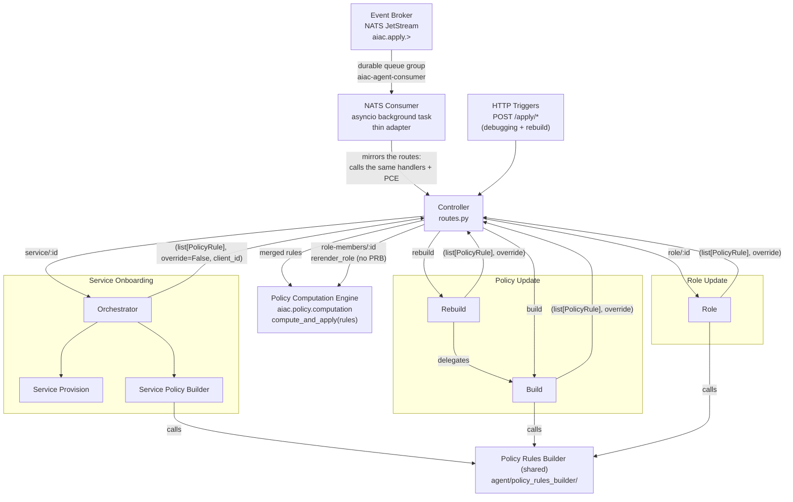

# Component PRD: AIAC Agent

## Description

A LangGraph-based AI agent service that enforces a natural-language access control policy against the live PDP state. Triggered via the **Event Broker** (NATS JetStream) for all automated triggers, and directly via HTTP for the operator-only `rebuild` and `offboard` commands and for the repair route `POST /apply/role-members/{role_id}` (D32):

- **Event Broker** → `aiac.apply.service.{id}` subject (originated by the Keycloak SPI on a `CLIENT` `CREATE` admin event)
- **Event Broker** → `aiac.apply.role.{name}` subject (percent-encoded role name; originated by Keycloak SPI role created/updated)
- **Event Broker** → `aiac.apply.role-members.{role-id}` subject (the Keycloak role id; originated by the Keycloak SPI when a user or an agent service account gets or loses a realm role, D32). The Controller calls the PCE `rerender_role`, with no PRB run (see [Role-membership change](#role-membership-change-d32)). **Status:** the Keycloak image of the platform does not have the publisher yet, so nothing publishes this subject (see [Role-membership change](#role-membership-change-d32)).
- **Event Broker** → `aiac.apply.policy.build` subject (originated by RAG Ingest Service post-ingest). **Status: not built yet** — no RAG Ingest Service exists; nothing publishes this subject.
- **Operator/admin call** → `POST /apply/policy/rebuild` directly via `kubectl port-forward` (HTTP only — not routed through Event Broker)
- **Operator/admin call** → `POST /apply/offboard/{service_id}` (the clientId) directly via `kubectl port-forward` (HTTP only; the NATS subject `aiac.apply.offboard.{id}` is a follow-up, see [Dispatch table](#dispatch-table))
- **Operator/admin call** → `POST /apply/role-members/{role_id}` (HTTP; it repairs a lost role-membership event at once, D32, see [Role-membership change](#role-membership-change-d32))

The Agent subscribes to the Event Broker as a durable competing consumer (`aiac-agent-consumer` queue group). It acknowledges each message only after successful processing — ensuring at-least-once delivery and automatic replay on pod restart.

The `/apply/*` HTTP endpoints are retained as a debugging escape hatch. The **NATS consumer is a thin adapter layer** that receives events from the Event Broker and calls the same use-case handlers, `compute_and_apply` and (UC1) `reenable_service` that the `/apply/*` routes call — or, for a role-membership change, the same PCE `rerender_role` that `POST /apply/role-members/{role_id}` calls. There is no duplicated business logic.

The service is structured as a **Controller** (FastAPI routes) that dispatches to the **Service Onboarding Orchestrator** (UC1) or directly to the Policy Update and Role Update sub-agents (UC2, UC3). Each producing sub-agent calls the **shared Policy Rules Builder** (`agent/policy_rules_builder/`) directly, merges the results internally, and returns a single `list[PolicyRule]` and an `override` flag to the Controller. The Controller calls `compute_and_apply(merged_rules, override)` from `aiac.policy.computation` (PCE) once.

| Use Case | Dispatch | Sub-agents | Sub-agent output |
|---|---|---|---|
| Service Onboarding (UC1) | via Orchestrator | Service Provision + Service Policy Builder | `(list[PolicyRule], override=False, client_id)` |
| Policy Update (UC2) | Controller → sub-agent directly | Build or Rebuild (TBD) | `(list[PolicyRule], override)` |
| Role Update (UC3) | Controller → sub-agent directly | Role sub-agent | `(list[PolicyRule], override)` |

**Status: not built yet** — UC2 Build/Rebuild and UC3 Role are stubs that return `([], False)` / `([], True)` / `([], True)`; none calls the PRB, and Rebuild does not delegate to Build.

The sub-agent calls the PRB for each applicable (roles, scope) or (role, scopes) pair. No shared apply node exists. The PCE owns all Policy Model Store ↔ PDP Policy Writer coordination. The Policy Rules Builder never calls `aiac.pdp.policy.library` or `aiac.policy.model_store.library`. The UC1 Service Policy Builder only reads the Policy Store (`get_service_policy`, read-only) for cross-service conflict detection. Only the PCE writes.

All components are **logically separated modules within a single pod and process** — no inter-service network calls between orchestrators and sub-agents.



---

## NATS Consumer

A thin adapter started as an **asyncio background task** in the FastAPI `lifespan` handler, as the last step of the [start sequence](#start-sequence). It binds the `aiac-agent-consumer` durable queue group on the `aiac-events` NATS JetStream stream (stream subjects `aiac.apply.>`), with the filter subjects `aiac.apply.service.*`, `aiac.apply.role.*`, `aiac.apply.role-members.*` and `aiac.apply.policy.build` — never the DLQ subject.

Before it subscribes, the consumer start updates an existing durable consumer to the config of the code (`ensure_consumer` in `eventbus/stream.py`): the filter subjects, the ack policy, `max_deliver` and `ack_wait`. Reason: nats-py `subscribe()` binds to an existing durable consumer with the config that the server has, so a new filter subject would not get to a running cluster. The update keeps the deliver subject and the deliver group of the consumer. A missing consumer is created by `subscribe()`, as before. See [`event-broker.md` → Consumer config at start](event-broker.md#consumer-config-at-start).

### Dispatch table

| Subject pattern | Internal handler |
|---|---|
| `aiac.apply.service.{id}` | Service Onboarding Orchestrator (UC1) |
| `aiac.apply.role.{name}` | Role Update sub-agent (UC3) |
| `aiac.apply.role-members.{role-id}` | None: the PCE `rerender_role(role_id)` directly, with no `compute_and_apply` and no re-enable (D32) |
| `aiac.apply.policy.build` | Policy Update Build sub-agent (UC2) |

The prefixes `aiac.apply.role.` and `aiac.apply.role-members.` are different: `aiac.apply.role.role-members` is the role subject of a role named `role-members`. The role id of `aiac.apply.role-members.{role-id}` is a UUID, so the consumer gives it to `rerender_role` as it is, with no decode (a role name in `aiac.apply.role.{name}` is percent-decoded).

> **Follow-up:** `aiac.apply.offboard.{id}` (Service Offboarding, UC4) is the intended subject for event-driven offboard. It is **not yet wired** into the consumer — offboard is reachable today only via the `POST /apply/offboard/{service_id}` HTTP route.

### Ack contract

The consumer **awaits** the internal handler before it issues the NATS acknowledgement. On handler success → ack. The internal handlers are **synchronous** and slow (they run the LLM Policy Rules Builder and `compute_and_apply`), so the consumer callback does **not** call them inline on the event loop. It offloads each handler to a **threadpool executor** — `await loop.run_in_executor(None, ...)` — and awaits that future. The PCE `rerender_role` of a role-membership subject is synchronous too (IdP, Policy Store and PDP calls), so the consumer offloads it in the same way. This keeps the ack-after-processing contract (the await still completes before the ack) **and** frees the event loop while the slow work runs. Offloading is not the same as fire-and-forget: the consumer still awaits completion, so it never acks early (see below).

On handler failure, the consumer classifies the exception by **type**, not by HTTP status code:

- **Permanent** — `PolicyConflictError`, `PolicyContradictionError`, `PolicyRulesBuilderError`, `UnparseableLLMResponseError`, and `EnforcementPreconditionError` (a failed UC1 precondition check, D30). The consumer calls `term()` and routes the message to `aiac.apply.dlq` **immediately**. There is no redelivery, because the same input cannot succeed on a retry. A failed precondition check needs a fix in the cluster first. After the fix, the operator starts the onboarding again (see [`uc1-service-onboarding.md` → Precondition checks](aiac-agent/uc1-service-onboarding.md#precondition-checks-d30)).
- **Retryable** — `LLMAccessError`, plus any genuinely unknown or transient error. The consumer does **not** ack. NATS redelivers after `AckWait`, up to `MAX_DELIVER` (5) deliveries, then routes the message to `aiac.apply.dlq`. A failed `rerender_role` (a role-membership subject; it re-raises each IdP, Policy Store or PDP error) is in this class. A redelivery is safe, because each run reads the current holders.
- **Retryable, not visible yet** — `ServiceNotVisibleError` (UC1 only). The IdP still answers `404` for the new service after the Orchestrator's bounded wait on the first read (the event-before-commit race; see [`uc1-service-onboarding.md` → The first read waits for a new client](aiac-agent/uc1-service-onboarding.md#the-first-read-waits-for-a-new-client-d33)). The client can become visible some seconds later, so the consumer does not wait for `AckWait`:
  - Below `MAX_DELIVER`, the consumer calls `nak(delay=…)` with the delay `AIAC_NOT_VISIBLE_NAK_DELAY_SECONDS` (default `30` s; see [Configuration](#configuration) below). NATS redelivers the message after the delay, not after `AckWait` (600 s). The consumer does not ack the message, and it does not call `term()`.
  - Each nak uses one of the `MAX_DELIVER` (5) deliveries. At delivery 5, the consumer routes the message to `aiac.apply.dlq` and calls `term()`, with no nak, as for every other retryable error. With the default knobs, a service that the IdP never shows gets to the DLQ after about 260 s (≈4.3 min) plus the time of the reads: four times the 28 s wait of the Orchestrator (`ONBOARD_CLIENT_WAIT_*`) plus the 30 s delay, then one more 28 s wait.
  - If the nak itself fails (for example, a dropped connection), the consumer logs the error and returns. The callback does not crash. The message stays unacked, so NATS redelivers it after `AckWait`.
  - The consumer naks only this error class. `ServiceNotVisibleError` is a subclass of `HTTPException(502)`, and the consumer checks the type, not the status: a different `HTTPException(502)` (for example, an IdP outage) stays in the class above, with the redelivery after `AckWait`. `AckWait` stays `600` s, because it is sized for long LLM onboardings (`stream.py`).

Both entry paths log through the shared `log_by_type` helper (`agent/shared/error_logging.py`), because FastAPI exception handlers do **not** fire on the NATS path.

Fire-and-forget (`asyncio.create_task`) is explicitly prohibited — an ack before handler completion would break the at-least-once guarantee.

### Failure isolation

The consumer and the FastAPI HTTP server share the same process. If the Agent pod crashes mid-processing, the in-flight message was never acked and NATS redelivers it to the next pod instance. This prevents the consumer from exhausting retry counts against an unavailable handler (which would occur if they were separate containers).

Sharing one process also creates a **loop-starvation hazard**, which is why the consumer offloads the synchronous handler (see [Ack contract](#ack-contract)). The event loop that runs the consumer callback is the **same** loop that serves `GET /health`. If the callback ran the slow synchronous handler inline, the loop would be blocked for the whole onboarding — the liveness probe could not get a reply, Kubernetes would kill the pod mid-processing, and the unacked message would be redelivered into a replay race. The threadpool offload keeps the loop free so `/health` stays answerable during onboarding. The HTTP `/apply/*` routes never had this hazard: Starlette runs a plain-`def` route handler in a threadpool automatically, so only the event path — an `async` callback calling a synchronous handler — could block the loop, and it does so only if the offload is removed. A tolerant liveness probe is the complementary defence (see [`/health`](#endpoints)).

### Configuration

| Variable | Default | Source |
|---|---|---|
| `NATS_URL` | `nats://aiac-event-broker-service:4222` | ConfigMap (`aiac-pdp-config`) |
| `AIAC_NOT_VISIBLE_NAK_DELAY_SECONDS` | `30` | env (optional; not set in `k8s/`; code default) — the nak delay, in seconds, for a `ServiceNotVisibleError` (see [Ack contract](#ack-contract)) |

The consumer reads `AIAC_NOT_VISIBLE_NAK_DELAY_SECONDS` from the environment at each nak. A non-numeric, non-finite, zero or negative value falls back to the default (with a delay of `0`, nats-py sends a nak with no delay, and NATS redelivers at once). Keep the value well below `AckWait` (600 s). The JetStream consumer config (`AckWait` 600 s, `MAX_DELIVER` 5) does not change, and the nak delay needs no other consumer setting.

---

## Controller

The Controller is a FastAPI routes layer (`controller/routes.py`). Its responsibilities are:

- Parse the trigger type and entity ID from the request path.
- Dispatch to the Service Onboarding Orchestrator (UC1) or directly to the Policy Update / Role Update sub-agents (UC2, UC3).
- Receive the `(list[PolicyRule], override)` tuple returned by the Orchestrator or sub-agent (rules already merged by the sub-agent; UC1 also returns `client_id`).
- Call `compute_and_apply(merged_rules, override)` from `aiac.policy.computation` (PCE) once. For UC1, the onboarding route and the NATS consumer also pass `focus_service` (the clientId of the service being onboarded, which `onboard_service` returns — not the UUID in the path), so the PCE routing guard keeps the rules of a disabled (quarantined) service that re-onboards.
- For UC1, after `compute_and_apply` succeeds, call `reenable_service(service_id)` (by the UUID).
- For a role-membership change (`POST /apply/role-members/{role_id}`), call the PCE `rerender_role(role_id)` directly, with no sub-agent and no `compute_and_apply` (see [Role-membership change](#role-membership-change-d32)).
- Return a bare HTTP status code to the caller; write summary and debug info to the log.
- Serve the read-only view `GET /policy/services/{service_id:path}` (D18; see [Endpoints](#endpoints)).
- Run the [start sequence](#start-sequence) in the FastAPI `lifespan` handler.

No per-use-case business logic, retry handling, or state assembly lives in the Controller. PRB calls are owned by the producing sub-agents; the Controller's shared step is the single PCE call.

---

## Start sequence

The FastAPI `lifespan` handler runs these steps in this order, at every Controller start. A failure in step 1, 2 or 3 stops the Controller: the lifespan raises, uvicorn exits, and Kubernetes restarts the pod. Each restart runs the steps again.

1. **Read the enforcement side (D29).** The PCE function `enforcement_side()` reads `AIAC_ENFORCEMENT_SIDE` (see the Configuration section). An unknown value raises `ValueError` and stops the Controller.
2. **Start check #4 (D30): the global combiner denies a pod that has no client CR.** The Controller reads the `AuthorizationPolicy` named `default` in the bundle-service namespace (`AIAC_BUNDLE_SERVICE_NAMESPACE`). The content of its `inbound/request.rego` entry must not contain `client_ok if not data.authbridge.client.inbound.request`. The content of its `outbound/request.rego` entry must not contain `client_ok if not data.authbridge.client.outbound.request`. If the CR is missing or cannot be read, if its `inbound/request.rego` or `outbound/request.rego` entry is missing, or if one of these lines is in a rule of that entry (a line in a comment does not count; runs of white space count as one space), the check fails and the Controller stops. The check runs under both sides. Reason: the quarantine and the decommission delete the CR of the service (D20). The stock combiner allows a pod that has no client CR, so with the stock combiner a delete opens the service. A `helm upgrade` of the operator can put the stock combiner back; this check finds that at the next start.
3. **The resync (D28).** The PCE function `resync()` runs under the PCE lock (D22):
   1. It calls `replace_policy` (`PUT /policy`) with the full policy model of the current side. Under target side, this is a `TargetSidePolicyModel` with every stored SPM. Under agent side, this is an `AgentSidePolicyModel` with the APMs of every stored agent SPM, and `pass_through` = the clientId of every stored tool SPM. Only live services are in the model: a disabled service, or a service that is absent from the IdP catalog, is not in it. The `PUT` also deletes each AIAC CR whose service is not in the model.
   2. It quarantines each disabled service that still has an SPM.

   The resync renders each CR with the current role holders from the IdP (D32), so it also repairs a role-membership event that the Controller did not get.

   If the resync fails, the Controller stops.
4. **Start the NATS consumer** as a background task (see [NATS Consumer](#nats-consumer)). The consumer start first updates an existing durable consumer to the config of the code, then subscribes. A failure of this step does not stop the Controller. The background task tries the full consumer start again (connect, `ensure_stream`, `ensure_consumer`, subscribe) with backoff (1 s, doubled after each try, at most 30 s) until it succeeds. During that time, `GET /health` answers `200` and the `/apply/*` routes are served, but no event is consumed. For a refused consumer update, see [`event-broker.md` → Consumer config at start](event-broker.md#consumer-config-at-start).

Uvicorn accepts a connection only after the lifespan start ends. So the Controller serves no request during steps 1–3: no onboarding runs during the resync, and `GET /health` does not answer yet. The Controller probes in `k8s/agent-deployment.yaml` are `httpGet /health`, so the Deployment also has a `startupProbe` on `/health`. Its budget (`failureThreshold` × `periodSeconds`) must be longer than the start sequence. The readiness and liveness probes start only after the startup probe passes, so a long resync does not cause a restart.

The resync makes every CR agree with the store at each start. It is also the upgrade path from the per-agent CRs of earlier versions, and the path for a side change. To change the side, patch `AIAC_ENFORCEMENT_SIDE` in the `aiac-agent-config` ConfigMap, then restart the Controller. The resync then writes every CR in the new side, so no CR of the old side stays.

**Known limit — a CR change takes effect at the next poll.** The OPA plugin of each pod polls its bundle every 10 s to 120 s. So after each CR write or delete (a resync, an onboarding, a quarantine), a pod can use its old CR for up to 120 s. After a side change, two pods can use different sides during that time, and a call can then pass with no check.

**Known limit — a client that is disabled by hand (C2).** If an operator disables a client by hand (not through the UC1 rollback), the service keeps its SPM and its CR. The routing guard and the focal resolver give it no new rules. The resync at the next Controller start quarantines it.

---

## Use Cases

Each use case (and the UC1 Orchestrator) is specified in a dedicated sub-PRD:

| Use Case | Sub-PRD | Trigger(s) | Notes |
|---|---|---|---|
| Service Onboarding | [aiac-agent/uc1-service-onboarding.md](aiac-agent/uc1-service-onboarding.md) | `aiac.apply.service.{id}`, `POST /apply/service/{id}` | Orchestrator sequences: precondition checks (D30) → (tool only) the PCE `bootstrap` → Service Provision → Service Policy Builder (IdP reader + PRB invoker) |
| Policy Update | [aiac-agent/uc2-policy-update.md](aiac-agent/uc2-policy-update.md) | `aiac.apply.policy.build`, `POST /apply/policy/build`, `POST /apply/policy/rebuild` | |
| Role Update | [aiac-agent/uc3-role-update.md](aiac-agent/uc3-role-update.md) | `aiac.apply.role.{name}`, `POST /apply/role/{id}` | |
| Role-membership change (D32) | (see [Role-membership change](#role-membership-change-d32)) | `aiac.apply.role-members.{role-id}`, `POST /apply/role-members/{role_id}` | Not a use case: no sub-agent, no rules, no PRB run. The consumer and the route call the PCE `rerender_role(role_id)` **directly**. |
| Service Offboarding | (see PCE `decommission`) | `POST /apply/offboard/{service_id}` (`aiac.apply.offboard.{id}` — NATS wiring is a follow-up) | Thin stub sub-agent returns the clientId unchanged; the Controller route calls the PCE's `decommission(service_id)` **directly** (whole-service teardown, not a rule fold — bypasses the PRB and `compute_and_apply`). Keyed by **clientId, not UUID** (an offboarded client is gone from `get_services()`). **Status: not built yet** — the sub-agent does no clientId validation or resolution (issue 3.21). |

> **Note:** Policy rule application is fully specified in [policy-computation-engine.md](policy-computation-engine.md). The Policy Rules Builder is specified in [aiac-agent/policy-rules-builder.md](aiac-agent/policy-rules-builder.md). **UC4 (Service Offboarding) is the exception:** it produces no rules — its stub handler returns the clientId unchanged, and the Controller route calls the PCE's authoritative `decommission(service_id)` (specified in [policy-computation-engine.md → Decommission](policy-computation-engine.md#decommission-service-offboard)) to tear down the service's entire policy footprint.

### Role-membership change (D32)

A user or an agent service account gets or loses a realm role in Keycloak. This changes who holds the role, not the policy (role → scope). But the CRs contain the holders of each role (`source_roles`, `subject_roles`), so the CRs that use the role must be rendered again. A PRB run is not necessary.

- **Trigger.** The Keycloak SPI publishes `aiac.apply.role-members.{role-id}` for each role of a `REALM_ROLE_MAPPING` admin event, after the commit (see [`event-broker.md` → Role-membership events](event-broker.md#role-membership-events)). The operator route `POST /apply/role-members/{role_id}` does the same work. Use it to repair a lost event at once (the SPI publish is at most once, D33). `role_id` is the Keycloak role id (a UUID). **Status:** the publisher is in the SPI jar of this repo, and the platform Keycloak needs a new image with it. Until that image runs, nothing publishes this subject (also not for the role mapping of Provision). Then a membership change gets to the CRs only through the resync at each Controller start, `POST /apply/role-members/{role_id}`, or a later PCE run that touches an SPM that uses the role (see [PRD → Role members · a new render](../PRD.md#role-members--a-new-render-aiacapplyrole-membersrole-id) and [`event-broker.md` → Subjects](event-broker.md#subjects)).
- **Work.** The consumer and the route call the PCE `rerender_role(role_id)` and nothing else: no sub-agent, no `compute_and_apply`, no re-enable. `rerender_role` holds the PCE lock (D22), reads the IdP catalog and the roles one time, re-renders the CRs that use the role with the current holders, makes no PRB call and writes no SPM (see [`policy-computation-engine.md`](policy-computation-engine.md)).
- **Result.** The route returns `200` with no body on success. A dependency error (IdP, Policy Store, PDP) propagates, and no Controller handler maps it, so the route answers `500` (see [Upstream → HTTP status](#upstream--http-status)). On the NATS path, the failure is retryable (see [Ack contract](#ack-contract)).
- **Provision gives the event too.** UC1 Provision maps each role to the service account of the service, also a role that it reuses by name. A UC1 rollback unmaps each role that the run created, and deletes it when it then has no member. Each mapping and each unmap gives `aiac.apply.role-members.{role-id}`. So when a new agent gets a shared role, the CRs that use the role get the new holder at once. A new role has no SPM edge, so its event changes no CR. A role that the run reused stays mapped to the disabled client, so the rollback gives no event for it. The quarantine takes the disabled service out of the CRs that use that role: it removes the edges of a role that no other service holds, and it renders the CRs of a shared role again without the disabled service, because a disabled service is not a holder. The successful re-onboarding that lifts the quarantine puts the service back in these CRs in its own PCE call, with no need for an event (see [`uc1-service-onboarding.md` → Failure & Rollback](aiac-agent/uc1-service-onboarding.md#failure--rollback)).
- **A missed event.** The resync at the next Controller start renders each CR with the current holders (see [Start sequence](#start-sequence)).

### IdP access — library, not service

Every sub-agent (UC1 Provision + Service Policy Builder, UC2 Build + Rebuild, UC3 Role) performs **all** IdP reads and writes through the **idp-library** API — `aiac.idp.configuration.api.Configuration` — and **never** calls the IdP Configuration **service** (`aiac.idp.service.configuration.*`) or its HTTP endpoints directly. The library owns the HTTP transport, retry/backoff, and Keycloak↔model mapping; sub-agents depend only on its typed `Configuration` methods (e.g. `get_service`, `get_services`, `get_subjects`, `get_scopes`, `create_service_role`, `create_service_scope`, `set_service_type`). The shared service-type vocabulary is `aiac.idp.configuration.models.ServiceType` (`Agent`/`Tool`) — the same enum used by `Service.type`. See [library-idp.md](library-idp.md).

---

## Endpoints

| Method | Path | Orchestrator | Sub-agent |
|---|---|---|---|
| GET | `/health` | — | — (liveness/readiness) |
| POST | `/apply/policy/build` | Policy Update | Build |
| POST | `/apply/policy/rebuild` | Policy Update | Rebuild |
| POST | `/apply/role/{role_id}` | Role Update | Role |
| POST | `/apply/role-members/{role_id}` | — | — (calls PCE `rerender_role` directly, D32) |
| POST | `/apply/service/{service_id}` | Service Onboarding | Provision |
| POST | `/apply/offboard/{service_id}` | Service Offboarding | Offboard (calls PCE `decommission` directly) |
| GET | `/policy/services/{service_id:path}` | — | — (read-only; calls PCE `policy_model_for`) |

`GET /health` is a bare liveness/readiness probe: the Controller is stateless (no local state, no connection held at rest), so it answers `200 {"status": "ok"}` whenever the process is serving, dispatching to no handler and touching no upstream. Upstream reachability (IdP, PCE, NATS) is validated per-request by the handlers. The k8s Deployment wires the startup, readiness and liveness probes to it (`httpGet /health`; see [Start sequence](#start-sequence) for the startup probe).

A `/health` reply needs a **free event loop** — the process being "up" is not enough. The event path therefore offloads its slow synchronous handler to a threadpool so the loop stays answerable during onboarding (see [NATS Consumer → Failure isolation](#failure-isolation)). As a complementary defence, the k8s Deployment tunes the **liveness** probe tolerant — an explicit `timeoutSeconds` and a raised `failureThreshold` (so several consecutive slow probes, not one, must fail before a restart) — so a brief loop-busy window cannot kill the pod. The concrete probe values are authoritative in `k8s/agent-deployment.yaml`; this spec fixes only the intent.

The `/apply/offboard/{service_id}` path uses the `{service_id:path}` converter (slash-bearing SPIFFE-URI clientIds) and is keyed on the **clientId (SPM key)**, not the Keycloak UUID that `/apply/service/{service_id}` carries — an offboarded client is gone from `get_services()`, so UUID→clientId resolution is impossible. The PCE takes only the clientId; the onboarding resolves it from the UUID in the Orchestrator.

`GET /policy/services/{service_id:path}` is a read-only view for tests and debugging (D18). Its `service_id` is the clientId (the SPM key), as on the offboard path, so the `{service_id:path}` converter carries a slash-bearing SPIFFE URI. The route returns `200` with the policy model of the current side, as JSON in the same shape as the body of `POST /policy` on the PDP Policy Writer. The model holds only the entry of that service:

- under target side, a `TargetSidePolicyModel` with the SPM of the service in `services`;
- under agent side, an `AgentSidePolicyModel` with the APM of the service in `agents` if it is an agent, or with `pass_through=[service_id]` if it is a tool.

The route returns `404` if the service has no SPM (it is not in the managed set). It calls the PCE function `policy_model_for(service_id)`, takes no PCE lock, and writes nothing. The Policy Model Store has a route with a similar path, `GET /policy/services/{service_id}`; that route returns the bare stored SPM, not a policy model.

The `/apply/*` endpoints return bare HTTP status codes: `200 OK` on success (no response body), and the status codes from the Error Handling table on upstream failure. Success responses carry no body; a use-case handler raises an upstream failure as a FastAPI `HTTPException`, and the Controller's exception handlers map the PRB exceptions and `EnforcementPreconditionError`. So an error response that a handler makes carries a JSON body alongside the status code: a `ConflictReport` for a conflict `422`, a safe summary and the `failed_checks` list for the precondition `409`, a fixed, safe summary (`{"detail": …}`) for a different PRB exception, and the detail as it is (`{"detail": …}`, with the upstream error text) for an `HTTPException` of a use-case handler. An unhandled error (`500`) returns only the plain text `Internal Server Error` (see [Error Handling → Sanitized body vs. full log](#sanitized-body-vs-full-log)). Summary, applied-rule details, and debug information are written to the service log. Validation failures surface as an error status and log entry; detailed reporting is specified in [policy-rules-builder.md](aiac-agent/policy-rules-builder.md). A genuine grant/prohibit conflict surfaces on `/apply` as a `422` with a `ConflictReport` body (verbatim policy quotes; see [Error Handling](#error-handling)). A failed UC1 precondition check (D30) surfaces on `/apply/service/{service_id}` as a `409` whose body names each failed check. There is no separate pre-commit `/policy/check` route — it is retired (see [PRB design decision: identify conflicts, never reconcile](aiac-agent/policy-rules-builder.md#design-decision-identify-conflicts-never-reconcile) / #2503), and the conflict diagnostic is folded into `/apply`.

---

## Configuration

| Variable | Default | Source |
|---|---|---|
| `NATS_URL` | `nats://aiac-event-broker-service:4222` | ConfigMap (`aiac-pdp-config`) |
| `AIAC_PDP_CONFIG_URL` | `http://aiac-pdp-config-service:7071` | ConfigMap (`aiac-pdp-config`) — used by `aiac.idp.configuration.api` (in-process: Orchestrator, Provision, Service Policy Builder, PCE; also the `aiac-init` health gate) |
| `AIAC_PDP_POLICY_URL` | `http://aiac-pdp-policy-service:7072` | ConfigMap (`aiac-pdp-config`) — used by `aiac.pdp.policy.library` (in-process via PCE; also the `aiac-init` health gate) |
| `AIAC_POLICY_MODEL_STORE_URL` | `http://aiac-policy-model-store-service:7074` | ConfigMap (`aiac-pdp-config`) — used by `aiac.policy.model_store.library` (in-process via PCE; read-only by the UC1 Service Policy Builder) |
| `AIAC_CHROMADB_URL` | `http://aiac-rag-service:8000` | ConfigMap (`aiac-pdp-config`). **Status: not built yet** — no code reads it, and no ConfigMap sets it (Phase 2 ChromaDB source). |
| `KEYCLOAK_REALM` | — | ConfigMap (`aiac-pdp-config`) |
| `LLM_BASE_URL` | — | ConfigMap |
| `LLM_MODEL` | — | ConfigMap |
| `LLM_API_KEY` | — | Kubernetes Secret |
| `AIAC_AC_MODEL` | `RBAC` | ConfigMap (accepted: `RBAC`, `ABAC`, `REBAC`). **Status: not built yet** — no code reads `AIAC_AC_MODEL`; the ConfigMap value is ignored. |
| `AIAC_ENFORCEMENT_SIDE` | `target-side` | ConfigMap (`aiac-agent-config`) (accepted: `target-side`, `agent-side`). The PCE function `enforcement_side()` reads it; the Controller calls it at start (D29). An unknown value stops the Controller. |
| `AIAC_BUNDLE_SERVICE_NAMESPACE` | `rossoctl-system` | ConfigMap `aiac-agent-config` (the code has the same default) — the namespace of the bundle service and its `default` combiner CR, which start check #4 reads |
| `CHROMA_N_RESULTS` | `10` | ConfigMap. **Status: not built yet** — no code reads it, and no ConfigMap sets it (Phase 2). |
| `MAX_CHANGES_PER_RUN` | `50` | ConfigMap. **Status: not built yet** — no code reads it, and no ConfigMap sets it. |
| `UPSTREAM_MAX_RETRIES` | `3` | ConfigMap |
| `LLM_MAX_RETRIES` | `3` | ConfigMap |
| `LLM_RETRY_BACKOFF_MIN` | `1` | ConfigMap |
| `LLM_RETRY_BACKOFF_MAX` | `30` | ConfigMap |
| `LLM_REQUEST_TIMEOUT` | `120` | ConfigMap |
| `ONBOARD_LABEL_WAIT_ATTEMPTS` | `15` | env (optional; not set in `k8s/`; code default) |
| `ONBOARD_LABEL_WAIT_BACKOFF` | `2.0` | env (optional; not set in `k8s/`; code default) |
| `ONBOARD_CARD_WAIT_ATTEMPTS` | `15` | env (optional; not set in `k8s/`; code default) |
| `ONBOARD_CARD_WAIT_BACKOFF` | `2.0` | env (optional; not set in `k8s/`; code default) |
| `ONBOARD_CLIENT_WAIT_ATTEMPTS` | `15` | env (optional; not set in `k8s/`; code default) |
| `ONBOARD_CLIENT_WAIT_BACKOFF` | `2.0` | env (optional; not set in `k8s/`; code default) |
| `AIAC_MCP_DISCOVERY_READY_TIMEOUT` | `180` | env (optional; not set in `k8s/`; code default) — UC1 `analyze_tool`'s wait for the MCP endpoint and for the bootstrap CR; it covers the OPA bundle poll. It is read at call time. A non-numeric, non-finite (for example `inf` or `nan`) or negative value falls back to `180`. `0` is accepted: one try, with no readiness wait |
| `AIAC_NOT_VISIBLE_NAK_DELAY_SECONDS` | `30` | env (optional; not set in `k8s/`; code default) — the NATS consumer's nak delay for a `ServiceNotVisibleError` (see [NATS Consumer → Ack contract](#ack-contract)) |
| `AIAC_POLICY_FILE` | `/etc/aiac/policy.md` | env (optional; not set in `k8s/`; code default) |
| `AIAC_RAG_INGEST_URL` | — | env (optional; `aiac-init` only; not set in `k8s/`) |

`UPSTREAM_MAX_RETRIES` governs the IdP, MCP, and Kubernetes transport seams only. The `LLM_*` knobs govern the PRB's LLM seam (see [Error Handling → Two retry layers](#two-retry-layers)). The `ONBOARD_LABEL_WAIT_*` knobs bound UC1 `classify_service`'s wait for the operator-applied `rossoctl.io/type` pod label, and the `ONBOARD_CARD_WAIT_*` knobs bound `analyze_agent`'s wait for the agent's AgentCard `status.card.skills` to sync — **two separate deploy→onboard races** (see [`uc1-service-onboarding.md`](aiac-agent/uc1-service-onboarding.md)). The `ONBOARD_CLIENT_WAIT_*` knobs bound the UC1 Orchestrator's wait on the first `get_service`, when the IdP answers `404` for a new client that Keycloak has not committed yet — the event-before-commit race, D33 (see [`uc1-service-onboarding.md` → The first read waits for a new client](aiac-agent/uc1-service-onboarding.md#the-first-read-waits-for-a-new-client-d33)). Each wait makes up to `*_ATTEMPTS` looks, `*_BACKOFF` seconds apart (all three default `15` / `2.0`, ≈30s of slack). A non-numeric, non-finite (for example `inf`) or below-minimum value falls back to the default rather than crashing onboarding.

**`AIAC_ENFORCEMENT_SIDE` and `AIAC_AC_MODEL` are different settings.** `AIAC_ENFORCEMENT_SIDE` tells **where** the check runs. Under target side, each callee (agent or tool) checks the access to itself in its own inbound OPA, from its own CR. Under agent side (the legacy method), each agent's outbound OPA checks the agent's calls to tools, and each tool gets a pass-through CR. `AIAC_AC_MODEL` names a **modeling paradigm** (RBAC, ABAC or REBAC), and no code reads it. One value of `AIAC_ENFORCEMENT_SIDE` applies to every callee, so the two sides never exist together (D16). The PDP Policy Writer does not read this variable: it reads the side from the tag of the policy model that it gets. A side change is a ConfigMap patch and a Controller restart (see [Start sequence](#start-sequence)).

ChromaDB collections: `aiac-policies` and `aiac-domain-knowledge`. **Status: not built yet** — no code uses ChromaDB (Phase 2).

---

## Error Handling

### Two retry layers

The Agent keeps two retry layers distinct.

**Transport retries.** The Agent makes each upstream transport call up to `UPSTREAM_MAX_RETRIES` attempts in total (default `3`: the first attempt and two retries), with exponential backoff (`tenacity`; 1 s, 2 s, …, at most 30 s), before the error propagates. It retries only a transient failure: a connection error, a timeout or a `5xx`. A `4xx` is raised at once (see [`library-idp.md` → Transport retries](library-idp.md)). The retry primitive is the project-level shared `run_upstream(fn)` helper (`aiac/shared/upstream.py`). It is transport-agnostic: it re-raises the original exception after the final attempt. The Agent applies retry at the **transport boundary**, not at the agent call sites — inside the idp-library `Configuration` (its `_request` helper), inside the provision MCP helper (`_mcp_tools_list`), and inside the provision Kubernetes seam (`uc/onboarding/provision/kube.py`). Each caller then maps the re-raised failure to the upstream status below.

**LLM-seam retries.** The Policy Rules Builder (PRB) retries its own LLM seam with dedicated knobs — `LLM_MAX_RETRIES`, `LLM_RETRY_BACKOFF_MIN`, and `LLM_RETRY_BACKOFF_MAX` (specified in [`aiac-agent/policy-rules-builder.md`](aiac-agent/policy-rules-builder.md)). `UPSTREAM_MAX_RETRIES` does **not** govern LLM calls. It stays for the IdP, MCP, and Kubernetes transport seams only.

### Upstream → HTTP status

| Upstream | HTTP status on final failure |
|---|---|
| ChromaDB | `503 Service Unavailable`. **Status: not built yet** — no code uses ChromaDB (Phase 2). |
| IdP Configuration Service | `502 Bad Gateway` when a use-case handler reads or writes it (the first read of the Orchestrator, Provision, the focal resolver). `500 Internal Server Error` (unhandled) when the failure comes through the PCE, `reenable_service` or the UC1 rollback. |
| Policy Model Store | `502 Bad Gateway` on the cross-service read of the Service Policy Builder. `500 Internal Server Error` (unhandled) when the failure comes through the PCE. |
| PDP Policy Writer | `500 Internal Server Error` (unhandled). Only the PCE calls it. |
| Kubernetes API | `502 Bad Gateway` |
| LLM API | `502 Bad Gateway` |

A use-case handler maps an upstream failure to an `HTTPException(502)`. The PCE, `reenable_service` and the UC1 rollback do not: they re-raise the error of the library (a `RuntimeError`) as it is, and no Controller handler maps it, so the route answers `500`. On the NATS path, the status has no effect: the consumer classifies the error by type (see [Async failure classification](#async-failure-classification)).

### Exception → HTTP status

The PRB raises a typed exception hierarchy (specified in [`aiac-agent/policy-rules-builder.md`](aiac-agent/policy-rules-builder.md)). The UC1 precondition checks (D30) raise one more type, `EnforcementPreconditionError`, and the UC1 first read raises `ServiceNotVisibleError` (D33). Each consuming caller maps the exception to an HTTP status.

| Exception | Raised where | HTTP status |
|---|---|---|
| `PolicyRulesBuilderBaseError` (base) | — | `500` (safety net) |
| `PolicyRulesBuilderError` | PRB `_audit`, after `MAX_AUDIT_RETRIES` | `422` |
| `LLMAccessError` | PRB `_structured_call`, transient retries exhausted | `502` |
| `UnparseableLLMResponseError` | PRB `_structured_call`, reachable but unparseable | `502` |
| `PolicyContradictionError` | PRB `_audit`, genuine contradiction | `422` |
| `PolicyConflictError` (carries a `ConflictReport`) | `ServicePolicyBuilder.build` (UC1) | `422` |
| `EnforcementPreconditionError` (carries `failures: list[str]`) | UC1 Orchestrator, the precondition checks (D30), before Provision | `409` |
| `ServiceNotVisibleError` (an `HTTPException`) | UC1 Orchestrator, the first `get_service`, when the IdP still answers `404` after the client wait (D33) | `502` |

The base class `PolicyRulesBuilderBaseError` is a `500` safety net: any unforeseen PRB error still returns a defined status, not an untyped `500`. Both `LLMAccessError` and `UnparseableLLMResponseError` map to `502`, but they differ on the async path (see [Async failure classification](#async-failure-classification)). The HTTP status is decoupled from the async retry class.

### Sanitized body vs. full log

Not every error body is sanitized:

- The handlers of the PRB exceptions return a fixed, safe summary only — `{"detail": <safe summary>}` — with no internal endpoint, host, or key. The full detail (endpoint, root cause, and traceback) goes to the named loggers only.
- The `PolicyConflictError` and `PolicyContradictionError` handlers return a `ConflictReport`, which is already safe, because it carries policy findings only.
- The `EnforcementPreconditionError` handler returns `{"detail": <safe summary>, "failed_checks": [...]}`. Each item of `failed_checks` names one failed check (#1, #2 or #6). The body carries no endpoint, host or key.
- The `502` of the cross-service Policy Store read of the Service Policy Builder has a fixed detail, with no error text.
- An unhandled error (`500`) returns only the text `Internal Server Error`.
- An `HTTPException` that a use-case handler raises returns its detail as it is. The IdP, Kubernetes, discovery-token and MCP `502`s and `ServiceNotVisibleError` put the upstream error text in the detail: for example the body of an IdP `404`, a `requests` error with the host, the port and the URL, or the MCP endpoint URL (see [`uc1-service-onboarding.md` → The first read waits for a new client](aiac-agent/uc1-service-onboarding.md#the-first-read-waits-for-a-new-client-d33)).

`EnforcementPreconditionError` is **not** a UC1 rollback error. The checks run first, so nothing has changed yet: there is no rollback, no client disable and no quarantine. A first onboarding then has no CR, so D20 denies the service (fail closed). An onboarded service keeps its policy (see [`uc1-service-onboarding.md` → Precondition checks](aiac-agent/uc1-service-onboarding.md#precondition-checks-d30)).

Upstream failures and PRB exceptions propagate as HTTP error responses on the synchronous `/apply/*` paths: a use-case handler raises an upstream failure as a FastAPI `HTTPException`, and the Controller's exception handlers map the PRB exceptions and `EnforcementPreconditionError`. An upstream failure that comes through the PCE, `reenable_service` or the UC1 rollback is not mapped, so it answers `500` (see [Upstream → HTTP status](#upstream--http-status)). The status code is authoritative.

### Async failure classification

On the NATS path the failure class is decided by **exception type**, never by HTTP status code. Permanent failures route straight to the dead-letter subject; retryable failures are redelivered. `ServiceNotVisibleError` is the only retryable failure that the consumer naks with a delay. It answers `502` on the HTTP route, as a plain `HTTPException(502)` does, but the consumer tells the two apart by type. See [NATS Consumer → Ack contract](#ack-contract).

---

## Runtime

- Framework: FastAPI with uvicorn
- Bind: `0.0.0.0:7070`
- State: stateless — changes applied immediately, no pending session required
- Base image: `python:3.13-slim`

### Kubernetes RBAC

The Controller runs as the ServiceAccount `aiac-agent`. Its ClusterRole `aiac-agent` (`k8s/agent-deployment.yaml`) gives only read access:

| API group | Resource | Verbs | Used by |
|---|---|---|---|
| `""` | `pods` | `get`, `list` | UC1 `classify_service`; UC1 precondition checks #1 and #6 |
| `""` | `services` | `get` | UC1 `analyze_tool` |
| `""` | `configmaps` (`resourceNames: [authbridge-runtime-config]`) | `get` | UC1 precondition check #2 (`authbridge-runtime-config` in the service namespace) |
| `agent.rossoctl.dev` | `agentcards` | `list` | UC1 `analyze_agent` |
| `agent.rossoctl.dev` | `authorizationpolicies` (`resourceNames: [default]`) | `get` | Start check #4 (the `default` CR in the bundle-service namespace) |

The Controller writes no `AuthorizationPolicy`. The PDP Policy Writer does every CR write and delete.

---

## File Structure

```
src/aiac/
├── shared/                             ← project-level shared: run_upstream (upstream.py) — transport retry primitive
└── agent/
    ├── controller/
    │   ├── routes.py                   ← FastAPI app, the /apply/* routes, the read-only route, the exception handlers
    │   └── start.py                    ← run_start_sequence (the side D29, start check #4 D30, the resync D28)
    ├── eventbus/                       ← consumer.py (NATS consumer, lifespan); stream.py (stream/consumer config, ensure_stream, ensure_consumer)
    ├── init/                           ← wait_and_provision.py (aiac-init container: health gates + stream provisioning)
    ├── llm.py                          ← shared LLM seam (client, retry, sanitized LLM errors) for the PRB and the Policy Digester
    ├── policy_digester/                ← Policy Digester (digest.py, prompts.py)
    ├── shared/                         ← flatten_role (roles.py); focal_entities.py (resolve_focal_entities — shared by live build() + diagnostic; skips the roles and scopes of every disabled service, except the focus service); error_logging.py (log_by_type — per-persona named-logger router); env.py (env_num — tolerant numeric env knobs of the onboarding waits, the MCP discovery timeout and the NATS nak delay)
    ├── uc/
    │   ├── offboarding/
    │   │   └── offboard.py             ← offboard_service stub: returns the clientId unchanged
    │   ├── onboarding/
    │   │   ├── orchestrator.py         ← sequences the precondition checks (D30) → (tool only) PCE bootstrap → provision → policy_builder, returns (list[PolicyRule], override=False, client_id)
    │   │   ├── preconditions.py        ← check_preconditions (#1, #2, #6; D30); EnforcementPreconditionError
    │   │   ├── provision/              ← non-LLM sub-agent: classify, analyze, write to IdP; kube.py = retrying K8s seam
    │   │   └── policy_builder/         ← IdP reader + PRB invoker: read IdP, call PRB, return list[PolicyRule]; cross_service.py = read-only Policy Store read (applied_rules_for_scopes)
    │   ├── policy_update/
    │   │   ├── build.py                ← stub: build_policy() returns ([], False); TBD internals
    │   │   └── rebuild.py              ← stub: rebuild_policy() returns ([], True); TBD internals
    │   └── role_update/
    │       └── role.py                 ← stub: update_role(role_id) returns ([], True)
    └── policy_rules_builder/           ← shared; called by the Service Policy Builder (Build and Role sub-agent: not built yet)
        ├── diagnostic.py               ← parallel diagnostic assembly (START-seeds-text, _audit_diagnostic record-not-raise, terminal _explain)
        └── diagnostic_models.py        ← ConflictReport + conflict/unevaluated row models
```

Docker build command (run from repo root):

```bash
docker build -f src/aiac/agent/controller/Dockerfile \
             -t aiac-agent:latest \
             src/
```

---

## Dependencies (`requirements.txt`)

```
langgraph
langchain-openai
chromadb
tenacity
fastapi
uvicorn[standard]
requests
python-dotenv
kubernetes
nats-py
httpx==0.28.1
```
