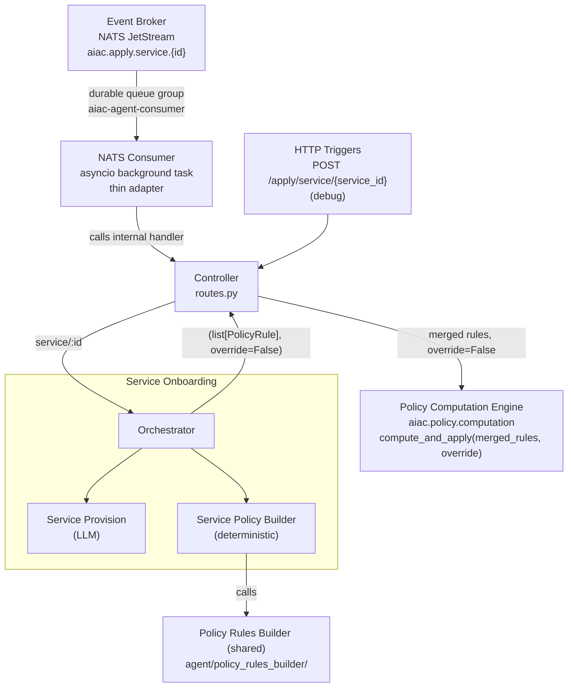

# Component Sub-PRD: UC1 — Service Onboarding

> **Depends on:** [`../aiac-agent.md`](../aiac-agent.md) — NATS Consumer, Controller, Shared Module, Configuration, Error Handling, Runtime.

> **IdP access — library, not service.** All IdP reads and writes go through the **idp-library** API (`aiac.idp.configuration.api.Configuration`), **never** the IdP Configuration **service** (`aiac.idp.service.configuration.*`) or its HTTP endpoints directly. See [aiac-agent.md → IdP access](../aiac-agent.md#idp-access--library-not-service).

## Triggers

| Source | Subject / Path |
|---|---|
| Event Broker (NATS) | `aiac.apply.service.{id}` (originated by Keycloak SPI `CLIENT_CREATED`) |
| HTTP (debug) | `POST /apply/service/{service_id}` |

## Architecture overview

UC1 is the only use case with an Orchestrator, because it is a two-stage pipeline:

1. **Service Provision** (LLM-based): classify the new service, derive its roles + scopes, write them into the IdP.
2. **Service Policy Builder** (deterministic): read the full IdP role + scope universe (excluding the new service's own entities), call the PRB for each applicable pair, and return a merged `list[PolicyRule]` to the Orchestrator.

The Orchestrator returns `(list[PolicyRule], override=False)` to the Controller. The Controller calls the PCE with that `override` flag; the PCE owns all rule reconciliation. UC1 is **incremental** — existing roles receive a partial new mapping and must not lose their other access — so the mode is always append (`override=False`).



## Orchestrator

`onboarding/orchestrator.py`

**Sequence:**
1. Call `ServiceProvisionGraph.invoke()` → get back `ServiceProvision { roles, scopes }` + `service_type`.
2. Call `ServicePolicyBuilder.build(service_id, service_type)` → get back `list[PolicyRule]`. Service Policy Builder re-resolves the focus service from the IdP catalog by its internal client UUID (`service_id`; Provision has already persisted its roles/scopes), so it needs only the id, not the `ServiceProvision`.
3. Return `(list[PolicyRule], override=False)` to the Controller.

No LLM calls or response assembly in the Orchestrator beyond sequencing and the compensating rollback (see [Failure & Rollback](#failure--rollback)).

**Replay safety (at-least-once delivery):** Service Provision IdP writes are **idempotent** (create-or-get by name: `create_service_role` / `create_service_scope` return the existing entity on a duplicate call). The PCE reconcile is also idempotent. If the pod crashes between Service Provision completing and the PCE call, NATS redelivers and the full pipeline re-runs safely to convergence — the success re-run stays idempotent. A build **failure**, however, triggers a **compensating rollback** (see [Failure & Rollback](#failure--rollback)) before the error propagates.

---

## Failure & Rollback

The Orchestrator wraps the `provision → ServicePolicyBuilder.build` pipeline in a compensating rollback. On any of `PolicyConflictError`, `PolicyRulesBuilderError`, `LLMAccessError`, or `UnparseableLLMResponseError`, the Orchestrator rolls back what Service Provision created, logs the rollback actions (info), and **re-raises** the original error. The Controller then maps the re-raised error to its HTTP status (see [aiac-agent.md → Error Handling](../aiac-agent.md#error-handling)).

**Rollback is a full teardown of what Provision created.** The `provision_service` node now returns a **created-manifest** — exactly the roles and scopes it **created** on this run, not the ones it reused by name. For each entity in that manifest, rollback **unmaps then deletes** it (the order the IdP library requires), and unsets the client `type` attribute. It then **disables the Keycloak client** (`enabled=false`), which is the failed-service marker visible in the admin UI. Because rollback tears down only what this run added, it never removes a pre-existing entity that another service shares. The IdP teardown and disable primitives (`delete_service_role`, `delete_service_scope`, `unset_service_type`, enable/disable) are specified in [`../library-idp.md`](../library-idp.md).

**Rollback fires on every attempt.** A permanent failure rolls back once, because the NATS consumer routes it straight to the dead-letter subject (see [aiac-agent.md → Ack contract](../aiac-agent.md#ack-contract)). A retryable `LLMAccessError` re-provisions idempotently and rolls back again on each NATS redelivery. This repeated provision-then-rollback is accepted.

**The success path re-enables the client — but only after the apply.** The Orchestrator does **not** re-enable the client itself. The caller (Controller route or NATS consumer) re-enables it through `reenable_service(service_id)` **after** its `compute_and_apply` (PCE) call succeeds. `reenable_service` sets the client `enabled=true` (idempotent), which clears a failed-disable left by a prior attempt. The re-enable is deliberately post-apply: if `compute_and_apply` fails, the caller never reaches `reenable_service`, so the client stays disabled (the failed-service marker) instead of being left enabled with no applied policy.

**Rollback is UC1-only.** UC2 (Policy Update) and UC3 (Role Update) provision nothing, so they have nothing to tear down and never disable a client.

---

## Sub-agent: Service Provision

`onboarding/provision/`

**Nature:** LLM-based. Classifies the new service (agent or tool), derives roles + scopes from AgentCard / MCP manifest, and **writes them into the IdP**.

All IdP writes and reads target the **idp-library** — `aiac.idp.configuration.api.Configuration` — not the IdP service directly:
- `create_service_role(service_id, role)` — idempotent (create-or-get by name, then map)
- `create_service_scope(service_id, scope)` — idempotent (create-or-get by name, then map)

### Graph

```
START → classify_service → [analyze_agent | analyze_tool] → provision_service → END
```

### Nodes

- **`classify_service`**: resolves identity + determines service type from the operator's authoritative `rossoctl.io/type` label (values `agent`/`tool`) — **not** from the `entity_id` format.
  1. Store `service_id = trigger.entity_id` (the Keycloak **internal client UUID** — `Service.id` — **not** the `clientId`/`serviceId`). The `/apply/service/{service_id}` route and every downstream lookup (`get_service` → `admin.get_client`, and the builder's focus resolution) are keyed on this UUID because a `clientId` can be a slash-bearing SPIFFE URI that a single path segment cannot carry.
  2. Resolve identity: call `get_service(service_id)` from `aiac.idp.configuration.api` → `client.name`, which the rossoctl-operator sets to `"{namespace}/{workload_name}"` for every workload (agents and tools, SPIRE-enabled or not). Split on the first `/` → store `namespace` and `workload_name`. `502` if `client.name` has no `/` (namespace unrecoverable).
  3. LIST pods in `namespace`; select the pod owned by `workload_name` via `ownerReferences` (Deployment → ReplicaSet name prefix, or `StatefulSet`/`Sandbox` name match). A Kubernetes API failure is an immediate `502`. **No matching pod** (not created yet) is a transient not-ready state — re-polled (step 5), not an immediate failure.
  4. Read the `rossoctl.io/type` label on that pod and normalize it to a `ServiceType`
     member via `ServiceType(label.capitalize())` — the label is lowercase
     (`agent`/`tool`); `ServiceType` values are capitalized (`Agent`/`Tool`):
     - `agent` → `ServiceType.AGENT`; route to `analyze_agent`.
     - `tool` → `ServiceType.TOOL`; route to `analyze_tool`.
     - A **present but invalid** value (not `agent`/`tool`; normalization raises `ValueError`) → **immediate** `502` — a real misconfiguration no wait can fix, so the re-poll loop short-circuits.
     - A **missing** label is a transient not-ready state — re-polled (step 5).
  5. **Deploy→onboard race tolerance.** Steps 3–4 run inside a bounded re-poll loop (`_await_service_type`). Onboarding is triggered by a **different** operator action — Keycloak client registration → admin event → NATS — from the label patch, and the two are **not atomic**, so this node can run *before* the operator has patched the `rossoctl.io/type` label onto the pod (or even before the pod exists). A briefly-absent label or a not-yet-created pod is therefore a transient race, re-polled up to `ONBOARD_LABEL_WAIT_ATTEMPTS` times (default `15`) with `ONBOARD_LABEL_WAIT_BACKOFF` seconds between looks (default `2.0` — ≈30s of slack, well under the NATS `AckWait` and the system-test convergence poll). Budget exhausted → `502` naming the workload + label (the unchanged contract for a genuinely never-labelled workload). A Kubernetes API failure (step 3) or a present-but-invalid label (step 4) breaks out immediately — neither is a race.

  > K8s access: `list` on `pods` in the target namespace (both paths).
  > `rossoctl.io/type` is authoritative — applied by the rossoctl-operator (via the AgentRuntime CR) and propagated to pod labels; it is the operator's own agent/tool discriminator (`SkipReason`, rossoctl-operator `internal/clientreg/names.go`). The operator *eventually* applies it to every workload it registers, but the label patch and the Keycloak client registration are **separate, non-atomic** operator actions — and it is the **registration** that fires the onboard event — so the event can reach `classify_service` before the label is patched. This node therefore tolerates a briefly-absent label as a transient race (bounded re-poll, step 5) rather than a hard failure; only a genuinely never-applied label (budget exhausted) or a present-but-invalid value fails loud (`502`, naming the workload + label). The service's `clientId` format (SPIFFE vs plain) reflects whether SPIRE is enabled, **not** the service type, so it is not used for classification (and is why `service_id`/`entity_id` is the slash-free internal UUID, not the clientId).

- **`analyze_agent`**: non-LLM node; reads AgentCard CR.
  1. LIST `AgentCard` CRs (`agent.rossoctl.dev/v1alpha1`) in `namespace`; find the one whose
     `spec.targetRef.name` is `workload_name` (the operator names the CR after the Deployment, e.g.
     `{workload}-deployment-card`, **not** after the workload — so match by `targetRef`, falling back
     to `metadata.name == workload_name` for hand-authored cards).
  2. **AgentCard with synced skills found** → produce `ServiceProvision`. The operator syncs the fetched
     A2A card onto `status.card`; each skill's **key** is its machine `id` (e.g. `source_operations`, a
     stable identifier), or its display `name` as a fallback for a hand-authored card that omits `id` — a
     skill with **neither** is an unusable card → `502` (naming the workload + the offending skill). From
     that `skill_key`, **per skill**:
     - `scopes`: `[ScopeDefinition(name=f"{workloadName}.{skill_key}", description=skill.description) for skill in card.status.card.skills]` —
       the machine `id` (not the display `name`, which may contain spaces) so the scope name is a stable Keycloak identifier.
     - `roles`: **one operator role per skill, mirroring the scope** — `[RoleDefinition(name=f"{workloadName}.{skill_key}", description=skill.description) for skill in …]`.
       Role name == scope name is fine (a realm role and a client scope are distinct Keycloak objects); the **role's
       description** is what the PRB capability-match reads to confine and grant the agent's outbound access on a domain
       basis (see [`policy-rules-builder.md`](policy-rules-builder.md)). This **replaces** the prior single generic
       `{workloadName}.agent`/"Agent role".
     - `reasoning`: `f"derived from AgentCard: {len(skills)} skills"`
  3. **No AgentCard, or its `status.card` has no synced skills yet** (only once the step-4 card-sync wait is exhausted) → produce minimal `ServiceProvision`:
     - `roles`: `[RoleDefinition(name=f"{workloadName}.access", description="Default access scope")]`
     - `scopes`: `[ScopeDefinition(name=f"{workloadName}.access", description="Default access scope")]`
     - `reasoning`: `"partial: no AgentCard found, default scope assigned"` (no CR) or
       `"partial: AgentCard has no synced skills, default scope assigned"` (CR present, unsynced).
  4. **Deploy→onboard race tolerance (AgentCard skill sync).** Steps 1–2 run inside a bounded re-poll loop (`_await_agent_skills`) — a **second, later** race than the `classify_service` label race (step 5 there). The operator syncs the fetched A2A card onto `status.card.skills` only **after** the agent pod is Ready, which lags the Keycloak client registration that fires onboarding, so this node can run while `status.card.skills` is still empty. An absent card, or a card whose skills have not synced yet, is therefore a transient not-ready state, re-polled up to `ONBOARD_CARD_WAIT_ATTEMPTS` times (default `15`) with `ONBOARD_CARD_WAIT_BACKOFF` seconds between looks (default `2.0` — ≈30s of slack, the same budget as the label wait, well under the NATS `AckWait`). It returns as soon as skills appear; the step-3 card-less / skill-less fallback applies **only after** the budget is exhausted — so a genuinely card-less legacy deployment still degrades gracefully, while a real deploy→onboard card-sync race is absorbed rather than mis-provisioned at the default scope. A Kubernetes API failure on the AgentCard LIST is an immediate `502` — not a race.

  > K8s access: `list` on `agentcards.agent.rossoctl.dev` in the target namespace.

- **`analyze_tool`**: non-LLM node; discovers MCP tools. `namespace` + `workload_name` are already resolved by `classify_service` (from the `client.name` split). MCP endpoint lookup uses the **hybrid Keycloak→K8s strategy** decided in issue `6.2` (analyze-tool lookup strategy): the Keycloak client name supplied the key `{namespace, workload_name}`; K8s supplies the reachable endpoint.
  1. Locate MCP endpoint:
     a. GET the K8s `Service` named `workload_name` in `namespace` (operator convention: Service name == workload name).
     b. Require the `protocol.rossoctl.io/mcp` label present on that Service; `502` (actionable) if absent — the label is applied at deploy time, not stamped by the operator.
     c. Build `http://{workload_name}.{namespace}.svc.cluster.local:{port}/mcp`, where `port` is the Service's first port (not hardcoded).
  2. Mint a discovery token via `Configuration.mint_discovery_token(service_id)` — the tool's MCP
     endpoint sits behind its AuthBridge sidecar, whose inbound `jwt-validation` plugin enforces an
     `aud` matching the tool's own Keycloak client-id; the config service mints the token as the tool's
     own client (client-credentials + a self-audience mapper) so it passes that gate. `502` (actionable,
     naming the service id) if minting fails.
  3. Call `tools/list` (HTTP POST, MCP protocol) on the resolved endpoint, sending the minted token as
     `Authorization: Bearer <token>`.
  4. Produce `ServiceProvision`:
     - `roles`: `[]` (tools do not initiate further calls)
     - `scopes`: `[ScopeDefinition(name=f"{workload_name}.{tool.name}", description=tool.description) for tool in manifest.tools]`
     - `reasoning`: `f"derived from MCP manifest: {len(tools)} tools"`
  5. Returns `502` on Service/label lookup failure, discovery-token minting failure, or MCP call failure.

  > K8s access: `get` on `services` in the workload namespace (tool path). Identity is resolved by `classify_service` (config API).
  > MCP path convention: all MCP tool services must serve at `/mcp` and carry the `protocol.rossoctl.io/mcp` label. This label is a **deploy-time prerequisite** — the rossoctl-operator does not stamp it today; automatic stamping is requested upstream (`docs/issues/rossoctl-operator-mcp-label-stamping.md`). Until then it must be applied at deploy time; `analyze_tool` fails loud (`502`, naming the workload + missing label) if it is absent.
  > Discovery auth: the tool's inbound `jwt-validation` plugin stays fully enforcing — there is no
  > path bypass for `/mcp`. `analyze_tool` authenticates instead of relaxing the sidecar's auth.

- **`provision_service`**: non-LLM node; calls `create_service_role` and `create_service_scope` from `aiac.idp.configuration.api` for each entry in `ServiceProvision`. Reads `service_id` from state. Writes are **idempotent** (create-or-get).
  - Also persists the discovered `service_type` onto the Keycloak client via `Configuration.set_service_type(service, service_type)`, which stores it as the **`client.type`** attribute. This is the **authoritative origin** of the attribute that the IdP library's `Service._resolve_keycloak_fields` reads back (see the IdP library spec's type-resolution precedence). No case mapping is needed here: `service_type` is a `ServiceType` (values `Agent`/`Tool`), already matching `client.type` and `Service.type`. Case normalization happens once, upstream, when `classify_service` reads the lowercase `rossoctl.io/type` label.

### State: `OnboardingProvisionState`

Extends `BaseAgentState` with:

| Field | Type | Description |
|---|---|---|
| `service_id` | `str \| None` | Keycloak **internal client UUID** (`Service.id`) = `trigger.entity_id` — not the `clientId` |
| `namespace` | `str \| None` | From the `client.name` split in `classify_service` (agents and tools) |
| `workload_name` | `str \| None` | From the `client.name` split in `classify_service` (agents and tools) |
| `service_type` | `ServiceType \| None` | `agent` or `tool`; routing field |
| `service_provision` | `ServiceProvision \| None` | Populated by `analyze_agent` or `analyze_tool` |

### Types

`ServiceType` is **not** redefined here — it is imported from `aiac.idp.configuration.models`
(the same enum backing `Service.type`), so the sub-agent, the IdP library, and the IdP service
share one vocabulary:

```python
# aiac.idp.configuration.models — shared, reused by the sub-agent (do not duplicate):
class ServiceType(str, Enum):
    AGENT = "Agent"   # values capitalized to match the Keycloak client.type attribute
    TOOL = "Tool"
```

The remaining types are sub-agent–local (in `provision/types.py`). `RoleDefinition` /
`ScopeDefinition` are deliberately distinct from the IdP `Role` / `Scope` models: a derived
role/scope is a pre-persistence *name + description* with no Keycloak `id` yet (idp `Role`
requires `id` + `composite`, `Scope` requires `id`), so it cannot be an idp model until
`provision_service` writes it.

```python
class RoleDefinition(BaseModel):
    name: str
    description: str

class ScopeDefinition(BaseModel):
    name: str
    description: str

class ServiceProvision(BaseModel):
    roles: list[RoleDefinition]
    scopes: list[ScopeDefinition]
    reasoning: str  # machine-generated provenance string
```

---

## Sub-agent: Service Policy Builder

`onboarding/policy_builder/`

**Nature:** deterministic IdP reader + PRB invoker.

**Purpose:** given the just-provisioned service's `service_id`, source candidates from the same worldview as the Policy Computation Engine (PCE) — `get_services()` for correct `kind`/ownership, `get_subjects()` for membership-derived user roles — exclude the focus service's own entities **by ownership**, call the PRB for each applicable (roles, scope) or (role, scopes) pair, and return a merged `list[PolicyRule]` to the Orchestrator.

**Why `service_id`, not `ServiceProvision`:** own roles/scopes must be id-bearing `Role`/`Scope` — `flatten_role` needs a `Role` (with `childRoles`) and the PRB builds `PolicyRule(role=Role, scope=Scope)`. The Provision-time `RoleDefinition`/`ScopeDefinition` carry only name+description (no Keycloak id), so they cannot be passed to the PRB. Provision has already persisted these entities, so resolving the focus service from `get_services()` returns them with ids and correct `kind`.

**Terminology — own vs candidate (used throughout this section):**
- **Own roles / own scopes** — the focus service's `aiac.managed` roles/scopes, found on the `Service` object returned by `get_services()` (matched by `id == service_id`, the internal client UUID). These are exactly the entities Service Provision wrote.
- **Candidate roles** — every role eligible to be mapped onto an own scope: other services' `aiac.managed` roles (`kind=Agent`) plus membership-derived user roles (`kind=User`; realm roles held by at least one user, composite-expanded, and not owned by any service). Never includes the focus service's own roles.
- **Other scopes** — every other service's `aiac.managed` scope (`scope.serviceId != service_id`). Never includes the focus service's own scopes.

**Self-mapping invariant (must hold):** the PRB must **never** be handed an *(own role, own scope)* pair — a service's own role must never be mapped to its own scope. Onboarding only ever grants **cross-service** access: *who else* may call this service, and (agents only) *what else* this service may call. A service's own role reaching its own scope is not something onboarding needs to author (that access is intrinsic and out of scope here) and would pollute the policy set. The Service Policy Builder sub-agent guarantees the invariant **by construction** through two complementary guards:

1. **Exclusion (own entities never appear on the candidate side), by ownership.** Own roles/scopes are identified by `role.id` / `scope.serviceId` matching the focus service — never by name — and are never added to `candidate_roles` / `other_scopes` (steps 3–4). This is immune to name collisions between services.
2. **Call direction (each call's "self" side is one own entity of the *opposite* kind).** Each PRB call pairs a single own entity with the candidate-side universe, never own-with-own, and keeps the semantic intent crisp:
   - `build_scope_rules(candidate_roles, own_scope)` = *who else may call this skill* (an **own scope** against candidate roles)
   - `build_role_rules(own_role, other_scopes)` = *what else may this role call* (an **own role** against other scopes; agent path only)

Neither guard alone is sufficient — ownership-based exclusion keeps own entities off the candidate side, and the call direction keeps the self side and the other side of *opposite* kinds (a scope vs roles, or a role vs scopes). Together they make an *(own role, own scope)* pair unrepresentable in any PRB call.

### Steps

1. Receive `service_id: str` + `service_type: ServiceType` from the Orchestrator.
2. Fetch `services = get_services()`, `all_scopes = get_scopes()`, `subjects = get_subjects()` from `aiac.idp.configuration.api`.
3. Resolve the focus service: `focus = next((s for s in services if s.id == service_id), None)` (matching on `id`, the internal client UUID carried by the route/`Trigger.entity_id` — **not** `serviceId`/clientId, which may be a slash-bearing SPIFFE URI); if `focus is None`, raise a clear `404` rather than letting `next(...)` raise `StopIteration`.
4. Compute candidate sets, all by ownership:
   - **own roles/scopes** — `focus.roles`/`focus.scopes` filtered to `aiac.managed` (drops Keycloak's built-in default client scopes, e.g. `profile`, which are stamped with this service's `serviceId` but are not `aiac.managed`).
   - **other-agent roles** — `aiac.managed` roles from every *other* service's `roles` (`kind=Agent`, ownership-excluded by `serviceId != focus.serviceId`).
   - **user roles** — realm roles linked to at least one subject (via `subjects[*].roles`, composite-expanded through `flatten_role`) and not owned by any service (`role.id` not in the union of every service's role ids). These carry `kind=User`.
   - **other scopes** — `aiac.managed` scopes from `all_scopes` with `serviceId != focus.serviceId`.
5. **Flatten candidate roles to their closure** before any PRB call, via the shared `flatten_role` helper (see [Composite role flattening](#composite-role-flattening)): union of other-agent roles + user roles, deduplicated by `role.id` (`candidate_roles`); on the agent path, also expand each of the focus service's own roles.
6. Call PRB and merge. Wrap each PRB call; catch `PolicyContradictionError`, accumulate `(focal, contradictions)`, and **continue** the fan-out (accumulate-and-merge). A hard failure — `PolicyRulesBuilderError`, `LLMAccessError`, or `UnparseableLLMResponseError` — aborts the fan-out immediately and propagates, so the Orchestrator can roll back (see [Failure & Rollback](#failure--rollback)). The PRB raise semantics are specified in [`policy-rules-builder.md`](policy-rules-builder.md) (handoff 03).
   - **`service_type = tool`:** call `build_scope_rules(candidate_roles, scope)` for each of the focus service's own scopes. Merge results into a single `list[PolicyRule]`.
   - **`service_type = agent`:** call `build_scope_rules(candidate_roles, scope)` for each own scope; for each of the focus service's own roles, call `build_role_rules(r, other_scopes)` **once per role `r` in that role's closure**. Merge all results into a single `list[PolicyRule]`.
7. Merge contradictions into one report. After the fan-out, run `detect_conflicts` and **union** its deterministic conflicts with the accumulated auditor contradictions into a single `ConflictReport` (a withheld focal appears as a Conflict row). If the report has any conflicts, run a best-effort `enrich_report`, then raise `PolicyConflictError(report)` — which the Controller maps to `422`. If the report has no conflicts, continue.
8. Return the merged `list[PolicyRule]` to the Orchestrator. (The Orchestrator pairs it with `override=False` for the Controller — see [Architecture overview](#architecture-overview).)

**Note on "all relevant scopes":** relevance (which of `other_scopes` maps to each `agent_role`) is determined by the PRB, not here. This module always passes the full ownership-excluded scope universe; the PRB emits only the relevant rule mappings. See [`policy-rules-builder.md`](policy-rules-builder.md).

### Composite role flattening

Every role passed to the PRB is first flattened to its **closure** via the shared
`flatten_role` helper (aiac-agent Shared Module): recursively collect the role and all
descendant roles from `role.childRoles` into a flat list, de-duplicated by `role.id`
(`Role` is not hashable, so de-duplication tracks seen `id`s rather than adding `Role`
objects to a `set`). A non-composite role yields a list containing only itself. The PRB
therefore receives already-flattened roles, and the PCE performs no further flattening.

## File structure

```
src/aiac/agent/uc/
└── onboarding/
    ├── orchestrator.py
    ├── provision/
    │   ├── __init__.py
    │   ├── graph.py      ← ServiceProvisionGraph (LLM-based StateGraph)
    │   ├── nodes.py      ← classify_service, analyze_agent, analyze_tool, provision_service
    │   ├── state.py      ← OnboardingProvisionState
    │   └── types.py      ← RoleDefinition, ScopeDefinition, ServiceProvision (ServiceType imported from aiac.idp.configuration.models)
    └── policy_builder/
        ├── __init__.py
        └── builder.py     ← ServicePolicyBuilder.build(service_id, service_type) → list[PolicyRule]
```

## Out of scope

- PRB internals — see [`policy-rules-builder.md`](policy-rules-builder.md).
- PCE reconcile mechanics — see [`../policy-computation-engine.md`](../policy-computation-engine.md).
- Response body shape — no success body; handlers return bare HTTP status codes (error responses carry FastAPI's default JSON error body from the raised `HTTPException`). Summary + debug go to the log.
- MCP endpoint lookup strategy for tools — **resolved** (hybrid Keycloak→K8s) in `docs/issues/agent/service-onboarding/6.2-analyze-tool-lookup-strategy.md` and reflected in the `analyze_tool` node above.
