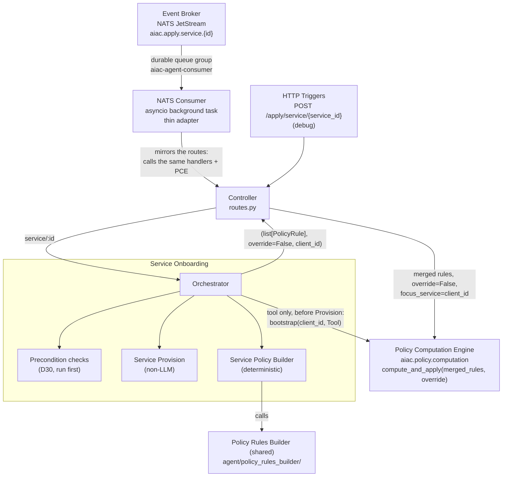

# Component Sub-PRD: UC1 — Service Onboarding

> **Depends on:** [`../aiac-agent.md`](../aiac-agent.md) — NATS Consumer, Controller, Shared Module, Configuration, Error Handling, Runtime.

> **IdP access — library, not service.** All IdP reads and writes go through the **idp-library** API (`aiac.idp.configuration.api.Configuration`), **never** the IdP Configuration **service** (`aiac.idp.service.configuration.*`) or its HTTP endpoints directly. See [aiac-agent.md → IdP access](../aiac-agent.md#idp-access--library-not-service).

## Triggers

| Source | Subject / Path |
|---|---|
| Event Broker (NATS) | `aiac.apply.service.{id}` (originated by Keycloak SPI `CLIENT_CREATED`) |
| HTTP (debug) | `POST /apply/service/{service_id}` |

## Architecture overview

UC1 is the only use case with an Orchestrator, because it is a two-stage pipeline:

1. **Service Provision** (non-LLM): classify the new service, derive its roles + scopes, write them into the IdP.
2. **Service Policy Builder** (deterministic): read the candidates from the IdP (the roles and scopes of the other services, by owner service, and the user roles), call the PRB for each applicable pair, and return a merged `list[PolicyRule]` to the Orchestrator.

Before the two stages, the Orchestrator runs the enforcement [precondition checks](#precondition-checks-d30) (D30). A service whose pod cannot enforce its CR gets no roles, no scopes and no rules. Then, for a tool only, the PCE `bootstrap` writes the tool's CR before Provision, so that discovery through the tool's own inbound passes D20 (see [Tool discovery and the bootstrap CR](#tool-discovery-and-the-bootstrap-cr)).

The Orchestrator returns `(list[PolicyRule], override=False, client_id)` to the Controller. The Controller calls the PCE with that `override` flag and `focus_service=client_id`; the PCE owns all rule reconciliation. UC1 is **incremental** — existing roles receive a partial new mapping and must not lose their other access — so the mode is always append (`override=False`).

**A successful onboarding always stores the focus SPM (D21).** The PCE stores the SPM of the focus service also when the build returns zero rules. So the service joins the managed set (the services that have a stored SPM), and the PCE deploys a CR for it (D23). Under target side, the CR holds the rules of the service; an inbound package with no allow denies every request (D25). Under agent side, an agent gets its agent CR, and a tool gets a pass-through CR (D24).


```mermaid
flowchart TD
    NATS["Event Broker\nNATS JetStream\naiac.apply.service.{id}"]
    NATS_CONSUMER["NATS Consumer\nasyncio background task\nthin adapter"]
    TRIGGERS["HTTP Triggers\nPOST /apply/service/{service_id}\n(debug)"]
    CTRL["Controller\nroutes.py"]

    NATS -->|"durable queue group\naiac-agent-consumer"| NATS_CONSUMER
    NATS_CONSUMER -->|"mirrors the routes:\ncalls the same handlers + PCE"| CTRL
    TRIGGERS --> CTRL

    subgraph CO["Service Onboarding"]
        ORC["Orchestrator"]
        CHK["Precondition checks\n(D30, run first)"]
        SA_PROV["Service Provision\n(non-LLM)"]
        SA_POL["Service Policy Builder\n(deterministic)"]
        ORC --> CHK
        ORC --> SA_PROV
        ORC --> SA_POL
    end

    PRB["Policy Rules Builder (shared)\nagent/policy_rules_builder/"]
    PCE["Policy Computation Engine\naiac.policy.computation\ncompute_and_apply(merged_rules, override)"]

    CTRL -->|"service/:id"| ORC
    ORC -->|"tool only, before Provision:\nbootstrap(client_id, Tool)"| PCE
    SA_POL -->|"calls"| PRB
    ORC -->|"(list[PolicyRule], override=False, client_id)"| CTRL
    CTRL -->|"merged rules, override=False,\nfocus_service=client_id"| PCE
```

## Orchestrator

`onboarding/orchestrator.py`

**Sequence:**
0. Read the `Service` once (`get_service(service_id)`, by the UUID) and take its clientId (`Service.serviceId`) — the only service id the PCE takes. A `404` on this read means that the new client is not visible yet: the Orchestrator reads it again for a bounded time (see [The first read waits for a new client](#the-first-read-waits-for-a-new-client-d33) below). This read comes before Provision, so if it fails, nothing exists yet that needs compensation: the Orchestrator raises `HTTPException(502)`, as Provision does for the same read — `ServiceNotVisibleError` (a `502`) when the client is still not visible after the wait, and a plain `HTTPException(502)` at once for any other error. The rollback reuses this `Service`.
1. Run the [precondition checks](#precondition-checks-d30) (D30) on the focus service. They run before Provision and before the PRB. A failed check raises `EnforcementPreconditionError`. Nothing has changed yet, so there is no rollback and no quarantine.
1b. For an enabled tool only, call the PCE `bootstrap(client_id, ServiceType.TOOL)`. A disabled (quarantined) tool gets no bootstrap: its discovery fails at the token mint anyway (C5), and the CR would stay until the next resync (see [Tool discovery and the bootstrap CR](#tool-discovery-and-the-bootstrap-cr)). It writes the tool's CR before Provision, so that discovery passes D20. The type comes from the pod label that the checks read. An agent gets no bootstrap.
2. Call `build_provision_graph().invoke(...)` → get back `service_type` and the created-manifest (`created_roles`, `created_scopes`).
3. Call `ServicePolicyBuilder.build(service_id, service_type)` → get back `list[PolicyRule]`. Service Policy Builder re-resolves the focus service from the IdP catalog by its internal client UUID (`service_id`; Provision has already persisted its roles/scopes), so it needs only the id, not the `ServiceProvision`.
4. Return `(list[PolicyRule], override=False, client_id)` to the Controller. `onboard_service(service_id)` returns this 3-tuple; the caller passes `client_id` to the PCE as `focus_service`, so it makes no second IdP read. It takes no default-effect argument: a pair that no rule mentions is always DENY.

No LLM calls or response assembly in the Orchestrator beyond sequencing and the compensating rollback (see [Failure & Rollback](#failure--rollback)).

**Replay safety (at-least-once delivery):** Service Provision IdP writes are **idempotent** (create-or-get by name: `create_service_role` / `create_service_scope` return the existing entity on a duplicate call; `link_subject_scope` converges to one state — the scope with its mapper, linked as a default scope — so a second call changes nothing). The PCE reconcile is also idempotent. If the pod crashes between Service Provision completing and the PCE call, NATS redelivers and the full pipeline re-runs safely to convergence — the success re-run stays idempotent. A build **failure**, however, triggers a **compensating rollback** and a PCE **quarantine** (see [Failure & Rollback](#failure--rollback)) before the error propagates. A failed precondition check changes nothing.

### The first read waits for a new client (D33)

**Why.** The Keycloak SPI listener runs inside the admin request. Without the SPI fix (publish after the commit, [D33](../../PRD.md#key-architectural-decisions)), the `CLIENT_CREATED` event, and with it the `aiac.apply.service.{id}` message, can come **before** Keycloak commits the new client. Then the first `get_service` gets `404`: the IdP Configuration Service keeps the Keycloak `404` (see [`../idp-configuration-service.md`](../idp-configuration-service.md)), and the IdP library raises `IdPHTTPError` with `status == 404` and does not retry a `4xx` (see [`../library-idp.md`](../library-idp.md)). If the Orchestrator failed at once, the next try would be the NATS redelivery after `AckWait` (600 s). During that time the new agent or tool has no CR, so the global combiner denies it (D20).

**The wait.** The Orchestrator (`_read_service`) treats a `404` on this first read as "not visible yet" and reads the `Service` again. The read is the whole `get_service`, so a `404` on one of its sub-reads (the roles or the scopes of the service, or the composites of a role that was deleted during the read) also gives a new read. The library retries a `5xx` first (`UPSTREAM_MAX_RETRIES`), and it does not retry a `404`. The poll uses the same mechanic as the label wait of `classify_service` (`poll_until_ready`, see [Nodes](#nodes)):

| Knob | Default | Meaning |
|---|---|---|
| `ONBOARD_CLIENT_WAIT_ATTEMPTS` | `15` | The maximum number of reads (minimum `1`). |
| `ONBOARD_CLIENT_WAIT_BACKOFF` | `2.0` | The seconds between two reads (minimum `0`). There is no sleep after the last read. |

The default budget is ≈30 s (15 reads, 28 s of sleep). The knobs are read from the environment at call time. A non-numeric, non-finite (for example `inf`) or below-minimum value falls back to the default. `k8s/` does not set them.

- When a read returns the `Service`, the onboarding continues at once (the precondition checks, then the bootstrap of a tool, then Provision).
- When the client is still not visible after the budget, the Orchestrator raises `ServiceNotVisibleError`. It is a subclass of `HTTPException(502)`, with the detail `IdP config unavailable resolving service '<uuid>': the client is not visible after <n> reads (ONBOARD_CLIENT_WAIT_*): HTTP 404: …`, and the last `404` as its `__cause__`. The route `POST /apply/service/{service_id}` answers `502`. The NATS consumer treats it as retryable, and naks it with a delay: `AIAC_NOT_VISIBLE_NAK_DELAY_SECONDS` (default `30` s). So the redelivery comes after the delay, not after `AckWait` (600 s). Each nak uses one of the `MAX_DELIVER` (5) deliveries (see [aiac-agent.md → Ack contract](../aiac-agent.md#ack-contract)).
- Any other error of the read is not the race: a `5xx` (after the library retries), another `4xx`, or a connection error. The Orchestrator raises a plain `HTTPException(502, "IdP config unavailable resolving service '<uuid>': …")` at once, chained to the error, as before.

In each failure case nothing has changed yet: no precondition check, no bootstrap, no Provision, no rollback, no client disable and no quarantine. Provision's `classify_service` reads the `Service` again, with no wait: the first read already saw the client.

**Every `404` waits.** The Orchestrator cannot tell a client that Keycloak has not committed yet from a client that does not exist. So each `404` on the first read costs the full budget (≈28 s with the defaults) before the `502`:

- **The manual route.** Before this change, `POST /apply/service/{service_id}` with an unknown UUID (for example, a typing error) or with the UUID of a deleted client answered `502` at once. Now it answers `502` (`ServiceNotVisibleError`) after the wait. During the wait, the request holds one threadpool worker and the lock of that UUID only, so the onboarding of other services is not blocked. Give the caller a timeout that is longer than the budget (for example, `curl --max-time 60`).
- **The event path.** An event for a client that never becomes visible costs the full budget at each delivery: a phantom event (Keycloak rolled back the create after the event; this can occur only without the SPI fix), or an event that comes after the client was deleted (for example, a redelivery after a teardown). The consumer handles one message at a time, so the next messages wait during each budget. With the default knobs, the message gets to `aiac.apply.dlq` after five deliveries, and the five budgets block the consumer for about 140 s in total (see [aiac-agent.md → Ack contract](../aiac-agent.md#ack-contract) for the nak delay between the deliveries).
- **A wrong configuration.** Some configuration errors also give a `404` on this read, so they also wait for the whole budget and then give `ServiceNotVisibleError`, not the race: a wrong realm (Keycloak answers `404` for the realm, and the IdP Configuration Service keeps it), or a wrong path in `AIAC_PDP_CONFIG_URL` (FastAPI answers `404` with `{"detail": "Not Found"}`). The detail of `ServiceNotVisibleError` ends with the body of the last `404`. Read it to tell these cases from a client that is not visible.

This cost is accepted: the default budget is short, and after the SPI fix an event for a client that does not exist is rare.

**Keep the budget short.** The wait runs inside the per-service lock (`_service_lock`), and the NATS consumer handles one message at a time. So a wait blocks the next messages for its whole budget.

**Defense in depth.** The SPI fix removes the race at its root: the SPI publishes the event only after a successful commit. The wait stays as a second protection, for example when an SPI image without the fix is deployed.

---

## Precondition checks (D30)

The Orchestrator runs these checks **first**: after it reads the `Service` (step 0), and before Provision and the PRB. Each check tells whether the pod of the focus service can enforce its CR. A failed check costs no IdP write of roles or scopes, no CR write (the checks also come before the bootstrap) and no LLM call.

| Check | Reads | Passes when |
|---|---|---|
| #1 — the sidecar | the live pods of the service | Every live pod has the AuthBridge sidecar container `authbridge-proxy`. Without it, no OPA is in front of the service, and its CR has no effect. |
| #2 — the pipeline | the ConfigMap `authbridge-runtime-config` in the service namespace (key `config.yaml`, `pipeline.inbound.plugins[].name`) | `opa` is in the inbound pipeline. For a tool, `mcp-parser` is also in it, because the tool's inbound package checks `input.mcp.params.name` (D26). Under agent side, `opa` is also in the outbound pipeline (`pipeline.outbound.plugins[].name`). A missing ConfigMap fails the check. |
| #6 — the probes | the live pods of the service | In every live pod, no app container (every container except `authbridge-proxy`) has an `httpGet` readiness, liveness or startup probe. A kubelet probe carries no identity. No request without identity passes a rules-based inbound package (D27), so an `httpGet` probe through the proxy fails. |

**Scope for each side.** Under target side, the checks run for every service, agent or tool. Under agent side, they run for agents only: a tool gets a pass-through CR, which needs no check (D24).

**The pods and the type.** The checks find the pods of the service, and its type (agent or tool), as `classify_service` does: the `client.name` split, the pod selection by `ownerReferences`, the `rossoctl.io/type` label, and the same bounded re-poll (`ONBOARD_LABEL_WAIT_*`). A pod or a label that is not there yet is a deploy→onboard race, not a failed check. A terminating pod (one with a `deletionTimestamp`) does not count. When the checks apply, a pod that fails #1 or #6 is also polled again in the same `ONBOARD_LABEL_WAIT_*` window, because the operator can still roll the pod onto the AuthBridge-injected template. When the budget ends, #1 and #6 report the labelled pods of the last look. If that look found no labelled pod, the result is a `502`, as in `classify_service`. A Kubernetes API failure is a `502`, as in Provision.

**A failed check.** The Orchestrator runs every check, then raises `EnforcementPreconditionError(failures)` if one or more checks failed. Each item of `failures` names one failed check. The error has these effects:

- The Controller maps it to **HTTP 409**, with the body `{"detail": "…", "failed_checks": [...]}` (see [aiac-agent.md → Error Handling](../aiac-agent.md#error-handling)).
- The NATS consumer treats it as **permanent**: it routes the message to the DLQ and calls `term()` at the first delivery (see [aiac-agent.md → Ack contract](../aiac-agent.md#ack-contract)).
- It is **not** a rollback error. The checks run first, so nothing has changed yet: there is no rollback, no client disable and no quarantine. At a first onboarding the service then has no CR, so D20 denies it (fail closed). An onboarded service keeps its SPM and its CR, so it keeps its policy.

After a fix in the cluster, the operator starts the onboarding again (for example, `POST /apply/service/{service_id}`). The client stays enabled, so this works for an agent and for a tool (the known limit C5 applies only to a quarantined tool; see [Failure & Rollback](#failure--rollback)).

> K8s access: `list` on `pods` in the service namespace (#1, #6); `get` on `configmaps` in the service namespace (#2). See [aiac-agent.md → Kubernetes RBAC](../aiac-agent.md#kubernetes-rbac).

**#4 is a start check, not an onboarding check.** At each Controller start, the global combiner must deny a pod that has no client CR, else the Controller stops (see [aiac-agent.md → Start sequence](../aiac-agent.md#start-sequence)).

**Known limit — #3, a direct path to the app port, is documented only.** AIAC does not check it. In reverse-proxy mode (the default), the sidecar covers only the first port of the first container, and the app moves to another port. Other pods can reach that moved app port directly, with no JWT and no OPA. Use transparent mode (it covers all ports), or a NetworkPolicy that admits only the proxy port.

**Known limit — the AgentCard sync.** When no `<agent>-card-signed` ConfigMap exists, the operator fetches the agent card over HTTP with no token from the first Service port. Only the optional `agentcard-signer` init container writes that ConfigMap. The demo reaches the moved app port directly (the #3 hole). If that path is closed, D20 and D27 deny the fetch, and the agent onboarding fails: the card does not sync, so `analyze_agent` gets no skills (after the card wait it falls back to the default scope). Then use the signed-card ConfigMap. This is a known limit only.

**Known limit — the probes and the open paths (D27).** Callees must use `tcpSocket` or `exec` probes (#6). Through the proxy, the A2A agent card and `/metrics` are also denied, because these requests carry no identity.

**Known limit — #2 reads the namespace ConfigMap, not the pod.** The webhook copies the namespace pipeline into the pod configuration at pod CREATE only. A pod that was created before a change of `authbridge-runtime-config` can run an older pipeline, and #2 does not see this. Restart the pods after a pipeline change.

## Tool discovery and the bootstrap CR

`analyze_tool` sends `tools/list` to the tool's MCP endpoint through the tool's AuthBridge inbound, with a discovery token (see [Sub-agent: Service Provision](#sub-agent-service-provision)). Two policy decisions apply to this call:

- **D20 — a pod that has no CR is denied.** At the first onboarding the tool has no CR yet. So the Orchestrator calls the PCE `bootstrap(client_id, ServiceType.TOOL)` before Provision. It writes the tool's CR and stores no SPM (see [`../policy-computation-engine.md` → Bootstrap CR (tool discovery)](../policy-computation-engine.md#bootstrap-cr-tool-discovery)). Under target side, the CR is rendered from the stored SPM, or from a zero-rule SPM: its inbound allows only the self-discovery rule (plus any stored rules), and its outbound is a pass-through. Under agent side, the CR is a pass-through CR. The type comes from the pod label that the precondition checks read, because the catalog type is not set before Provision.
- **D26 — the tool inbound checks each caller (target side).** The discovery identity holds no granted user role and no granted agent role. So the tool inbound has a **self-discovery rule**: it allows the four MCP session methods (`initialize`, `notifications/initialized`, `ping`, `tools/list`), never `tools/call`, when `input.identity.client_id` equals the tool's own clientId (the constant `self_client_id`). This works because the discovery token is minted as the tool's own client (client credentials): its `azp` claim, which `jwt-validation` gives as `input.identity.client_id`, is the tool's clientId. A call from an agent carries the agent's clientId, so it never matches. See [`../pdp-policy-writer-opa.md` → Tool inbound package](../pdp-policy-writer-opa.md#tool-inbound-package-target-side-authbridgeclientinboundrequest).

So the onboarding order of a tool is: precondition checks → `bootstrap` → Provision (with the discovery) → PRB. An agent gets no bootstrap, because AIAC does not call an agent at onboarding.

The bootstrap CR takes effect at the next poll of the tool's OPA plugin (10 s min, up to 120 s). Discovery waits for it: `AIAC_MCP_DISCOVERY_READY_TIMEOUT` (default 180 s) covers that poll (see `analyze_tool` step 3). If the build fails, the quarantine deletes the bootstrap CR. If the onboarding stops in a different way, the bootstrap CR stays until the next onboarding of the tool, or until the resync deletes it (the tool has no SPM).

---

## Failure & Rollback

The Orchestrator wraps the `provision → ServicePolicyBuilder.build` pipeline in a compensating rollback. On any of `PolicyConflictError`, `PolicyRulesBuilderError`, `LLMAccessError`, or `UnparseableLLMResponseError`, the Orchestrator does these steps in this order. A failed precondition check (`EnforcementPreconditionError`) is not one of these errors: it causes no rollback and no quarantine (see [Precondition checks](#precondition-checks-d30)). The trigger is the same for agents and tools, and it fires on the first failure (also for the retryable `LLMAccessError`).

1. It rolls back what Service Provision created (`_rollback`) and logs the rollback actions (info). The last rollback step disables the client.
2. It calls the PCE `quarantine(client_id, created_roles)` (the clientId resolved in step 0, not the UUID) (see [`../policy-computation-engine.md` → Quarantine (failed onboarding)](../policy-computation-engine.md#quarantine-failed-onboarding)). The quarantine deletes the SPM of the service and removes its roles from the other SPMs (also the created roles, which the rollback deleted from the IdP, so the catalog no longer lists them), but not a role that another service in the catalog also holds (a shared role, [D32](../../PRD.md#key-architectural-decisions)). The edges of a shared role stay, and the PCE renders again the CRs of the SPMs that have them, without the service (a disabled service is not a holder; these SPMs are not written). The quarantine also deletes the CR of the service (`delete_service_cr`, for an agent and for a tool; for a tool, also a bootstrap CR), and deploys the CRs of the affected services of the current side. The service leaves the managed set (D21). The global combiner denies a pod that has no client CR, so the service is then denied (D20). The delete takes effect at the next poll of the OPA plugin of the service (up to 120 s).
3. It **re-raises** the original error.

The disable comes before the quarantine, so no run after the teardown sees the service as enabled. The quarantine runs even when the rollback raises, so a failed rollback never leaves a first onboarding fail-open. If the rollback or the quarantine fails, that error propagates instead of the original error (the build error stays on its `__context__`). This is deliberate: a compensation failure is not a permanent error, so the NATS consumer redelivers and the next run tries the compensation again. If the build error won, a permanent build error would stop redelivery and leave a half-compensated service fail-open. The Orchestrator never imports `aiac.pdp.policy.library`: the PCE owns the PDP. The Controller then maps the re-raised error to its HTTP status (see [aiac-agent.md → Error Handling](../aiac-agent.md#error-handling)).

**Rollback is a full teardown of what Provision created.** The `provision_service` node now returns a **created-manifest** — exactly the roles and scopes it **created** on this run, not the ones it reused by name. For each entity in that manifest, rollback **unmaps then deletes** it (the order the IdP library requires). The rollback **keeps the client `type` attribute**: it removes only what this run created, and this run did not create the type. It then **disables the Keycloak client** (`enabled=false`) as the last step. The disabled client is the failed-service marker visible in the admin UI. Because rollback tears down only what this run added, it never removes a pre-existing entity that another service shares. **The shared subject scope `aiac-username-sub` is never in the manifest** ([D31](../../PRD.md#key-architectural-decisions)): it is not an own scope of the service. Every AIAC-managed client links it, also when the IdP Configuration Service created it in this run. So the rollback never deletes the scope or its link, and the disabled client keeps the link. The quarantine makes no IdP write, so it never deletes the scope either. The offboarding (the PCE `decommission`) also makes no IdP write: when the client is deleted, Keycloak removes the links of that client, and the scope stays for the other clients. The IdP teardown and disable primitives (`delete_service_role`, `delete_service_scope`, enable/disable) are specified in [`../library-idp.md`](../library-idp.md).

**Rollback fires on every attempt.** A permanent failure rolls back once, because the NATS consumer routes it straight to the dead-letter subject (see [aiac-agent.md → Ack contract](../aiac-agent.md#ack-contract)). A retryable `LLMAccessError` re-provisions idempotently and rolls back (and quarantines) again on each NATS redelivery. This repeated provision-then-rollback is accepted. This is true for an agent only. For a tool, a redelivery fails in Provision at the discovery-token mint (see the known limit below), so it never gets to the build.

**The success path re-enables the client — but only after the apply.** The Orchestrator does **not** re-enable the client itself. The caller (Controller route or NATS consumer) calls `compute_and_apply(rules, override, focus_service=client_id)` (the clientId from `onboard_service`) and then re-enables the client through `reenable_service(service_id)` (an IdP call, by the UUID) **after** that call succeeds. `reenable_service` sets the client `enabled=true` (idempotent), which clears a failed-disable left by a prior attempt. The re-enable is deliberately post-apply: if `compute_and_apply` fails, the caller never reaches `reenable_service`, so the client stays disabled (the failed-service marker) instead of being left enabled with no applied policy.

**Only a successful re-onboarding lifts a quarantine.** The precondition checks run again first. The PRB rebuilds the rules. The routing guard of the PCE keeps them, because the service is the `focus_service` (its client is still disabled at this time). `compute_and_apply` stores the SPM of the service again (also with zero rules, D21), so the service is back in the managed set, and the PCE writes its CR again. The quarantine deleted that CR, so the service stays denied until the new CR takes effect at the next poll of its OPA plugin. In the same call, the PCE deploys again the CRs of the live SPMs that have an edge of a role of the service (for example a shared role that the rollback kept mapped, [D32](../../PRD.md#key-architectural-decisions)), with the service as a holder again. Under agent side, it deploys the agents among them, and a tool keeps its pass-through CR. The quarantine rendered these CRs without the service and did not write their SPMs, so the stale-holders check of the PCE does not find them, and the rebuilt rules need not touch them. The PCE writes only those of these SPMs whose stored holders are stale (a run wrote them while the service was quarantined), so the snapshot of each one names the holders that its CR names (see [`../policy-computation-engine.md` → Quarantine (failed onboarding)](../policy-computation-engine.md#quarantine-failed-onboarding)). The lift does not wait for a role-members event. Provision maps the kept role again, and Keycloak records a `REALM_ROLE_MAPPING` event also for a mapping that is already there. But the platform Keycloak does not publish that subject yet (see [aiac-agent.md → Role-membership change](../aiac-agent.md#role-membership-change-d32)). With the publisher, on the NATS path the event comes only after the onboarding, because the consumer handles one message at a time. On the HTTP route `POST /apply/service/{service_id}`, the event can come before the re-enable. Its re-render then sees the service still disabled and keeps it out of the shared CRs, and the lifted snapshots already name it, so only a later role-members event, a rules change or the resync puts it back (a known limit, see [`../policy-computation-engine.md` → Role holders at render time (D32)](../policy-computation-engine.md#role-holders-at-render-time-d32)). Then `reenable_service` re-enables the client. The UC2 rebuild route is a stub, so it does not lift a quarantine. The resync at Controller start does not lift it either, because it leaves out every disabled service (see [aiac-agent.md → Start sequence](../aiac-agent.md#start-sequence)).

**Known limit — a quarantined tool cannot be lifted today (C5).** Tool Provision mints its discovery token with the tool client's own secret (`client_credentials`, `GET /services/{id}/discovery-token`). A disabled client cannot get a token, so the re-onboarding of a quarantined tool fails in Provision (a retryable `HTTPException(502)`) before the build. The lift works for an agent only. A failed precondition check does not disable the client, so it does not cause this limit: after the fix in the cluster, a tool that failed a check can be onboarded again. Handoff 14 (offboarding through Keycloak, not built yet) removes this limit.

**Known limit — a new client with the clientId of an offboarded service is not a lift.** The PCE `decommission` keeps the edges of a shared role of the service and renders their CRs again without the service, with no store write, as the quarantine does. A new client that gets the same clientId later is enabled, so its onboarding lifts nothing. Its run deploys such an SPM only when the run changes it or finds its stored holders stale, and these can still name the clientId, so they look current. Those CRs then get the new holder only at a role-members event of the role (Provision maps it; see the status note in [aiac-agent.md → Role-membership change](../aiac-agent.md#role-membership-change-d32)), at `POST /apply/role-members/{role_id}`, at a later run that changes such an SPM, or at the resync. In general, each render with no store write (`rerender_role`, the resync, and the shared SPMs of a quarantine or a decommission) leaves the stored holders different from the CR (see [`../policy-computation-engine.md` → Role holders at render time (D32)](../policy-computation-engine.md#role-holders-at-render-time-d32)).

**Rollback is UC1-only.** UC2 (Policy Update) and UC3 (Role Update) provision nothing, so they have nothing to tear down and never disable a client.

---

## Sub-agent: Service Provision

`onboarding/provision/`

**Nature:** non-LLM. Classifies the new service (agent or tool), derives roles + scopes from AgentCard / MCP manifest, and **writes them into the IdP**.

All IdP writes and reads target the **idp-library** — `aiac.idp.configuration.api.Configuration` — not the IdP service directly:
- `create_service_role(service_id, role)` — idempotent (create-or-get by name, then map; a different description of a reused role logs a warning, D32)
- `create_service_scope(service_id, scope)` — idempotent (create-or-get by name, then map; a different description of a reused scope logs a warning, D32)
- `link_subject_scope(service)` — idempotent (ensure the shared subject scope `aiac-username-sub`, then link it as a default scope; D31)
- `set_service_type(service, service_type)` — persists the type as the `client.type` attribute

### Graph

```
START → classify_service → [analyze_agent | analyze_tool] → provision_service → END
```

### Nodes

- **`classify_service`**: resolves identity + determines service type from the operator's authoritative `rossoctl.io/type` label (values `agent`/`tool`) — **not** from the `entity_id` format.
  1. Store `service_id = trigger.entity_id` (the Keycloak **internal client UUID** — `Service.id` — **not** the `clientId`/`serviceId`). The `/apply/service/{service_id}` route and every downstream lookup (`get_service` → `admin.get_client`, and the builder's focus resolution) are keyed on this UUID because a `clientId` can be a slash-bearing SPIFFE URI that a single path segment cannot carry.
  2. Resolve identity: call `get_service(service_id)` from `aiac.idp.configuration.api` → `client.name`, which the rossoctl-operator sets to `"{namespace}/{workload_name}"` for every workload (agents and tools, SPIRE-enabled or not). Split on the first `/` → store `namespace` and `workload_name`. `502` if `client.name` has no `/` (namespace unrecoverable).
  3. LIST pods in `namespace`; select the pods owned by `workload_name` via `ownerReferences` (Deployment → ReplicaSet name prefix, or `StatefulSet`/`Sandbox` name match). A terminating pod (one with a `deletionTimestamp`) does not count. A Kubernetes API failure is an immediate `502`. **No matching pod** (not created yet, or only a terminating one) is a transient not-ready state — re-polled (step 5), not an immediate failure.
  4. Read the `rossoctl.io/type` label on the first of those pods and normalize it to a `ServiceType`
     member via `ServiceType(label.capitalize())` — the label is lowercase
     (`agent`/`tool`); `ServiceType` values are capitalized (`Agent`/`Tool`):
     - `agent` → `ServiceType.AGENT`; route to `analyze_agent`.
     - `tool` → `ServiceType.TOOL`; route to `analyze_tool`.
     - A **present but invalid** value (not `agent`/`tool`; normalization raises `ValueError`) → **immediate** `502` — a real misconfiguration no wait can fix, so the re-poll loop short-circuits.
     - A **missing** label is a transient not-ready state — re-polled (step 5).
  5. **Deploy→onboard race tolerance.** Steps 3–4 run inside a bounded re-poll loop (`await_labelled_pods`, which the D30 precondition checks also use). Onboarding is triggered by a **different** operator action — Keycloak client registration → admin event → NATS — from the label patch, and the two are **not atomic**, so this node can run *before* the operator has patched the `rossoctl.io/type` label onto the pod (or even before the pod exists). A briefly-absent label or a not-yet-created pod is therefore a transient race, re-polled up to `ONBOARD_LABEL_WAIT_ATTEMPTS` times (default `15`) with `ONBOARD_LABEL_WAIT_BACKOFF` seconds between looks (default `2.0` — ≈30s of slack, well under the NATS `AckWait` and the system-test convergence poll). Budget exhausted → `502` naming the workload + label (the unchanged contract for a genuinely never-labelled workload). A Kubernetes API failure (step 3) or a present-but-invalid label (step 4) breaks out immediately — neither is a race.

  > K8s access: `list` on `pods` in the target namespace (both paths).
  > `rossoctl.io/type` is authoritative — applied by the rossoctl-operator (via the AgentRuntime CR) and propagated to pod labels; it is the operator's own agent/tool discriminator (`SkipReason`, rossoctl-operator `internal/clientreg/names.go`). The operator *eventually* applies it to every workload it registers, but the label patch and the Keycloak client registration are **separate, non-atomic** operator actions — and it is the **registration** that fires the onboard event — so the event can reach `classify_service` before the label is patched. This node therefore tolerates a briefly-absent label as a transient race (bounded re-poll, step 5) rather than a hard failure; only a genuinely never-applied label (budget exhausted) or a present-but-invalid value fails loud (`502`, naming the workload + label). The service's `clientId` format (SPIFFE vs plain) reflects whether SPIRE is enabled, **not** the service type, so it is not used for classification (and is why `service_id`/`entity_id` is the slash-free internal UUID, not the clientId).

- **`analyze_agent`**: non-LLM node; reads AgentCard CR.
  1. LIST `AgentCard` CRs (`agent.rossoctl.dev/v1alpha1`) in `namespace`; find the one whose
     `spec.targetRef.name` is `workload_name` (the operator names the CR after the Deployment, e.g.
     `{workload}-deployment-card`, **not** after the workload — so match by `targetRef`, falling back
     to `metadata.name == workload_name` for hand-authored cards).
  2. **AgentCard with synced skills found** → produce `ServiceProvision`. The operator syncs the fetched
     A2A card onto `status.card`; each skill's **key** is its machine `id` (e.g. `source_operations`, a
     stable identifier), or its display `name` as a fallback for a hand-authored card that omits `id` — a
     skill with **neither** is an unusable card → `502` (naming the workload + the offending skill). From
     that `skill_key`, **per skill**:
     - `scopes`: `[ScopeDefinition(name=f"{workloadName}.{skill_key}", description=skill.description) for skill in card.status.card.skills]` —
       the machine `id` (not the display `name`, which may contain spaces) so the scope name is a stable Keycloak identifier.
     - `roles`: **one operator role per skill, mirroring the scope** — `[RoleDefinition(name=f"{workloadName}.{skill_key}", description=skill.description) for skill in …]`.
       Role name == scope name is fine (a realm role and a client scope are distinct Keycloak objects); the **role's
       description** is what the PRB capability-match reads to confine and grant the agent's outbound access on a domain
       basis (see [`policy-rules-builder.md`](policy-rules-builder.md)). This **replaces** the prior single generic
       `{workloadName}.agent`/"Agent role".
     - `reasoning`: `f"derived from AgentCard: {len(skills)} skills"`
  3. **No AgentCard, or its `status.card` has no synced skills yet** (only once the step-4 card-sync wait is exhausted) → produce minimal `ServiceProvision`:
     - `roles`: `[RoleDefinition(name=f"{workloadName}.access", description="Default access scope")]`
     - `scopes`: `[ScopeDefinition(name=f"{workloadName}.access", description="Default access scope")]`
     - `reasoning`: `"partial: no AgentCard found, default scope assigned"` (no CR) or
       `"partial: AgentCard has no synced skills, default scope assigned"` (CR present, unsynced).
  4. **Deploy→onboard race tolerance (AgentCard skill sync).** Steps 1–2 run inside a bounded re-poll loop (`_await_agent_skills`) — a **second, later** race than the `classify_service` label race (step 5 there). The operator syncs the fetched A2A card onto `status.card.skills` only **after** the agent pod is Ready, which lags the Keycloak client registration that fires onboarding, so this node can run while `status.card.skills` is still empty. An absent card, or a card whose skills have not synced yet, is therefore a transient not-ready state, re-polled up to `ONBOARD_CARD_WAIT_ATTEMPTS` times (default `15`) with `ONBOARD_CARD_WAIT_BACKOFF` seconds between looks (default `2.0` — ≈30s of slack, the same budget as the label wait, well under the NATS `AckWait`). It returns as soon as skills appear; the step-3 card-less / skill-less fallback applies **only after** the budget is exhausted — so a genuinely card-less legacy deployment still degrades gracefully, while a real deploy→onboard card-sync race is absorbed rather than mis-provisioned at the default scope. A Kubernetes API failure on the AgentCard LIST is an immediate `502` — not a race.

  > K8s access: `list` on `agentcards.agent.rossoctl.dev` in the target namespace.

- **`analyze_tool`**: non-LLM node; discovers MCP tools. `namespace` + `workload_name` are already resolved by `classify_service` (from the `client.name` split). MCP endpoint lookup uses the **hybrid Keycloak→K8s strategy** decided in issue `6.2` (analyze-tool lookup strategy): the Keycloak client name supplied the key `{namespace, workload_name}`; K8s supplies the reachable endpoint.
  1. Locate MCP endpoint:
     a. GET the K8s `Service` named `workload_name` in `namespace` (operator convention: Service name == workload name).
     b. Require the `protocol.rossoctl.io/mcp` label present on that Service; `502` (actionable) if absent — the label is applied at deploy time, not stamped by the operator.
     c. Build `http://{workload_name}.{namespace}.svc.cluster.local:{port}/mcp`, where `port` is the Service's first port (not hardcoded).
  2. Mint a discovery token via `Configuration.mint_discovery_token(service_id)` — the tool's MCP
     endpoint sits behind its AuthBridge sidecar, whose inbound `jwt-validation` plugin enforces an
     `aud` matching the tool's own Keycloak client-id; the config service mints the token as the tool's
     own client (client-credentials + a self-audience mapper) so it passes that gate. `502` (actionable,
     naming the service id) if minting fails.
  3. Call `tools/list` (HTTP POST, MCP protocol) on the resolved endpoint, sending the minted token as
     `Authorization: Bearer <token>`. The call passes the tool's inbound OPA through the bootstrap CR and
     the self-discovery rule (under agent side, through the pass-through CR; see [Tool discovery and the bootstrap CR](#tool-discovery-and-the-bootstrap-cr)).
     **Wait for the endpoint and for the bootstrap CR.** The operator registers the tool's client (which
     fires the onboarding event) while it still rolls the tool pod onto the AuthBridge-injected template,
     so the endpoint can be not ready for some seconds. Also, the bootstrap CR takes effect only at the next
     poll of the tool's OPA plugin (up to 120 s); until then the tool's OPA denies the call (`403`, D20).
     Discovery tries `tools/list` again every 3 s while the endpoint is not ready — a connection error
     (refused, reset, connect timeout) or a `502`/`503`/`504` from the sidecar — or while the OPA denies
     it (`403`), until `AIAC_MCP_DISCOVERY_READY_TIMEOUT` ends (default 180 s: it covers the OPA bundle
     poll, and it stays well below the NATS `ACK_WAIT` of 600 s).
     Any other `4xx` or a read timeout is not waited for (a read timeout still gets the `UPSTREAM_MAX_RETRIES` transport retries).
  4. Produce `ServiceProvision`:
     - `roles`: `[]` (tools do not initiate further calls)
     - `scopes`: `[ScopeDefinition(name=f"{workload_name}.{tool.name}", description=tool.description) for tool in manifest.tools]`
     - `reasoning`: `f"derived from MCP manifest: {len(tools)} tools"`
  5. Returns `502` on Service/label lookup failure, discovery-token minting failure, or MCP call failure.

  > K8s access: `get` on `services` in the workload namespace (tool path). Identity is resolved by `classify_service` (config API).
  > MCP path convention: all MCP tool services must serve at `/mcp` and carry the `protocol.rossoctl.io/mcp` label. This label is a **deploy-time prerequisite** — the rossoctl-operator does not stamp it today; automatic stamping is requested upstream. Until then it must be applied at deploy time; `analyze_tool` fails loud (`502`, naming the workload + missing label) if it is absent.
  > Discovery auth: the tool's inbound `jwt-validation` plugin stays fully enforcing — there is no
  > path bypass for `/mcp`. `analyze_tool` authenticates instead of relaxing the sidecar's auth. The
  > tool's inbound OPA allows the discovery: under target side only through the self-discovery rule
  > (the session methods for the tool's own clientId, never `tools/call`); under agent side through the
  > tool's pass-through CR.

- **`provision_service`**: non-LLM node; calls `create_service_role` and `create_service_scope` from `aiac.idp.configuration.api` for each entry in `ServiceProvision`. Reads `service_id` from state. Writes are **idempotent** (create-or-get).
  - **The reuse by name is by design ([D32](../../PRD.md#key-architectural-decisions)).** The names (`<workload>.<tool|skill>`) have no namespace. So `team1/github-tool` and `team2/github-tool` share the scope `github-tool.source-read`, and `team1/github-agent` and `team2/github-agent` share the role `github-agent.source_operations`. This is correct: a realm is a tenant, and one policy covers all AIAC-managed services in the realm. The reused role or scope keeps its first description. When the new description is not the same, the library logs a `WARNING` and does not update Keycloak, so a policy decision does not change silently (see [`../library-idp.md`](../library-idp.md)). A reused object is not in the created-manifest, so the rollback never deletes it, and the IdP Configuration Service deletes a shared object only when its last owner goes.
  - **A role mapping gives a role-mapping event (D32).** `create_service_role` maps the role to the service account of the agent (`POST /services/{id}/roles/{role_id}`). Keycloak records this as a `REALM_ROLE_MAPPING` admin event, so the SPI publishes `aiac.apply.role-members.{role-id}`. The unmap of a rollback gives the same event, for each role that the run created. A role that the run reused stays mapped to the disabled client, so it gives no event; the quarantine takes the service out of the CRs of that role, and the successful re-onboarding that lifts the quarantine puts it back in its own PCE call, with no need for an event (see [Failure & Rollback](#failure--rollback)). The Controller then calls the PCE `rerender_role`, which renders again the CRs that use the role, with the current holders and with no PRB run. So a new holder of a shared role gets the grants of the role at once (when the deployed SPI has the listener; see [PRD → Role members · a new render](../../PRD.md#role-members--a-new-render-aiacapplyrole-membersrole-id)). A new role has no SPM edge yet, so its event changes nothing. On the NATS path, the consumer handles one message at a time, so this event comes after the onboarding. On the HTTP route `POST /apply/service/{service_id}`, the consumer is free, so the event can come during the onboarding. For a new holder this does no harm, because the service is enabled and is a holder. For a lift, see [Failure & Rollback](#failure--rollback).
  - Then links the shared subject scope to the client via `Configuration.link_subject_scope(service)`, right **before** `set_service_type`, for agents and tools ([D31](../../PRD.md#key-architectural-decisions)). The IdP Configuration Service makes sure that the client scope `aiac-username-sub` and its `username-to-sub` mapper exist (with no `aiac.managed` marker) and links the scope as a default scope of the client (see [`../idp-configuration-service.md`](../idp-configuration-service.md)). The Keycloak standard token exchange applies only the scopes of the requester (the agent client), so this link gives `sub` = the username in each exchanged token, as the CR keys users by username. The link comes before `set_service_type`, so every client that has `client.type` also has the link. Provision runs before the PRB and `compute_and_apply`, so the link is there before `compute_and_apply` writes the CR from the rules. The bootstrap CR of a tool comes earlier (see [Tool discovery and the bootstrap CR](#tool-discovery-and-the-bootstrap-cr)). At a first onboarding, it grants no user. At a re-onboarding under target side, it renders the stored rules with the current holders (D32), so it grants only what the stored SPM already grants; the exchanged token of each of those users gets `sub` = the username from the scope link of the calling agent, which the onboarding of that agent made. Under agent side, it is a pass-through CR. The link is **not** in the created-manifest (see [Failure & Rollback](#failure--rollback)). An error of the link is a `502`, as for the other IdP writes, and then the type is not set.
  - Also persists the discovered `service_type` onto the Keycloak client via `Configuration.set_service_type(service, service_type)`, which stores it as the **`client.type`** attribute. This is the **authoritative origin** of the attribute that the IdP library's `Service._resolve_keycloak_fields` reads back (see the IdP library spec's type-resolution precedence). No case mapping is needed here: `service_type` is a `ServiceType` (values `Agent`/`Tool`), already matching `client.type` and `Service.type`. Case normalization happens once, upstream, when `classify_service` reads the lowercase `rossoctl.io/type` label.

### State: `OnboardingProvisionState`

A pydantic `BaseModel` with `trigger: Trigger` (`entity_id`) and:

| Field | Type | Description |
|---|---|---|
| `service_id` | `str \| None` | Keycloak **internal client UUID** (`Service.id`) = `trigger.entity_id` — not the `clientId` |
| `namespace` | `str \| None` | From the `client.name` split in `classify_service` (agents and tools) |
| `workload_name` | `str \| None` | From the `client.name` split in `classify_service` (agents and tools) |
| `service_type` | `ServiceType \| None` | `agent` or `tool`; routing field |
| `service_provision` | `ServiceProvision \| None` | Populated by `analyze_agent` or `analyze_tool` |
| `created_roles` | `list[Role]` | Created-manifest from `provision_service`: the roles this run created (rollback input) |
| `created_scopes` | `list[Scope]` | Created-manifest from `provision_service`: the scopes this run created (rollback input). Never the shared subject scope `aiac-username-sub` (D31) |

### Types

`ServiceType` is **not** redefined here — it is imported from `aiac.idp.configuration.models`
(the same enum backing `Service.type`), so the sub-agent, the IdP library, and the IdP service
share one vocabulary:

```python
# aiac.idp.configuration.models — shared, reused by the sub-agent (do not duplicate):
class ServiceType(str, Enum):
    AGENT = "Agent"   # values capitalized to match the Keycloak client.type attribute
    TOOL = "Tool"
```

The remaining types are sub-agent–local (in `provision/types.py`). `RoleDefinition` /
`ScopeDefinition` are deliberately distinct from the IdP `Role` / `Scope` models: a derived
role/scope is a pre-persistence *name + description* with no Keycloak `id` yet (idp `Role`
requires `id` + `composite`, `Scope` requires `id`), so it cannot be an idp model until
`provision_service` writes it.

```python
class RoleDefinition(BaseModel):
    name: str
    description: str

class ScopeDefinition(BaseModel):
    name: str
    description: str

class ServiceProvision(BaseModel):
    roles: list[RoleDefinition]
    scopes: list[ScopeDefinition]
    reasoning: str  # machine-generated provenance string
```

---

## Sub-agent: Service Policy Builder

`onboarding/policy_builder/`

**Nature:** deterministic IdP reader + PRB invoker.

**Purpose:** given the just-provisioned service's `service_id`, source candidates from the IdP — `get_services()` for correct `kind`/ownership (the catalog that the Policy Computation Engine (PCE) also reads), and `get_subjects()` for membership-derived user roles (the PCE never reads `get_subjects()`; it reads `get_roles()` for the current members, D32) — with the holders of each candidate role from the same `RoleHolders` rule as the PCE (step 5), select the candidates of the **other** services **by owner service** (not by role id, scope id or name), call the PRB for each applicable (roles, scope) or (role, scopes) pair, and return a merged `list[PolicyRule]` to the Orchestrator.

**Why `service_id`, not `ServiceProvision`:** own roles/scopes must be id-bearing `Role`/`Scope` — `flatten_role` needs a `Role` (with `childRoles`) and the PRB builds `PolicyRule(role=Role, scope=Scope)`. The Provision-time `RoleDefinition`/`ScopeDefinition` carry only name+description (no Keycloak id), so they cannot be passed to the PRB. Provision has already persisted these entities, so resolving the focus service from `get_services()` returns them with ids and correct `kind`.

**Terminology — own vs candidate (used throughout this section):**
- **Own roles / own scopes** — the focus service's `aiac.managed` roles/scopes, found on the `Service` object returned by `get_services()` (matched by `id == service_id`, the internal client UUID). These are exactly the entities Service Provision wrote.
- **Candidate roles** — every role eligible to be mapped onto an own scope: other **enabled** services' `aiac.managed` roles (`kind=Agent`, selected by the service that holds them) plus membership-derived user roles (`kind=User`; realm roles held by at least one user, composite-expanded, and not owned by any service). A role that only the focus service holds is never a candidate. A shared role that the focus service also holds is a candidate through its other holder (see [Shared roles and scopes: self-mapping (D32)](#shared-roles-and-scopes-self-mapping-d32)).
- **Other scopes** — every other **enabled** service's `aiac.managed` scope, each copy with its owner as `scope.serviceId` (`scope.serviceId != focus.serviceId`). A scope that only the focus service owns is never in this list. The other owner's copy of a shared scope is in it.
- **Disabled services** — a disabled service (`Service.enabled == False`, the failed-service marker of the rollback) is a quarantined service. It gives no candidate role and no other scope, so no build grants access to or from it. The focus service is the exception: it resolves while it is disabled, because a re-onboarding builds its rules before `reenable_service` runs. A disabled service still *owns* its roles, so a user who holds one of them does not make that role a user-kind candidate. A client that is disabled by hand (not by the rollback) is skipped in the same way, but it keeps its SPM and its CR until the next Controller start, when the resync quarantines it (C2; see [aiac-agent.md → Start sequence](../aiac-agent.md#start-sequence)).

**Call direction.** Each PRB call pairs one own entity with the candidate side, and the two sides are of opposite kinds:

- `build_scope_rules(candidate_roles, own_scope)` = *who may call this scope* (an **own scope** against the candidate roles)
- `build_role_rules(own_role, other_scopes)` = *what may this role call* (an **own role** against the other scopes; agent path only)

### Shared roles and scopes: self-mapping (D32)

The Service Policy Builder selects the candidates by **owner service**: the service that holds a role, and the `scope.serviceId` of a scope copy. It does not select them by role id, by scope id or by name. One policy covers the whole realm, so two services can share a role or a scope ([D32](../../PRD.md#key-architectural-decisions)). Then a shared object is on the own side and on the candidate side of one build:

- A realm role that the focus service and another enabled service hold is an own role, and also a candidate role through the other holder. The candidate role carries every current holder, the focus service included (step 5).
- A client scope that the focus service and another enabled service own is an own scope (the copy of the focus service), and the copy of the other owner is in `other_scopes`.

Thus a PRB call can get a *(role, scope)* pair where a holder of the role owns the scope (`scope.serviceId`). This is a **self-mapping**:

- The scope-focal pass of an own scope can get a shared role that the focus service holds. A rule goes to the SPM of the focus service.
- The role-focal pass of a shared own role (agent path) gets the scopes that the other holders of the role own. A rule goes to the SPM of that holder.

The role-focal pass of an own role also gets the other owner's copy of a shared scope, also when the focus service owns a copy of the same scope. That rule goes only to the SPM of the other owner, so it lets the holders of the role call that copy. The copy of the focus service gets no rule from it.

**A self-mapping is allowed.** No filter removes such a pair, at build time or at render time. The builder gives the pair to the PRB and keeps the rule that the PRB gives. The PCE renders the current holders of the role (D32), so a grant on such a pair also lets that holder call its own scope. This agrees with the realm-wide policy: the policy grants the role access to the scope, and each holder of the role gets the grant. The conflict diagnostic uses the same resolver (`resolve_focal_entities`), so it surveys the same pairs.

**The own roles and scopes that the focus service does not share are never candidates.** A role that only the focus service holds is not in `candidate_roles`, and a scope that only the focus service owns is not in `other_scopes`. With the call direction above, no build gives the PRB a role that only the focus service holds together with a scope copy of the focus service.

### Steps

1. Receive `service_id: str` + `service_type: ServiceType` from the Orchestrator.
2. Fetch `services = get_services()` and `subjects = get_subjects()` from `aiac.idp.configuration.api` (`502` if the IdP is unreachable).
3. Resolve the focus service: `focus = next((s for s in services if s.id == service_id), None)` (matching on `id`, the internal client UUID carried by the route/`Trigger.entity_id` — **not** `serviceId`/clientId, which may be a slash-bearing SPIFFE URI); if `focus is None`, raise a clear `404` rather than letting `next(...)` raise `StopIteration`.
4. Compute candidate sets, all by owner service (see [Shared roles and scopes: self-mapping (D32)](#shared-roles-and-scopes-self-mapping-d32)):
   - **own roles/scopes** — `focus.roles`/`focus.scopes` filtered to `aiac.managed` (drops Keycloak's built-in default client scopes, e.g. `profile`, and the shared subject scope `aiac-username-sub` (D31), which are stamped with this service's `serviceId` but are not `aiac.managed`).
   - **other-agent roles** — `aiac.managed` roles from every *other* **enabled** service's `roles` (`kind=Agent`, from each service with `serviceId != focus.serviceId`; a disabled service is skipped, see the terminology above). A shared role that the focus service also holds is in this list through its other holder.
   - **user roles** — realm roles linked to at least one subject (via `subjects[*].roles`, composite-expanded through `flatten_role`) and not owned by any service (`role.id` not in the union of every service's role ids, disabled services included). These carry `kind=User`.
   - **other scopes** — `aiac.managed` scopes with `serviceId != focus.serviceId`, from every other **enabled** service (a disabled service is skipped). A shared scope ([D32](../../PRD.md#key-architectural-decisions)) has one copy for each owner, so it is in this list one time for each other owner (the copy of the focus service is not in it). The PRB prompt lists each scope id one time, and the rule assembly gives one rule for each copy, so the SPM of each owner gets the rule.
5. **Flatten candidate roles to their closure** before any PRB call, via the shared `flatten_role` helper (see [Composite role flattening](#composite-role-flattening)): union of other-agent roles + user roles, deduplicated by `role.id` (`candidate_roles`); on the agent path, also expand each of the focus service's own roles. A shared role has one copy for each service that holds it, each with `actorIds = [that service]`. The dedup merges the holders of all the copies (`RoleHolders`, D32), so the candidate role carries every holder, not only the holder of the first copy. The focus service counts as live, so it is one of these holders when it holds the role.
6. Call PRB and merge. Wrap each PRB call; catch `PolicyContradictionError`, accumulate `(focal, contradictions)`, and **continue** the fan-out (accumulate-and-merge). A hard failure — `PolicyRulesBuilderError`, `LLMAccessError`, or `UnparseableLLMResponseError` — aborts the fan-out immediately and propagates, so the Orchestrator can roll back (see [Failure & Rollback](#failure--rollback)). The PRB raise semantics are specified in [`policy-rules-builder.md`](policy-rules-builder.md) (handoff 03).
   - **`service_type = tool`:** call `build_scope_rules(candidate_roles, scope)` for each of the focus service's own scopes. Merge results into a single `list[PolicyRule]`.
   - **`service_type = agent`:** call `build_scope_rules(candidate_roles, scope)` for each own scope; for each of the focus service's own roles, call `build_role_rules(r, other_scopes)` **once per role `r` in that role's closure**. Merge all results into a single `list[PolicyRule]`.
7. Merge contradictions into one report. After the fan-out, run `detect_conflicts` and **union** its deterministic conflicts with the accumulated auditor contradictions into a single `ConflictReport` (a withheld focal appears as a Conflict row). If the report has any conflicts, run a best-effort `enrich_report`, then raise `PolicyConflictError(report)` — which the Controller maps to `422`. If the report has no conflicts, continue.
8. Return the merged `list[PolicyRule]` to the Orchestrator. (The Orchestrator pairs it with `override=False` for the Controller — see [Architecture overview](#architecture-overview).)

**Note on "all relevant scopes":** relevance (which of `other_scopes` maps to each `agent_role`) is determined by the PRB, not here. This module always passes the full `other_scopes` list (step 4); the PRB emits only the relevant rule mappings. See [`policy-rules-builder.md`](policy-rules-builder.md).

### Composite role flattening

Every role passed to the PRB is first flattened to its **closure** via the shared
`flatten_role` helper (aiac-agent Shared Module): recursively collect the role and all
descendant roles from `role.childRoles` into a flat list, de-duplicated by `role.id`
(`Role` is not hashable, so de-duplication tracks seen `id`s rather than adding `Role`
objects to a `set`). A non-composite role yields a list containing only itself. The PRB
therefore receives already-flattened roles, and the PCE performs no further flattening.

## File structure

```
src/aiac/agent/uc/
└── onboarding/
    ├── __init__.py
    ├── orchestrator.py
    ├── preconditions.py  ← check_preconditions(service) → ServiceType (D30: #1, #2, #6); EnforcementPreconditionError
    ├── provision/
    │   ├── __init__.py
    │   ├── graph.py      ← build_provision_graph() (non-LLM StateGraph)
    │   ├── kube.py       ← retrying Kubernetes seam (list_pods, read_service, list_agentcards, read_configmap, read_authorization_policy, is_not_found)
    │   ├── nodes.py      ← classify_service, analyze_agent, analyze_tool, provision_service
    │   ├── state.py      ← OnboardingProvisionState
    │   └── types.py      ← RoleDefinition, ScopeDefinition, ServiceProvision (ServiceType imported from aiac.idp.configuration.models)
    └── policy_builder/
        ├── __init__.py
        ├── builder.py     ← ServicePolicyBuilder.build(service_id, service_type) → list[PolicyRule]
        └── cross_service.py ← applied_rules_for_scopes (read-only Policy Store read for cross-service conflict detection)
```

## Out of scope

- PRB internals — see [`policy-rules-builder.md`](policy-rules-builder.md).
- PCE reconcile mechanics — see [`../policy-computation-engine.md`](../policy-computation-engine.md).
- Response body shape — no success body; handlers return bare HTTP status codes (error responses carry a `{"detail": …}` body from a raised `HTTPException` or a Controller exception handler, or a `ConflictReport` (`422`), or the `failed_checks` body of a failed precondition check (`409`)). Summary + debug go to the log.
- MCP endpoint lookup strategy for tools — **resolved** (hybrid Keycloak→K8s) in issue `6.2` (analyze-tool lookup strategy) and reflected in the `analyze_tool` node above.
