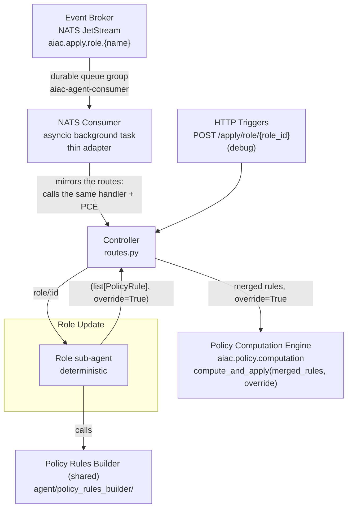

# Component Sub-PRD: UC3 — Role Update

> **Depends on:** [`../aiac-agent.md`](../aiac-agent.md) — NATS Consumer, Controller, Shared Module, Configuration, Error Handling, Runtime.

> **IdP access — library, not service.** All IdP reads and writes go through the **idp-library** API (`aiac.idp.configuration.api.Configuration`), **never** the IdP Configuration **service** (`aiac.idp.service.configuration.*`) or its HTTP endpoints directly. See [aiac-agent.md → IdP access](../aiac-agent.md#idp-access--library-not-service).

## Triggers

| Source | Subject / Path |
|---|---|
| Event Broker (NATS) | `aiac.apply.role.{name}` (percent-encoded role name; originated by Keycloak SPI role created/updated) |
| HTTP (debug) | `POST /apply/role/{role_id}` |

> **Key contract: open.** The two triggers do not give the same key now. The NATS subject carries the role **name**: the SPI percent-encodes it into one NATS token, and the consumer (`eventbus/consumer.py`) decodes it with `unquote` before it calls `update_role`. The debug route gives its `{role_id}` path segment to `update_role` unchanged. Until UC3 is built, the stub reads no key, so give the role name on the route too. A name alone is ambiguous for a client role: the subject carries only the last segment of the role path, not the client. So the final contract must use the name and the owning client, or the SPI must publish the role id (see [`keycloak-spi/README.md` → Known gaps / open questions](../../../../keycloak-spi/README.md#known-gaps--open-questions)).

## Architecture

Single path, no create/update branch. The sub-agent is **deterministic** (non-LLM).



## Sub-agent: Role sub-agent

**Status: not built yet** — `update_role(role_id)` is a stub that returns `([], True)`; it reads no IdP data and calls no PRB.

**Nature:** deterministic, non-LLM. Pure IdP reader.

**Steps:**
1. Read the triggering role from `aiac.idp.configuration.api`, with the key that the trigger gives (see the key contract in [Triggers](#triggers)).
2. **Flatten the triggering role to its closure** via the shared `flatten_role` helper (see [Composite role flattening](#composite-role-flattening)): the role itself plus all descendant roles from `role.childRoles`, de-duplicated by `role.id`. A non-composite role yields just itself.
3. Read **all scopes** from `aiac.idp.configuration.api`.
4. Call `build_role_rules(r, all_scopes)` on the PRB **once per role `r` in the closure**, and merge the results into a single `list[PolicyRule]`.
5. Return the merged `list[PolicyRule]` (paired with `override=True` — see [Controller behaviour](#controller-behaviour-for-this-uc)).

**Output:** `(list[PolicyRule], override=True)`.

### Composite role flattening

The triggering role is flattened to its **closure** via the shared `flatten_role` helper
(aiac-agent Shared Module): recursively collect the role and all descendant roles from
`role.childRoles` into a flat list, de-duplicated by `role.id` (`Role` is not hashable, so
de-duplication tracks seen `id`s rather than adding `Role` objects to a `set`). A
non-composite role yields a list containing only itself. `build_role_rules` is then called
once per role in the closure, so the PRB receives already-flattened roles and the PCE
performs no further flattening.

## Controller behaviour (for this UC)

1. Receives `(list[PolicyRule], override=True)` from the Role sub-agent (PRB already called and merged internally).
2. Calls `compute_and_apply(rules, override=True)` from `aiac.policy.computation`.
   - With `override=True`, the PCE purges every input role's existing mappings — across **both** the allow and deny lists (`inbound_allow_rules` + `inbound_deny_rules`) of every SPM containing the role, keyed on `role.id` alone — before applying the fresh rules, an authoritative role-keyed replace. (The target maps `target_allow_scopes` / `target_deny_scopes` are derived, never stored, so nothing to reconcile there.) Because the sub-agent submits `build_role_rules(r, all_scopes)` output for the full closure, this replaces the complete mapping of the triggering role and every descendant. See [`../policy-computation-engine.md`](../policy-computation-engine.md).
3. Returns bare HTTP status; writes summary + debug to log.

## File structure

```
src/aiac/agent/uc/
└── role_update/
    ├── __init__.py
    └── role.py       ← update_role(role_id) stub → ([], True)
```

## Out of scope

- PRB internals — see [`policy-rules-builder.md`](policy-rules-builder.md).
- PCE override (role-keyed replace) mechanics — see [`../policy-computation-engine.md`](../policy-computation-engine.md).
- Response body shape — no success body; handlers return bare HTTP status codes (error responses carry a `{"detail": …}` body from a raised `HTTPException` or a Controller exception handler, or a `ConflictReport` (`422`)). Summary + debug go to the log.
