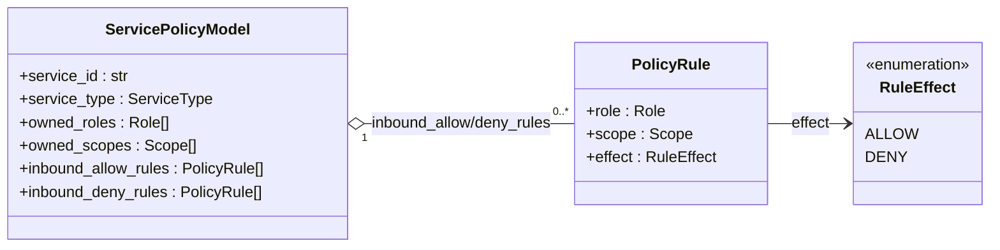
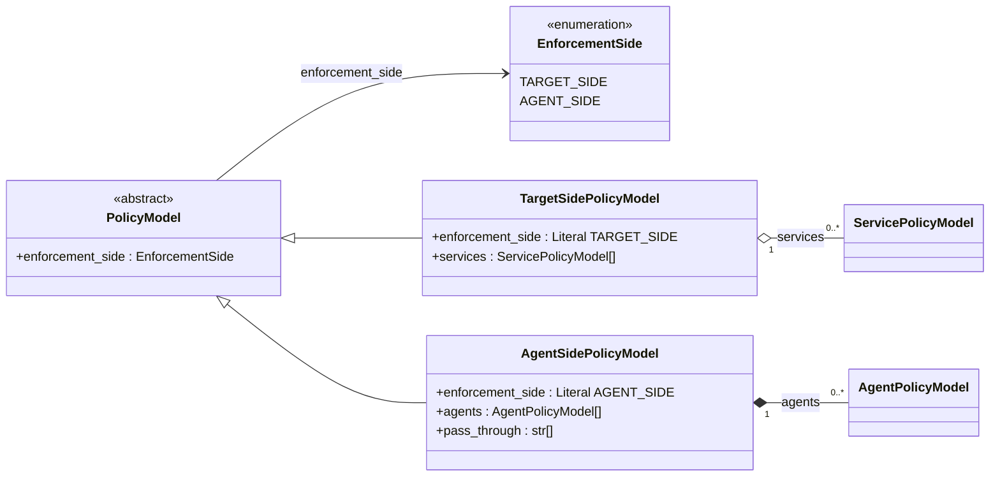
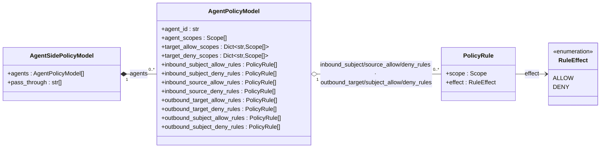

# Component PRD: Policy Model (`aiac.policy.model`)

## Problem Statement

`PolicyRule`, `AgentPolicyModel`, and `PolicyModel` were previously defined in `aiac.pdp.library.models`. Three independent consumers now need these types:

- `aiac.pdp.policy.library` — translates the policy model (`PolicyModel` and its subclasses) into HTTP calls to the PDP Policy Writer
- `aiac.policy.model_store.library` — reads/writes `ServicePolicyModel` (SPM) from/to the Policy Model Store
- `aiac.policy.computation` — merges rules into `ServicePolicyModel` objects, derives `AgentPolicyModel` objects under agent side, and builds the policy model of the current enforcement side

Keeping the canonical model definitions inside a PDP-namespaced module (`aiac.pdp.library.models`) forces both the Policy Model Store library and the Policy Computation Engine to take a dependency on the PDP package — a wrong-layer coupling. Any of the three consumers importing from `aiac.pdp.library.models` would create a transitive dependency on an unrelated service namespace.

Additionally, the old `PolicyRule` used plain `str` for `role` and `scope`. The current SPM/APM PCE requires typed `Role` and `Scope` objects (from `aiac.idp.configuration.models`): it routes each rule to the owning service's SPM by `scope.serviceId`, classifies edges by `role.kind`, and reads `role.actorIds` when deriving each `AgentPolicyModel` — all fields that a plain `str` cannot carry. (These typed fields replaced the earlier reliance on `Configuration.get_services_by_role` / `get_services_by_scope`, which the SPM-based engine no longer calls.)

The original `source_roles`, `subject_roles`, and `scope_targets` maps used pydantic model objects (`Service`, `Subject`, `Scope`) as dict keys. Model-object keys do not round-trip through `model_dump(mode="json")` / JSON without custom key handling, and they couple `aiac.policy.model` to the id-only `__hash__`/`__eq__` of the IdP models. The outbound map was also keyed by scope (`scope → targets`), whereas consumers need the inverse (`target → scopes`) to emit per-target authorization directly.

### Order-dependence bug (the reason for the two-layer model)

The Policy Computation Engine (PCE) merges `list[PolicyRule]` from onboarding sub-agents into per-agent policy. Historically `AgentPolicyModel` (APM) was the **only persisted entity** and stored rules **denormalised onto the agent**. That made policy **order-dependent**.

Concretely, let `UR` be a user (realm) role mapped to agent `A`'s scope `AS` and tool `T`'s scope `TS`, and `AR` be agent `A`'s (client) role mapped to `TS`:

- **A onboarded, then T:** at T-onboarding `A`'s model already exists, so the `(UR, TS)` rule attaches to `A`'s outbound-subject gate. Correct.
- **T onboarded, then A:** at T-onboarding no agent targets `TS`, so `UR→TS` is **dropped**; A-onboarding never re-emits it, so **`UR→TS` is lost forever.**

The fix is a **two-layer model**: a per-service persistent source of truth (`ServicePolicyModel`) that stores every inbound edge durably on the service that owns the scope — so `UR→TS` lands on `SPM(T)` at tool-onboarding, no agent required, and can never be lost — with `AgentPolicyModel` demoted to a **pure derived projection** that is no longer persisted.

### Allowlist-only (the former model — no negative rules)

The former model could express only **grants**. A `PolicyRule(role, scope)` was always positive — "this role *may* reach this scope" — and everything not granted was implicitly unreachable (`default allow := false`). There was no way to record that a role **must not** reach a scope. Policy authors describe access in mixed terms ("developers can read source files **but must not** touch issues"), but an allowlist-only model forced the negative to be expressed as the *absence* of a grant. That was fragile: any later, broader grant (a composite role, a role update, another onboarding) silently re-opened the path the author meant to keep closed, because no durable fact recorded the prohibition.

## Solution

A canonical, dependency-free model module at `aiac.policy.model` defines `ServicePolicyModel`, `PolicyRule`, `AgentPolicyModel`, and the policy-model hierarchy (`EnforcementSide`, `PolicyModel`, `TargetSidePolicyModel`, `AgentSidePolicyModel`, `AnyPolicyModel`) with typed fields. The same package has the shared projection `project_inbound` (`aiac.policy.model.projection`). No HTTP client, no service code — importable by any consumer without side effects. `PolicyRule.role` and `PolicyRule.scope` are typed `Role` and `Scope` objects from `aiac.idp.configuration.models`.

**Two-layer model.** `ServicePolicyModel` (SPM) is the **persistent source of truth**, one per **service** (agent *and* tool). It holds the service's **inbound** rules plus its own identity (owned roles and scopes). `AgentPolicyModel` (APM) becomes a **pure derived projection** built from the relevant SPMs by the PCE — it is **no longer persisted**. Its shape is unchanged so existing consumers (PDP Policy Library, PDP Policy Writer) keep working.

**The policy model is the render input of the current enforcement side (D18, D18a).** One global switch selects the **enforcement side** for every callee (D16). The PCE gives the PDP Policy Writer a **policy model** that is tagged with that side:

- Under **target side**, a `TargetSidePolicyModel` holds the stored SPMs. Each callee checks the access to itself in its own inbound OPA, from its own CR. Every edge that a callee checks is already on its own SPM, because a rule is stored on the SPM of the service that owns its scope. So the writer renders one SPM and does no join.
- Under **agent side**, an `AgentSidePolicyModel` holds the APMs, which the PCE derives in memory at each deploy, and the clientIds of the managed tools, which get a **pass-through CR**. An agent's outbound needs the edges on the SPMs of other services (a join). The PCE does this join when it derives the APM.

There is no other render input. One policy model never mixes the two sides.

**One shared inbound projection (D18b).** The function `project_inbound` splits the inbound edges of one SPM into the user gate and the calling-agent gate, and builds the identity maps. The PCE uses it to derive the APM inbound (agent side). The writer uses it to render the inbound of a callee (target side). So, for one SPM, both sides give the same inbound gates.

**Canonical form.** *Every rule is an inbound edge on the SPM of the service that owns the rule's scope.* An agent's outbound edge is the target's inbound edge — `AR→TS` is stored on `SPM(T)`, not on `A`. The routing key is `Scope.serviceId`: a rule `(role, scope)` routes to `SPM(scope.serviceId)`.

The relationship maps (`source_roles`, `subject_roles`, `target_allow_scopes` / `target_deny_scopes`) are keyed by a plain string (a username or a clientId) rather than by a typed object, so they serialize to JSON natively and carry no hashability requirement into `aiac.policy.model`. Typed `Role` / `Scope` objects are retained as the map *values* (and in `PolicyRule`), preserving the typing the PCE needs for IdP queries. The outbound maps are `target_allow_scopes` / `target_deny_scopes` (`target service id → scopes permitted / prohibited`), the inverse of the former `scope_targets`.

**Two-sided rules (ALLOW / DENY).** Every rule carries a `RuleEffect` — `Allow` or `Deny` — and both kinds are stored side by side as first-class facts in **explicitly separated** parallel lists (never one intermixed list). A DENY rule is a durable prohibition that **subtracts** from what the ALLOW rules grant, honored uniformly at every gate (inbound subject, inbound source, outbound subject, outbound target). Generated policy applies **deny-overrides**: a request is allowed only if some ALLOW gate passes **and** no DENY gate matches, so a later broad grant can no longer silently re-open a denied path. For now the model assumes **no conflict** — no `(role, scope)` is ever both ALLOW and DENY for the same subject — so there is **no precedence/tie-break logic**; DENY simply subtracts. Cross-role conflict resolution is a deliberate later concern (see [Out of Scope](#out-of-scope)).

**Always DENY by default.** `AgentPolicyModel` has no default-effect field. The deployed Rego always denies a `(role, scope)` pair that **no rule mentions** (`default allow := false`, granting only what an allow gate matches). A legacy payload that still carries `default_effect` is accepted and the field is ignored (`extra='ignore'`). `RuleEffect` stays: each rule is still `Allow` or `Deny` (see [`pdp-policy-writer-opa.md`](pdp-policy-writer-opa.md)). The pass-through packages are the only packages that allow every request (D24, D25). They check no rules, so no field of this module selects them: the writer renders one for every outbound under target side, and for both packages of each `pass_through` tool under agent side.

---

## User Stories

1. As the Policy Computation Engine, I want to import `PolicyRule`, `AgentPolicyModel`, and `PolicyModel` from a shared, neutral namespace, so that I do not take an unwanted dependency on the PDP package.
2. As the PDP Policy Library, I want to import the policy-model classes (`PolicyModel`, `TargetSidePolicyModel`, `AgentSidePolicyModel`) and `AgentPolicyModel` from `aiac.policy.model`, so that my HTTP serialization logic does not duplicate model definitions.
3. As the Policy Model Store Library, I want to import `ServicePolicyModel`, `Role`, and `Scope` from `aiac.policy.model`, so that response deserialization uses the same canonical types as every other consumer.
4. As an AIAC Agent sub-UC agent, I want to construct a `PolicyRule` with typed `Role` and `Scope` objects, so that the PCE can use them for IdP queries without additional type conversion.
5. As the Policy Computation Engine, I want `source_roles`, `subject_roles`, `target_allow_scopes`, and `target_deny_scopes` keyed by plain strings (a username or a clientId), so that I build them from `role.actorIds` and `scope.serviceId` and they serialize to JSON without custom key handling.
6. As a developer, I want all models to silently ignore unknown fields from API responses, so that IdP API additions do not break deserialization.
7. As the PDP Policy Library, I want outbound permissions expressed as `target service id → allowed scopes`, so that I can emit per-target authorization directly without inverting a `scope → targets` map.
8. As a consumer serializing an `AgentPolicyModel` to JSON, I want every relationship map to have string keys, so that `model_dump(mode="json")` round-trips without a custom key serializer.
9. As a policy author, I want to tag a rule `Deny` so that it records a durable prohibition, independent of the grants around it.
10. As a consumer, I want `PolicyRule.effect` to default to `Allow`, so that existing allow-only producers keep working without change.
11. As a consumer, I want ALLOW and DENY rule sets held in separate lists, so that a gate can evaluate each side without filtering an intermixed list by effect.
12. As the PDP Policy Writer, I want a role that appears **only** in DENY edges still registered into the effect-agnostic identity maps (`subject_roles` / `source_roles`), so that the Rego deny lookup can resolve it at request time.
13. As a policy author, I want a pair that no rule mentions to be always denied, so that every re-derivation of an agent gives the same least-privilege behavior.
14. As a consumer, I want a legacy `AgentPolicyModel` payload that still carries `default_effect` to load, so that old serialized models do not break deserialization (the field is ignored).
15. As the PDP Policy Writer, I want each policy model to carry its enforcement side as a tag, so that one `POST /policy` body parses into the correct subclass and I dispatch the render on the subclass.
16. As the Policy Computation Engine, I want a policy model that cannot mix the two sides, so that no deploy writes target-side CRs and agent-side CRs together.
17. As the Policy Computation Engine and the PDP Policy Writer, I want one shared projection of an SPM's inbound edges, so that for one SPM both sides give the same inbound gates.

---

## Implementation Decisions

### Module Identity

**Namespace:** `aiac.policy.model`

**Location:** `src/aiac/policy/model/`

**Package structure:**

```
src/aiac/policy/
└── model/
    ├── __init__.py    # empty
    ├── models.py      # ServicePolicyModel, PolicyRule, AgentPolicyModel, EnforcementSide,
    │                  # PolicyModel, TargetSidePolicyModel, AgentSidePolicyModel, AnyPolicyModel
    └── projection.py  # project_inbound, InboundProjection (D18b)
```

### Dependencies

| Dependency | Purpose |
|------------|---------|
| `pydantic` | `BaseModel`, `ConfigDict`, `Field` (the discriminator of `AnyPolicyModel`) |
| `aiac.idp.configuration.models` | Typed `Role`, `Scope`, `ServiceType` (as map values, in `PolicyRule`, and in `ServicePolicyModel`) |

No HTTP client dependency. No `requests`, no `python-dotenv`.

### Pydantic Models

All models use `model_config = ConfigDict(extra='ignore')`.

#### Class Diagrams

Class relationships split by root class.

**`ServicePolicyModel`** — the persistent source of truth, one per service. Every rule lands here as an inbound edge on the SPM that owns the rule's scope.



**`PolicyModel`** — the base of the policy-model hierarchy (D18a): the deploy input of the current enforcement side. Each subclass fixes the tag `enforcement_side` as a class constant. `TargetSidePolicyModel` holds stored SPMs. `AgentSidePolicyModel` holds derived APMs and the clientIds of the managed tools.



**`AgentPolicyModel`** — the agent-side render input: one agent's derived policy. `AgentPolicyModel` is a pure derived projection built by the PCE from the relevant `ServicePolicyModel`s; it is not persisted itself.



Legend: `<|--` inheritance (a subclass); `*--` composition (owned, deleted with parent); `o--` aggregation (holds a list of); `-->` reference (a field of this type).

#### New `Role` / `Scope` fields (defined in `aiac.idp.configuration.models`)

The two-layer model requires ownership and a user/agent distinction on the IdP types. These fields are **defined in `aiac.idp.configuration.models`** (the deep population from Keycloak is handoff 02's concern), but the policy model depends on them for SPM routing and APM derivation:

- **`Scope.serviceId: str`** — the single owning service's `serviceId`. This is the SPM routing key: a rule `(role, scope)` routes to `SPM(scope.serviceId)`. See Assumption 2 (a scope has exactly one owner).
- **`RoleKind(str, Enum)`** — `USER = "User"`, `AGENT = "Agent"` (mirrors `ServiceType`'s style).
- **`Role.kind: RoleKind`** — whether the role is held by users or by agent service accounts.
- **`Role.actorIds: list[str]`** — context-dependent on `kind`:
  - `kind == AGENT` ⇔ a Keycloak **client role** on the agent's client, or an `aiac.managed` **realm role** on the agent's service account; `actorIds` = the owning **agent `serviceId`(s)** (usually one).
  - `kind == USER` ⇔ a Keycloak **realm role**; `actorIds` = the **holder usernames**.

A `model_validator` on `Role` enforces what it can locally (`kind` present/valid; `actorIds` is a `list[str]`). The **cross-kind** invariant (Assumption 1) and the **client/realm ⇔ agent/user** invariant (Assumption 3) are enforced **upstream at construction** (the Keycloak IdP boundary), because the raw Keycloak facts are only visible there — see handoff 02 for that enforcement and field population.

#### `RuleEffect`

```python
class RuleEffect(str, Enum):
    ALLOW = "Allow"
    DENY = "Deny"
```

A string enum (mirroring `ServiceType` / `RoleKind`) tagging a `PolicyRule` as a **grant** (`Allow`) or a **prohibition** (`Deny`). Serializes as the string `"Allow"` / `"Deny"`.

#### `ServicePolicyModel`

The persistent source of truth — one per service (agent *and* tool), keyed by `service_id`. Holds the service's inbound rules plus its own identity.

| Field | Type | Description |
|-------|------|-------------|
| `service_id` | `str` | The owning service's id. |
| `service_type` | `ServiceType` | `Agent` or `Tool`. Under target side, it selects the inbound render of the service's CR (a tool inbound or an agent inbound). Under agent side, it drives derivation: only `Agent` services get an APM, and a managed `Tool` gets a pass-through CR (its clientId in `AgentSidePolicyModel.pass_through`). |
| `owned_roles` | `list[Role]` | This service's own roles (`Service.roles`; `aiac.managed` marker only). |
| `owned_scopes` | `list[Scope]` | This service's exposed scopes (`aiac.managed` marker only). |
| `inbound_allow_rules` | `list[PolicyRule]` | Canonical positive edges: every `Allow` rule granting access to `owned_scopes`. |
| `inbound_deny_rules` | `list[PolicyRule]` | Canonical negative edges: every `Deny` rule prohibiting access to `owned_scopes`. |

`inbound_rules` splits into two **explicitly separated** parallel lists — `inbound_allow_rules` + `inbound_deny_rules` — not one intermixed list filtered by `effect`. `owned_roles` / `owned_scopes` are the service's own identity, filtered to the `aiac.managed` marker (this is where the PCE's P2 identity now lives). They are seeded from the catalog by the PCE; this module only defines the shape. `ServicePolicyModel` round-trips through `model_dump(mode="json")` / `model_validate()` with string keys only.

The stored SPM is also the **target-side render input** (D18): `TargetSidePolicyModel.services` carries stored SPMs as they are. An SPM with zero rules is valid there. A successful onboarding stores the SPM of its focus service also when it has zero rules (D21), so the service joins the **managed set** (the services that have a stored SPM) and gets a CR.

#### `PolicyRule`

A single access rule pairing a typed role with a typed scope, tagged with an effect. Used in both inbound and outbound rule sets.

| Field | Type | Description |
|-------|------|-------------|
| `role` | `Role` | Typed role from `aiac.idp.configuration.models` |
| `scope` | `Scope` | Typed scope from `aiac.idp.configuration.models` |
| `effect` | `RuleEffect` | `Allow` (default) or `Deny`. Defaulting to `Allow` keeps existing allow-only producers working unchanged. |

**Dedup identity is `(role.id, scope.id, effect)`** (was `(role.id, scope.id)`). Including `effect` lets the same `(role, scope)` exist once as `Allow` and once as `Deny` without one clobbering the other on append. (Under the no-conflict assumption that never happens for the *same subject*, but the identity is effect-aware regardless.)

#### `AgentPolicyModel`

Complete policy definition for a single agent (service). Inbound and outbound rule sets are typed collections.

**The agent-side render input (D18).** Only the agent-side policy model (`AgentSidePolicyModel.agents`) carries APMs. Under target side the PCE derives no APM. The four inbound buckets of an APM, and the inbound part of its identity maps, come from the shared projection of `SPM(A)` (`project_inbound`, D18b). So they are the same gates that the target-side render gives for `SPM(A)`.

> **Derived, not persisted.** `AgentPolicyModel` is now a **pure derived projection** built by the PCE from the relevant `ServicePolicyModel`s. It is **no longer a persisted entity** — the durable source of truth is `ServicePolicyModel`. Its shape is **unchanged** so existing consumers (PDP Policy Library, PDP Policy Writer) keep working; the docstring on the model states this explicitly.

The rule lists split into **8 entity×effect lists** — {inbound subject, inbound source, outbound subject, outbound target} × {allow, deny} — plus split target maps. The identity/aggregate maps (`subject_roles`, `source_roles`, `agent_roles`, `agent_scopes`) stay **effect-agnostic**.

| Field | Type | Description |
|-------|------|-------------|
| `agent_id` | `str` | The agent's clientId (`Service.serviceId`, the SPM key) — not the UUID that `aiac.apply.service.<uuid>` carries |
| `agent_roles` | `list[Role]` | This agent's own `aiac.managed` roles (`SPM.owned_roles`). **Effect-agnostic identity.** |
| `agent_scopes` | `list[Scope]` | Scopes this agent exposes. **Effect-agnostic identity.** |
| `source_roles` | `dict[str, list[Role]]` | Inbound: source (calling service) **clientId** → roles held. **Optional** gate input — an absent source passes. **Effect-agnostic identity** (see deny-inclusion note). |
| `subject_roles` | `dict[str, list[Role]]` | Inbound: subject (end-user) **username** → roles held. **Mandatory** gate input. **Effect-agnostic identity** (see deny-inclusion note). |
| `target_allow_scopes` | `dict[str, list[Scope]]` | Outbound: target service **id** → scopes this agent **may** request on it |
| `target_deny_scopes` | `dict[str, list[Scope]]` | Outbound: target service **id** → scopes this agent **must not** request on it |
| `inbound_subject_allow_rules` | `list[PolicyRule]` | Who may call this agent: `(subject_role, agent_scope)` `Allow` tuples |
| `inbound_subject_deny_rules` | `list[PolicyRule]` | Which subjects are barred: `(subject_role, agent_scope)` `Deny` tuples |
| `inbound_source_allow_rules` | `list[PolicyRule]` | Which calling services may call this agent: `(source_role, agent_scope)` `Allow` tuples |
| `inbound_source_deny_rules` | `list[PolicyRule]` | Which calling services are barred: `(source_role, agent_scope)` `Deny` tuples |
| `outbound_target_allow_rules` | `list[PolicyRule]` | What this agent may call: `(this_agent_role, target_scope)` `Allow` tuples |
| `outbound_target_deny_rules` | `list[PolicyRule]` | What this agent must not call: `(this_agent_role, target_scope)` `Deny` tuples |
| `outbound_subject_allow_rules` | `list[PolicyRule]` | Which users may reach the agent's targets: `(user_role, tool_scope)` `Allow` tuples. Defaults to `[]`. |
| `outbound_subject_deny_rules` | `list[PolicyRule]` | Which users are barred from the agent's targets: `(user_role, tool_scope)` `Deny` tuples. Defaults to `[]`. |

> **Effect-agnostic identity maps must include deny-edge roles.** `subject_roles` / `source_roles` (and `agent_roles` / `agent_scopes`) carry **no** allow/deny split — the split lives only in the rule lists and target maps. A role or subject that appears **only** in DENY edges **must still be registered** into `subject_roles` / `source_roles`, or the Rego deny lookup (`subject_roles[input.identity.subject]` → deny-scope map) cannot resolve the role and the prohibition silently fails to fire.

> **No default effect.** The model has no default-effect field, so the PCE sets none at derive time. A pair that no rule mentions is always DENY.

**Inbound rule semantics (deny-overrides):** a subject holding realm role `role` is permitted to invoke this agent for the agent scope `scope` iff an `inbound_subject_allow` edge grants it **and no** `inbound_subject_deny` edge prohibits it; the same allow-and-not-deny logic applies to the source gate. The PDP Policy Writer consumes the allow/deny lists as separate role → agent-scope maps; its inbound gate is keyed on the subject username (`input.identity.subject`, the JWT `sub` on every leg, D31; mandatory), with the calling source id optional.

**Outbound target rule semantics (deny-overrides):** this agent acting as realm role `role` is permitted to request the target scope `scope` iff an `outbound_target_allow` edge grants it **and no** `outbound_target_deny` edge prohibits it. The PDP Policy Writer gates on the target maps `target_allow_scopes` / `target_deny_scopes` (keyed by `input.identity.service_id`). It emits the allow list only as the informational `agent_role_scopes` map (the `allow` rule does not use it), and it does not emit the deny list. Its outbound gate requires both the subject and the agent to be authorized and neither to be denied.

**Outbound subject rule semantics (deny-overrides):** the outbound subject gate pairs `(user role, tool scope)` — a user holding `role` may reach a tool exposing `scope` iff an `outbound_subject_allow` edge grants it and no `outbound_subject_deny` edge prohibits it. It is the outbound counterpart of the inbound subject rules (which pair a user role with an *agent* scope): where those answer "may this user call the agent?", these answer "may this user reach the tool the agent targets?". The PDP Policy Writer groups them into `subject_role_allow_scopes` / `subject_role_deny_scopes` (user role → tool-scope names) and matches against `target_allow_scopes[input.identity.service_id]` / `target_deny_scopes[input.identity.service_id]`, not against `agent_scopes`.

#### The policy model — `PolicyModel` and its subclasses (D18a)

A partial or full system policy model of the current enforcement side. When sent to `POST /policy` on the PDP Policy Writer (via `aiac.pdp.policy.library.apply_policy`), it may contain only the services whose CRs must change. When sent to `PUT /policy` (via `replace_policy`, the resync), it contains every managed service.

```python
class EnforcementSide(str, Enum):
    TARGET_SIDE = "target-side"
    AGENT_SIDE = "agent-side"

class PolicyModel(BaseModel):                 # the base; never sent on its own
    enforcement_side: EnforcementSide

class TargetSidePolicyModel(PolicyModel):
    enforcement_side: Literal[EnforcementSide.TARGET_SIDE] = EnforcementSide.TARGET_SIDE
    services: list[ServicePolicyModel]        # stored SPMs, one per callee

class AgentSidePolicyModel(PolicyModel):
    enforcement_side: Literal[EnforcementSide.AGENT_SIDE] = EnforcementSide.AGENT_SIDE
    agents: list[AgentPolicyModel]            # derived in memory, never stored
    pass_through: list[str] = []              # clientIds of managed tools

AnyPolicyModel = Annotated[TargetSidePolicyModel | AgentSidePolicyModel,
                           Field(discriminator="enforcement_side")]
```

| Class | Field | Type | Description |
|-------|-------|------|-------------|
| `PolicyModel` | `enforcement_side` | `EnforcementSide` | The tag. `target-side` or `agent-side`. The base is never sent on its own. |
| `TargetSidePolicyModel` | `services` | `list[ServicePolicyModel]` | The stored SPMs of the callees to deploy, one CR each. An SPM with zero rules is valid. |
| `AgentSidePolicyModel` | `agents` | `list[AgentPolicyModel]` | The APMs that the PCE derived in memory, one agent CR each (the inbound checks and the outbound tool checks). |
| `AgentSidePolicyModel` | `pass_through` | `list[str]` | The clientIds of the managed tools to deploy, one pass-through CR each (D24). Defaults to `[]`. |

Rules:

- **The tag is a class constant.** In each subclass, `enforcement_side` is a `Literal` with a default. Code never sets it by hand: `TargetSidePolicyModel(services=[...])` has the tag `target-side`.
- **A discriminated union.** `POST /policy` and `PUT /policy` take `AnyPolicyModel`. Pydantic parses the body into the correct subclass by the tag. The writer then dispatches on the subclass. So a model that mixes the sides cannot exist.
- **A bad tag is rejected.** A body with a wrong or a missing tag fails validation, and the writer returns **422**. The old tag-less shape `PolicyModel(agents=[...])` is gone, so such a body also gets 422.
- **The writer reads the side only from the tag** (D29). It reads no env var for the side.
- **An entry is one CR.** Under target side, each `services[]` SPM is one CR. Under agent side, each `agents[]` APM is one CR, and each `pass_through[]` clientId is one pass-through CR.

#### The shared projection — `aiac.policy.model.projection` (D18b)

```python
def project_inbound(spm: ServicePolicyModel) -> InboundProjection
```

A pure function with zero I/O. It projects the inbound edges of one SPM into the two inbound gates, and builds the identity maps.

| `InboundProjection` field | Type | Content |
|---------------------------|------|---------|
| `subject_allow_rules` | `list[PolicyRule]` | The `User`-kind edges in `spm.inbound_allow_rules` (the user gate, allow). |
| `subject_deny_rules` | `list[PolicyRule]` | The `User`-kind edges in `spm.inbound_deny_rules` (the user gate, deny). |
| `source_allow_rules` | `list[PolicyRule]` | The `Agent`-kind edges in `spm.inbound_allow_rules` (the calling-agent gate, allow). |
| `source_deny_rules` | `list[PolicyRule]` | The `Agent`-kind edges in `spm.inbound_deny_rules` (the calling-agent gate, deny). |
| `subject_roles` | `dict[str, list[Role]]` | Username → the roles that the user holds, from `role.actorIds` of every `User`-kind edge. **Effect-agnostic.** |
| `source_roles` | `dict[str, list[Role]]` | Calling clientId → the roles that the agent holds, from `role.actorIds` of every `Agent`-kind edge. **Effect-agnostic.** |

The split is by `role.kind` (`User` → subject, `Agent` → source) and by effect (the SPM's allow list or deny list). The identity maps register the role of **every** edge, allow and deny. So a role that appears only in a DENY edge is still in the map, and the Rego deny lookup can resolve it. Rules dedup by `(role.id, scope.id, effect)`. Map entries dedup by `role.id`.

Two consumers use it:

- **The PCE, under agent side.** `_derive` fills the four APM inbound buckets (`inbound_subject_allow_rules` … `inbound_source_deny_rules`) and the APM `subject_roles` / `source_roles` from `project_inbound(SPM(A))`. The outbound derivation then adds more users to `subject_roles` (the outbound subject gate).
- **The PDP Policy Writer, under target side.** The renderer of a callee's inbound package projects the callee's own SPM. The user gate keys on `subject_roles[input.identity.subject]`. The calling-agent gate keys on `source_roles[input.identity.client_id]`. The writer projects one SPM and does no join.

So, for one SPM, both sides give the same inbound gates.

### Map keys are string IDs

`source_roles`, `subject_roles`, `target_allow_scopes`, and `target_deny_scopes` are keyed by a plain string — the subject's username, the source service's clientId, and the target service's clientId (`Scope.serviceId`) — rather than by the typed `Service` / `Subject` / `Scope` object. Rationale:

- JSON object keys must be strings. A dict keyed by a pydantic model does not round-trip through `model_dump(mode="json")` / JSON without a custom key serializer; a `str` key serializes natively.
- The IdP models are plain pydantic models (default field-based equality, not hashable). The PCE builds these maps from `role.actorIds` and `scope.serviceId`.

As a result, no field in `aiac.policy.model` uses a typed object as a dict key, and this module imports only `Role`, `Scope`, and `ServiceType` from `aiac.idp.configuration.models` (as map *values*, in `PolicyRule`, and in `ServicePolicyModel`). `Service` and `Subject` are no longer referenced here.

### Usage

```python
from aiac.policy.model.models import (
    AgentPolicyModel, AgentSidePolicyModel, PolicyRule, RuleEffect, TargetSidePolicyModel,
)
from aiac.policy.model.projection import project_inbound
from aiac.idp.configuration.models import Role, Scope

reader = Role(id="r1", name="weather-reader", composite=False)
issues_role = Role(id="r2", name="developer", composite=False)
read = Scope(id="s1", name="read")
issues = Scope(id="s2", name="issues")

allow_rule = PolicyRule(role=reader, scope=read)                       # effect defaults to Allow
deny_rule = PolicyRule(role=issues_role, scope=issues, effect=RuleEffect.DENY)

agent_model = AgentPolicyModel(
    agent_id="weather-agent",
    agent_roles=[reader],
    agent_scopes=[read],
    source_roles={},
    subject_roles={"u1": [reader], "u2": [issues_role]},   # keyed by username; deny-only role u2 still listed
    target_allow_scopes={"github-tool": [read]},           # target service id → allowed scopes
    target_deny_scopes={"github-tool": [issues]},          # target service id → prohibited scopes
    inbound_subject_allow_rules=[allow_rule],
    inbound_subject_deny_rules=[],
    inbound_source_allow_rules=[],
    inbound_source_deny_rules=[],
    outbound_target_allow_rules=[],
    outbound_target_deny_rules=[deny_rule],
    outbound_subject_allow_rules=[],                       # (user_role, tool_scope) pairs; defaults to []
    outbound_subject_deny_rules=[],                        # defaults to []
)

# Agent side: the derived APMs, plus a pass-through CR for each managed tool
agent_side = AgentSidePolicyModel(agents=[agent_model], pass_through=["team1/github-tool"])

# Target side: the stored SPMs as they are (tool_spm is a ServicePolicyModel from the store)
target_side = TargetSidePolicyModel(services=[tool_spm])
assert target_side.enforcement_side == "target-side"     # the tag is a class constant

# The shared inbound projection of one SPM (both sides use it)
gates = project_inbound(tool_spm)
```

### Replaces

`aiac.pdp.library.models` has been removed. All consumers import from `aiac.policy.model.models`.

---

## Assumptions

The two-layer model rests on three invariants. All three are **AIAC invariants**, not Keycloak guarantees, and the ones that require raw Keycloak facts are enforced upstream at the IdP boundary (handoff 02):

1. **No role spans both kinds.** A role is held by users *or* by agent service accounts, never both. This is what lets `Role.actorIds` be a single list. Enforced upstream at construction (cross-kind invariant not visible to the local `Role` validator).
2. **No scope shared across services.** A scope has exactly one owner → a single `Scope.serviceId`. This reconciles with the existing `get_services_by_scope(scope) -> list[Service]` (plural, because Keycloak client scopes are realm-level and assignable to many clients): for AIAC-managed scopes that list is always length 1.
3. **Agent role ⇔ a client role on the agent's client, or an `aiac.managed` realm role on its service account; user role ⇔ a realm role held by users.** The IdP config service sources agent roles from `Service.roles` and sets `Role.kind`: `GET /services/{id}/roles` marks agent roles `Agent`, and `GET /roles` marks realm roles `User`. Enforced upstream at construction.

---

## Testing Decisions

**Seam:** model instantiation and serialization — no HTTP boundary, no mocking required.

Key behaviors to assert:
- `Scope.serviceId` is present; `Role.kind` (a `RoleKind`) and `Role.actorIds` (a `list[str]`) are present; the `Role` `model_validator` accepts a valid `kind` + `list[str]` `actorIds` and rejects a malformed one.
- `RuleEffect` values serialize as `"Allow"` / `"Deny"`; `PolicyRule.effect` defaults to `RuleEffect.ALLOW` when omitted.
- `AgentPolicyModel` has no `default_effect` field; a legacy payload that carries `default_effect` validates, and the field is dropped (`extra='ignore'`).
- The same `(role, scope)` coexists as one `Allow` and one `Deny` rule (dedup identity `(role.id, scope.id, effect)` keeps them distinct).
- `ServicePolicyModel` constructs with `service_id`, `service_type`, `owned_roles`, `owned_scopes`, `inbound_allow_rules`, `inbound_deny_rules`, and round-trips via `model_dump(mode="json")` / `model_validate()` (string keys only) with typed `Role` / `Scope` / `PolicyRule` values preserved.
- `PolicyRule` accepts typed `Role` and `Scope` objects; rejects plain `str` where `Role`/`Scope` is expected.
- `AgentPolicyModel` with string-ID keys in `source_roles`, `subject_roles`, `target_allow_scopes`, and `target_deny_scopes`, and the 8 entity×effect rule lists populated, round-trips through `model_dump(mode="json")` / `model_validate()` with the typed values preserved.
- `target_allow_scopes` / `target_deny_scopes` each map a target service id to the list of `Scope` objects permitted / prohibited on it (outbound direction is `target → scopes`, not `scope → targets`).
- **Deny-edge role registered in identity maps:** a role appearing **only** in a DENY rule is still present in the `subject_roles` / `source_roles` value list for its subject/source — assert the identity map is effect-agnostic and complete.
- The 8 rule lists and both target maps default to empty (constructors that omit them still validate) and round-trip with their `PolicyRule` / `Scope` values preserved.
- A relationship map keyed by a plain string serializes to a JSON object without a custom key serializer.
- `ConfigDict(extra='ignore')` causes unknown fields to be silently discarded on `model_validate()` (this is exactly why the rename requires a store reset — see Migration).
- **The policy-model tag (D18a).** `TargetSidePolicyModel(services=[...])` and `AgentSidePolicyModel(agents=[...])` get their tag with no argument (`target-side` / `agent-side`), and `pass_through` defaults to `[]`. Each round-trips through `model_dump(mode="json")` with its tag.
- **The discriminated union.** A target-side body parses through `AnyPolicyModel` to `TargetSidePolicyModel`, and an agent-side body to `AgentSidePolicyModel`. A body with a wrong tag, a missing tag, or the old tag-less `{"agents": [...]}` shape fails validation.
- **The shared projection (D18b).** `project_inbound` splits the edges of one SPM by `role.kind` and effect into the four rule lists. A role that appears only in a DENY edge is in `subject_roles` / `source_roles`. An SPM with zero rules gives empty lists and empty maps. For the same SPM, the projection gives the same inbound buckets and identity maps as the APM inbound that `_derive` builds (the `_derive` tests that exist stay green).

---

## Out of Scope

- HTTP serialization logic — handled by `aiac.policy.model_store.library`, `aiac.policy.model_store.service`, and `aiac.pdp.policy.library`.
- IdP API integration — `Service`, `Role`, `Scope` shapes are owned by `aiac.idp.configuration.models`.
- Rule revocation semantics — TBD; no model changes required until the design is finalised.
- **PRB deny-extraction** — pulling `Deny` rules out of natural-language policy text is the Policy Rules Builder's concern, not this model module's; this module only defines the `effect` field the PRB populates. (The PRB now extracts `Deny` rules — explicit prohibitions, description-driven denies, and the derived exclusivity complement — see [`aiac-agent/policy-rules-builder.md`](aiac-agent/policy-rules-builder.md).)
- **Conflict / precedence resolution** — the model assumes no `(role, scope)` is both `Allow` and `Deny` for the same subject, so there is no tie-break. Cross-role ALLOW-vs-DENY conflict resolution is an explicit later concern.

---

## Migration (state reset, no back-compat)

**Symmetric rename, no alias, no dual-read shim, no record migration.** `inbound_rules` → `inbound_allow_rules` + `inbound_deny_rules` (SPM) and the APM rule-list/target-map renames are hard renames. Because every model uses `ConfigDict(extra='ignore')`, loading an old single-list record would **silently drop** the now-unknown `inbound_rules` field and yield a stale, half-migrated read. So the Policy Model Store state is **nuked out-of-band and re-seeded by re-onboarding** — there is no alias, no dual-read compatibility path, and no migration of old records. All generated `.rego` golden fixtures are regenerated as part of the rollout.

**The policy-model hierarchy is also a hard change (D18a).** The tag-less `PolicyModel(agents=[...])` body is gone, with no alias. The PCE, the PDP Policy Library and the PDP Policy Writer change in one release. The store is not affected: it keeps only SPMs, and the SPM shape does not change. The resync at the Controller start (D28, `PUT /policy`) replaces the per-agent CRs of an older release with the CRs of the current side.

## Further Notes

- Keying maps by string `id` sidesteps the previous reliance on id-only hashing of the IdP models: two records for the same Keycloak entity fetched at different times (with potentially different enrichment fields) collapse to the same string key regardless of those differences.
- The `effect` split lives **only** in the rule lists (`*_allow_rules` / `*_deny_rules`) and the target maps (`target_allow_scopes` / `target_deny_scopes`). The identity/aggregate maps (`subject_roles`, `source_roles`, `agent_roles`, `agent_scopes`) remain effect-agnostic and must include deny-edge roles so the Rego deny lookup can resolve them.
