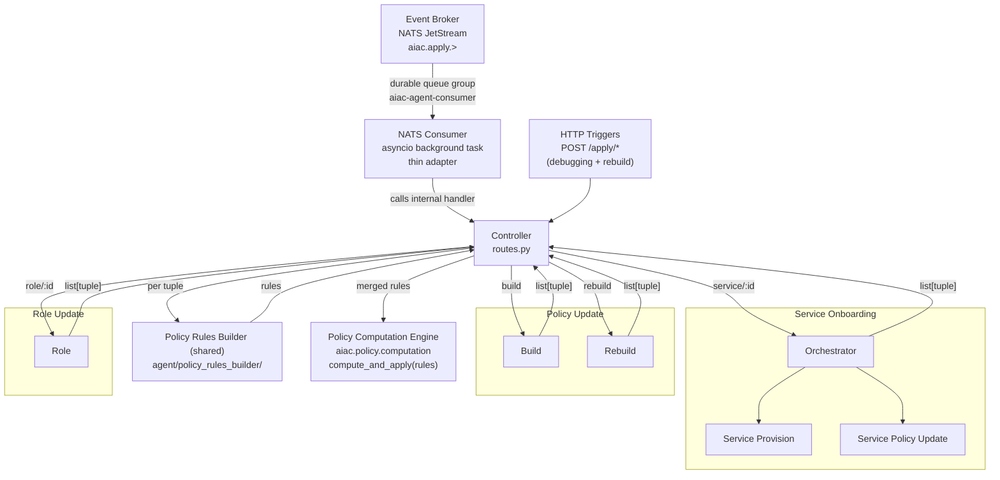

# Component PRD: AIAC Agent

## Description

A LangGraph-based AI agent service that enforces a natural-language access control policy against the live PDP state. Triggered via the **Event Broker** (NATS JetStream) for all automated triggers, and directly via HTTP for the operator-only `rebuild` command:

- **Event Broker** → `aiac.apply.service.{id}` subject (originated by Keycloak SPI `CLIENT_CREATED`)
- **Event Broker** → `aiac.apply.role.{id}` subject (originated by Keycloak SPI role created/updated)
- **Event Broker** → `aiac.apply.policy.build` subject (originated by RAG Ingest Service post-ingest)
- **Operator/admin call** → `POST /apply/policy/rebuild` directly via `kubectl port-forward` (HTTP only — not routed through Event Broker)

The Agent subscribes to the Event Broker as a durable competing consumer (`aiac-agent-consumer` queue group). It acknowledges each message only after successful processing — ensuring at-least-once delivery and automatic replay on pod restart.

The `/apply/*` HTTP endpoints are retained as a debugging escape hatch. The **NATS consumer is a thin adapter layer** that receives events from the Event Broker and calls the same internal `/apply/*` handler functions — there is no duplicated business logic.

The service is structured as a **Controller** (FastAPI routes) that dispatches to the **Service Onboarding Orchestrator** (UC1) or directly to the Policy Update and Role Update sub-agents (UC2, UC3). Each sub-agent returns a `list[tuple[list[Role], list[Scope]]]` scoped to the trigger. The Controller receives this list; for each tuple it calls the **shared Policy Rules Builder** (`agent/policy_rules_builder/`) to produce `list[PolicyRule]`, concatenates all results into a single `list[PolicyRule]`, then makes a single `compute_and_apply(merged_rules)` call via the PCE.

| Use Case | Dispatch | Sub-agents | Sub-agent output |
|---|---|---|---|
| Service Onboarding (UC1) | via Orchestrator | Service Provision + Service Policy Update | `list[tuple[list[Role], list[Scope]]]` |
| Policy Update (UC2) | Controller → sub-agent directly | Build or Rebuild (TBD) | `list[tuple[list[Role], list[Scope]]]` |
| Role Update (UC3) | Controller → sub-agent directly | Role sub-agent | `list[tuple[list[Role], list[Scope]]]` (one-element list) |

Each producing sub-agent returns a `list[tuple[list[Role], list[Scope]]]` scoped to the trigger. The Controller calls the **shared Policy Rules Builder** (`agent/policy_rules_builder/`) once per tuple in the list to produce `list[PolicyRule]`, concatenates all results into a single merged list, then calls `compute_and_apply(merged_rules)` from `aiac.policy.computation` (PCE) once — no shared apply node exists. The PCE owns all Policy Store ↔ PDP Policy Writer coordination. Neither sub-agents nor the Policy Rules Builder call `aiac.pdp.policy.library` or `aiac.policy.store.library` directly.

All components are **logically separated modules within a single pod and process** — no inter-service network calls between orchestrators and sub-agents.



---

## NATS Consumer

A thin adapter started as an **asyncio background task** in the FastAPI `lifespan` handler. It subscribes to the `aiac.apply.>` wildcard on the `aiac-events` NATS JetStream stream using the `aiac-agent-consumer` durable queue group.

### Dispatch table

| Subject pattern | Internal handler |
|---|---|
| `aiac.apply.service.{id}` | Service Onboarding Orchestrator (UC1) |
| `aiac.apply.role.{id}` | Role Update sub-agent (UC3, via Controller) |
| `aiac.apply.policy.build` | Policy Update Build sub-agent (UC2, via Controller) |

### Ack contract

The consumer **awaits** the internal handler before issuing the NATS acknowledgement. On handler success → ack. On handler exception → do not ack; NATS redelivers after `AckWait`. After 5 unacknowledged redeliveries, NATS routes the message to `aiac.apply.dlq`.

Fire-and-forget (`asyncio.create_task`) is explicitly prohibited — acking before handler completion would break at-least-once guarantees.

### Failure isolation

The consumer and the FastAPI HTTP server share the same process. If the Agent pod crashes mid-processing, the in-flight message was never acked and NATS redelivers it to the next pod instance. This prevents the consumer from exhausting retry counts against an unavailable handler (which would occur if they were separate containers).

### Configuration

| Variable | Default | Source |
|---|---|---|
| `NATS_URL` | `nats://aiac-event-broker-service:4222` | ConfigMap (`aiac-pdp-config`) |

---

## Controller

The Controller is a FastAPI routes layer (`controller/routes.py`). Its responsibilities are:

- Parse the trigger type and entity ID from the request path.
- Dispatch to the Service Onboarding Orchestrator (UC1) or directly to the Policy Update / Role Update sub-agents (UC2, UC3).
- Receive the `list[tuple[list[Role], list[Scope]]]` returned by the Orchestrator or sub-agent.
- For each tuple in the list, call the **shared Policy Rules Builder** and collect `list[PolicyRule]`.
- Concatenate all `list[PolicyRule]` results into a single list.
- Call `compute_and_apply(merged_rules)` from `aiac.policy.computation` (PCE) once.
- Return a bare HTTP status code to the caller; write summary and debug info to the log.

No per-use-case business logic, retry handling, or state assembly lives in the Controller. The PRB and PCE calls are shared steps driven uniformly by the Controller across all use cases.

---

## Use Cases

Each use case (and the UC1 Orchestrator) is specified in a dedicated sub-PRD:

| Use Case | Sub-PRD | Trigger(s) | Notes |
|---|---|---|---|
| Service Onboarding | [aiac-agent/uc1-service-onboarding.md](aiac-agent/uc1-service-onboarding.md) | `aiac.apply.service.{id}`, `POST /apply/service/{id}` | Orchestrator sequences: Service Provision → Service Policy Update (deterministic) |
| Policy Update | [aiac-agent/uc2-policy-update.md](aiac-agent/uc2-policy-update.md) | `aiac.apply.policy.build`, `POST /apply/policy/build`, `POST /apply/policy/rebuild` | |
| Role Update | [aiac-agent/uc3-role-update.md](aiac-agent/uc3-role-update.md) | `aiac.apply.role.{id}`, `POST /apply/role/{id}` | |

> **Note:** After the Orchestrator or sub-agent returns a `list[tuple[list[Role], list[Scope]]]`, the Controller calls the **shared Policy Rules Builder** once per tuple to produce `list[PolicyRule]`, concatenates the results, then calls `compute_and_apply(merged_rules)` from `aiac.policy.computation` (PCE). Policy rule application is fully specified in [policy-computation-engine.md](policy-computation-engine.md). The Policy Rules Builder is specified in [aiac-agent/policy-rules-builder.md](aiac-agent/policy-rules-builder.md).

---

## Endpoints

| Method | Path | Orchestrator | Sub-agent |
|---|---|---|---|
| POST | `/apply/policy/build` | Policy Update | Build |
| POST | `/apply/policy/rebuild` | Policy Update | Rebuild |
| POST | `/apply/role/{role_id}` | Role Update | Role |
| POST | `/apply/service/{service_id}` | Service Onboarding | Provision |

All endpoints return bare HTTP status codes: `200 OK` on success, and the status codes from the Error Handling table on upstream failure. No JSON body is returned. Summary, applied-rule details, and debug information are written to the service log. Validation failures surface as an error status and log entry; detailed reporting is specified in [policy-rules-builder.md](aiac-agent/policy-rules-builder.md).

---

## Configuration

| Variable | Default | Source |
|---|---|---|
| `NATS_URL` | `nats://aiac-event-broker-service:4222` | ConfigMap (`aiac-pdp-config`) |
| `AIAC_PDP_CONFIG_URL` | `http://aiac-pdp-config-service:7071` | ConfigMap (`aiac-pdp-config`) — used by `aiac.idp.configuration.api` (in-process via PCE) |
| `AIAC_PDP_POLICY_URL` | `http://aiac-pdp-policy-service:7072` | ConfigMap (`aiac-pdp-config`) — used by `aiac.pdp.policy.library` (in-process via PCE) |
| `AIAC_POLICY_STORE_URL` | `http://aiac-policy-store-service:7074` | ConfigMap (`aiac-pdp-config`) — used by `aiac.policy.store.library` (in-process via PCE) |
| `AIAC_CHROMADB_URL` | `http://aiac-rag-service:8000` | ConfigMap (`aiac-pdp-config`) |
| `KEYCLOAK_REALM` | — | ConfigMap (`aiac-pdp-config`) |
| `LLM_BASE_URL` | — | ConfigMap |
| `LLM_MODEL` | — | ConfigMap |
| `LLM_API_KEY` | — | Kubernetes Secret |
| `AIAC_AC_MODEL` | `RBAC` | ConfigMap (accepted: `RBAC`, `ABAC`, `REBAC`) |
| `CHROMA_N_RESULTS` | `10` | ConfigMap |
| `MAX_CHANGES_PER_RUN` | `50` | ConfigMap |
| `UPSTREAM_MAX_RETRIES` | `3` | ConfigMap |

ChromaDB collections: `aiac-policies` and `aiac-domain-knowledge`.

---

## Error Handling

All upstream calls are retried up to `UPSTREAM_MAX_RETRIES` times with exponential backoff (`tenacity`) before propagating the error.

| Upstream | HTTP status on final failure |
|---|---|
| ChromaDB | `503 Service Unavailable` |
| IdP Configuration Service | `502 Bad Gateway` |
| PDP Policy Writer | `502 Bad Gateway` |
| Kubernetes API | `502 Bad Gateway` |
| LLM API | `504 Gateway Timeout` |

Upstream failures propagate as bare HTTP error responses (see table above); no JSON body is returned. All failure details are logged.

---

## Runtime

- Framework: FastAPI with uvicorn
- Bind: `0.0.0.0:7070`
- State: stateless — changes applied immediately, no pending session required
- Base image: `python:3.12-slim`

---

## File Structure

```
aiac/src/aiac/agent/
├── controller/
├── uc/
│   ├── onboarding/
│   │   ├── orchestrator.py          ← sequences provision → service_policy, returns list[tuple]
│   │   ├── provision/               ← LLM sub-agent: classify, analyze, write to IdP
│   │   └── service_policy/          ← deterministic: read IdP, package list[tuple]
│   ├── policy_update/
│   │   ├── build/                   ← TBD
│   │   └── rebuild/                 ← TBD
│   └── role_update/                 ← deterministic: read role + all scopes, return [(role, all_scopes)]
└── policy_rules_builder/            ← shared; called only by Controller
```

Docker build command (run from repo root):

```bash
docker build -f aiac/src/aiac/agent/controller/Dockerfile \
             -t aiac-agent:latest \
             aiac/src/
```

---

## Dependencies (`requirements.txt`)

```
langgraph
langchain-openai
chromadb
tenacity
fastapi
uvicorn[standard]
requests
python-dotenv
kubernetes
nats-py
```
