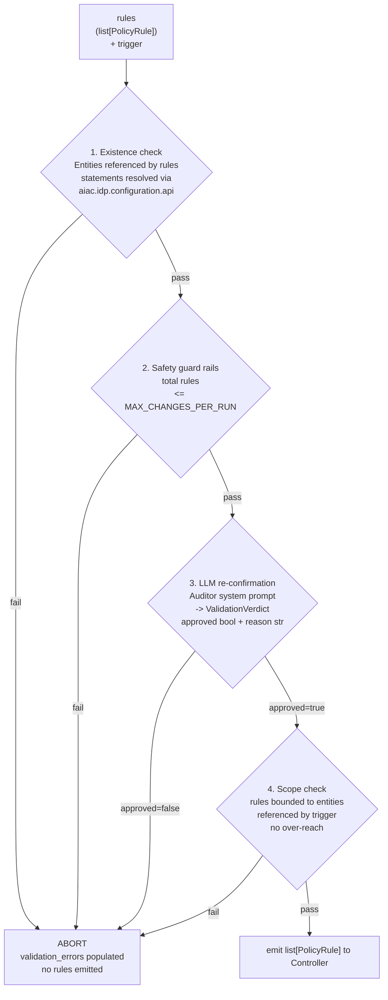

# Sub-PRD: AIAC Agent — Policy Rules Builder

## Description

The **Policy Rules Builder** (PRB) is a shared module at `agent/shared/policy_rules_builder/`. It receives `tuple[list[Role], list[Scope]]` from the producing sub-agent (or UC1 Orchestrator) and the natural-language policy, and emits `list[PolicyRule]` scoped to the trigger. It does **not** call `aiac.pdp.policy.library` or `aiac.policy.store.library` directly; only the PCE does.

> **Detailed design TBD — pending dedicated grill.** Open questions: Is the Policy Rules Builder a LangGraph `StateGraph` or a simpler callable? Does it use a single LLM call or a `propose_*` + `validate_*` node pattern? What context does it receive beyond the tuple — policy chunks, domain knowledge chunks, PDP snapshot? Does it need a `realm` parameter? Does it read current Policy Store state to avoid duplicates, or does the PCE handle dedup?

---

## Nodes

Two node functions exclusive to the Policy Rules Builder:

- `fetch_policy`: queries `aiac-policies` ChromaDB collection; stores results in `PRBState.policy_chunks`. Returns `503` when ChromaDB is unavailable after `UPSTREAM_MAX_RETRIES` retries.
- `fetch_domain_knowledge`: queries `aiac-domain-knowledge` ChromaDB collection; stores results in `PRBState.domain_knowledge_chunks`. Returns `[]` when collection is empty — non-fatal.

Both nodes use trigger-type-keyed query strings:

| Trigger | ChromaDB similarity query |
|---|---|
| `build` | `"all access control rules"` |
| `rebuild` | `"all access control rules"` |
| `role/{id}` | `"role assignment rules"` |
| `service/{id}` | `"service access control rules"` |

Number of results capped by `CHROMA_N_RESULTS` (default `10`).

---

## State

```python
class PRBState(BaseModel):
    trigger: TriggerContext
    realm: str
    roles: list[Role]
    scopes: list[Scope]
    policy_chunks: list[str]
    domain_knowledge_chunks: list[str]
    rules: list[PolicyRule]          # TBD — pending PRB grill
    validation_errors: list[str]     # TBD — pending PRB grill
```

`ValidationVerdict` is used internally by the LLM re-confirmation node (check 3):

```python
class ValidationVerdict(BaseModel):
    approved: bool
    reason: str
```

> **Note:** The exact shape of `PRBState` — including whether `rules` and `validation_errors` are intermediate fields or only produced at the end — is pending the dedicated grill.

---

## Validate Node — Common Checks

> **Note:** Validation is confirmed to live inside the Policy Rules Builder. The node structure within the PRB (single call vs. multi-node) is pending the dedicated grill. The four checks below are confirmed requirements.

The validation step performs four checks. Binary abort on any failure:



1. **Existence check** — all entities referenced by `rules` statements exist; resolved via `aiac.idp.configuration.api`.
2. **Safety guard rails** — total rules ≤ `MAX_CHANGES_PER_RUN`.
3. **LLM re-confirmation** — second LLM call with auditor system prompt; returns `ValidationVerdict(approved, reason)`.
4. **Scope check** — emitted `rules` are bounded to entities referenced by the trigger; no over-reach on partial updates.

---

## LLM Integration

The **Auditor prompt** (check 3 above) belongs to the Policy Rules Builder. The full LLM usage pattern for the PRB — prompts, node structure, and whether the PRB defines a `PLANNER_SYSTEM` in addition to an `AUDITOR_SYSTEM` — is TBD pending the dedicated grill.
