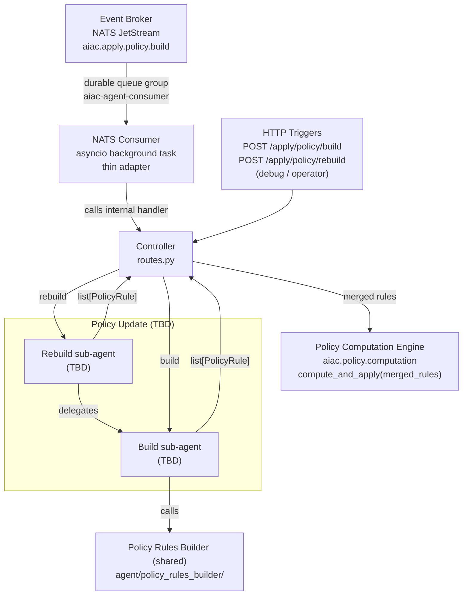

# Component Sub-PRD: UC2 — Policy Update

> **Status: TBD.** The internal design of the Build and Rebuild sub-agents is not yet defined. A dedicated grill session is required.

> **Depends on:** [`../aiac-agent.md`](../aiac-agent.md) — NATS Consumer, Controller, Shared Module, Configuration, Error Handling, Runtime.

## Triggers

| Source | Subject / Path |
|---|---|
| Event Broker (NATS) | `aiac.apply.policy.build` (originated by RAG Ingest Service post-ingest) |
| HTTP (debug / operator) | `POST /apply/policy/build` |
| HTTP (operator only) | `POST /apply/policy/rebuild` (not routed through Event Broker) |

## Architecture

## What is known

- **Two sub-agents:** Build (responds to `aiac.apply.policy.build` + `POST /apply/policy/build`) and Rebuild (responds to `POST /apply/policy/rebuild` only).
- Build calls the PRB directly, merges the results, and returns `list[PolicyRule]` to the Controller.
- Rebuild delegates to Build and returns Build's `list[PolicyRule]` to the Controller.
- The Controller calls `compute_and_apply(merged_rules)` via the PCE — the same pattern as all other UCs.
- Internal behavior (how Build/Rebuild sub-agents derive their tuple content, what IdP data they read, whether any LLM node is involved) is **deferred** — to be resolved in a dedicated grill session.

## Out of scope (this stub)

- Build sub-agent internal design.
- Rebuild sub-agent internal design.
- PRB internals — see [`policy-rules-builder.md`](policy-rules-builder.md).
- PCE reconcile mechanics — see [`../policy-computation-engine.md`](../policy-computation-engine.md).
- Response body shape — no response bodies; handlers return bare HTTP status codes. Summary + debug go to the log.
