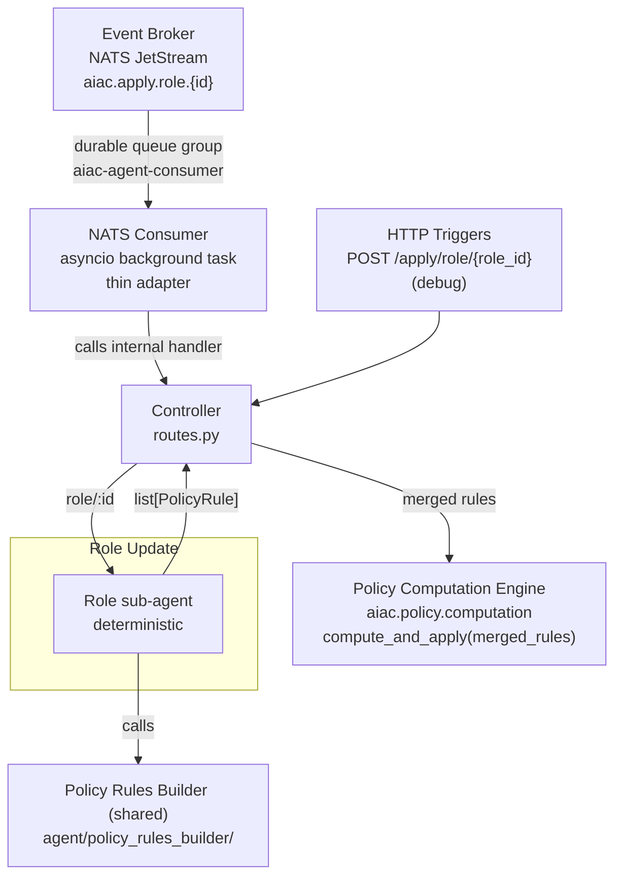

# Component Sub-PRD: UC3 — Role Update

> **Depends on:** [`../aiac-agent.md`](../aiac-agent.md) — NATS Consumer, Controller, Shared Module, Configuration, Error Handling, Runtime.

## Triggers

| Source | Subject / Path |
|---|---|
| Event Broker (NATS) | `aiac.apply.role.{id}` (originated by Keycloak SPI role created/updated) |
| HTTP (debug) | `POST /apply/role/{role_id}` |

## Architecture

Single path, no create/update branch. The sub-agent is **deterministic** (non-LLM).



## Sub-agent: Role sub-agent

**Nature:** deterministic, non-LLM. Pure IdP reader.

**Steps:**
1. Read the triggering role (`role_id`) from `aiac.idp.configuration.api`.
2. Read **all scopes** from `aiac.idp.configuration.api`.
3. Call `build_role_rules(role, all_scopes)` on the PRB.
4. Return the resulting `list[PolicyRule]`.

**Output:** `list[PolicyRule]`.

## Controller behaviour (for this UC)

1. Receives `list[PolicyRule]` from the Role sub-agent (PRB already called and merged internally).
2. Calls `compute_and_apply(rules)` from `aiac.policy.computation`.
   - The PCE unconditionally deletes the role's stale rules before applying the new ones. See [`../policy-computation-engine.md`](../policy-computation-engine.md).
3. Returns bare HTTP status; writes summary + debug to log.

## File structure

```
aiac/src/aiac/agent/uc/
└── role_update/
    ├── __init__.py
    ├── graph.py      ← Role sub-agent StateGraph (deterministic)
    ├── nodes.py      ← fetch_role, fetch_all_scopes, package_tuple
    └── state.py      ← RoleUpdateState
```

## Out of scope

- PRB internals — see [`policy-rules-builder.md`](policy-rules-builder.md).
- PCE stale-rule deletion mechanics — see [`../policy-computation-engine.md`](../policy-computation-engine.md).
- Response body shape — no response bodies; handlers return bare HTTP status codes. Summary + debug go to the log.
